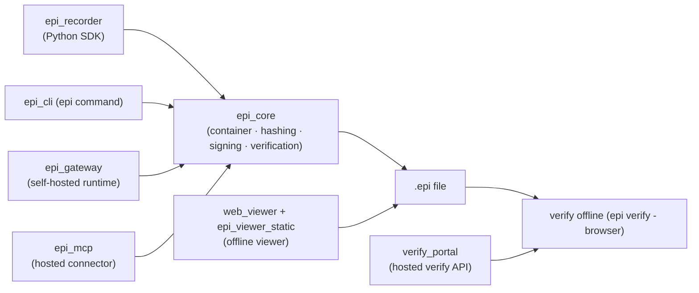

# EPI Architecture

EPI (Evidence Packaged Infrastructure) turns an AI agent's run into a signed, tamper-evident `.epi` evidence file: a portable container holding the run's step timeline, environment snapshot, file hashes and an Ed25519 signature, which anyone can re-check offline with `epi verify` and no account, API key, or network access.

Record → steps hash chain → manifest → signature → `.epi` → verify offline:

1. `record()` captures steps into `steps.jsonl`, each step linked to the previous by `prev_hash` (first step: `"CHAIN_START"`).
2. At seal time `EPIContainer.pack()` writes the payload files, records a SHA-256 hash per file in `manifest.json` (`file_manifest`), and embeds the offline viewer.
3. The manifest (with the public key embedded) is hashed canonically and signed with Ed25519; the signature is stored in the manifest.
4. Verification recomputes file hashes, the chain, and the signature locally — Tier 1 needs only the file.

## Packages

| Package | Responsibility | Main entry point |
|---|---|---|
| `epi_recorder/` | Python SDK: `record()` sessions, LLM/framework wrappers | `from epi_recorder import record` |
| `epi_core/` | Container pack/unpack, canonical hashing, signing, verification, policy/fault analysis | Library (`EPIContainer` in `epi_core/container.py`); no CLI script |
| `epi_cli/` | The `epi` command (record, verify, view, policy, gateway, share) and `epi-register` | `epi` (`epi_cli.main:cli_main`), `epi-register` (`epi_cli.register:cli_main`) |
| `web_viewer/` | Canonical browser UI for reviewing case files | Opened by `epi view` |
| `epi_viewer_static/` | Browser crypto (`crypto.js`) baked into every sealed file at pack time | Consumed by `epi_core/container.py`; no direct entry |
| `epi_gateway/` | Self-hosted capture, review, approval and share runtime | `epi gateway serve` |
| `epi_mcp/` | Hosted evidence connector for Claude and ChatGPT (stdio for local use, Streamable HTTP for hosting) | `epi-mcp` (stdio), `epi-mcp-http` (hosted; Render runs this) |
| `verify_portal/` | Hosted verify/auth API behind epilabs.org | `python -m verify_portal.main` (Render runs this) |
| `pytest_epi/` | Pytest plugin: attach `.epi` evidence to tests | `pytest --epi` |
| `website/` / `site/` | Public site source / Cloudflare Pages build output | `npm run build` copies `website/` to `site/` |

Console entry points are declared in `pyproject.toml` `[project.scripts]` (`epi`, `epi-register`, `epi-mcp`, `epi-mcp-http`); the gateway and portal run via the `epi` CLI and `python -m` as above.

## How integrity works

- **SHA-256 everywhere.** File bytes, canonical forms and key ids all hash with SHA-256 (`epi_core/serialize.py`, `epi_core/container.py`).
- **Canonical JSON is RFC 8785 (JCS) for spec 4.4.1 and later** (`epi_core/serialize.py`, `epi_core/_version.py`). Older specs verify under their original legacy-JSON/CBOR canonicalization via one dispatch function — sign and verify always use the same selection.
- **`steps.jsonl` is hash-chained.** Step 0 carries the genesis marker `prev_hash: "CHAIN_START"` (the sealer writes it); step N>0 carries the canonical hash of step N−1. A marker past index 0 is reported as a break (`epi_cli/verify.py`).
- **`file_manifest` maps each sealed file to its SHA-256** (`epi_core/schemas.py`). Verification recomputes every entry; any mismatch fails integrity.
- **Ed25519 signature over the canonical manifest hash, signature field excluded.** Stored as `ed25519:<keyname>:<hex>`, where `keyname` is the first 16 hex chars of SHA-256 of the hex-encoded public key (`epi_core/trust.py`).
- **The public key is embedded in the manifest before signing**, so Tier-1 verification needs no server, account, or trust registry (`epi_core/trust.py`).
- **RFC 3161 timestamp tokens are stored when the timestamp service answers, but their signature is not yet validated** — verification reports presence only (`epi_cli/verify.py`, `epi_core/checkpoints.py`).

## Where to read next

- [Codebase walkthrough](docs/EPI-CODEBASE-WALKTHROUGH.md) — how the parts fit and the main runtime paths.
- [File format spec](docs/spec/EPI-SPEC.md) — the authoritative wire format.
- [Verification contract](docs/VERIFICATION_CONTRACT.md) — exactly what a verify result means (and does not mean).
- [Threat model](docs/THREAT_MODEL.md) — which attacks are prevented and which are out of scope.
- [MCP contract](docs/EPI-MCP-CONTRACT.md) — the hosted connector's exact tools and honesty limits.
