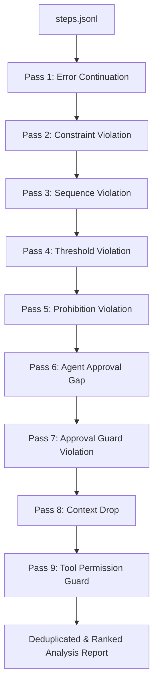

# EPI-Recorder: Comprehensive Codebase Technical Guide

> **Version**: 4.1.0 · **Python**: ≥ 3.11 · **License**: MIT · **Core Standard**: Evidence Packaged Infrastructure (EPI)

This document provides a highly detailed, low-level technical reference of the entire `epi-recorder` codebase. It outlines the architectural patterns, cryptographic foundations, data schemas, and runtime execution paths of all packages in the repository.

---

## 1. Architectural Blueprint & Core Concept

**EPI** (Evidence Packaged Infrastructure) packages AI agent execution steps—timeline, prompts, responses, tool calls, environment info, policy verification, and human reviews—into a single **tamper-evident, cryptographically signed, self-contained `.epi` file**.

### The Core Operational Lifecycle
```
 ┌───────────────┐
 │ Capture Layer │  → In-process SDK recording (decorators, patchers)
 └───────┬───────┘    or Remote API event capture (HTTP gateway proxy)
         ▼
 ┌───────────────┐
 │ Process Layer │  → Deterministic heuristic analysis (9-pass fault detector)
 └───────┬───────┘    and policy evaluation (JSON Schema & YAML rules)
         ▼
 ┌───────────────┐
 │ Packing Layer │  → Write timeline, manifest, env snapshot, and viewer
 └───────┬───────┘    into a polyglot envelope (EPI1 Header + HTML + ZIP)
         ▼
 ┌───────────────┐
 │ Signing Layer │  → Canonical JSON hash signed with Ed25519
 └───────┬───────┘
         ▼
 ┌───────────────┐
 │ Review Layer  │  → Offline viewer extraction, local verification,
 └───────────────┘    and additive human review injection
```

---

## 2. Codebase Directory and File Reference

```
epi-recorder/
├── epi_core/                   # Core business logic and cryptographic domain
│   ├── schemas.py              #   Pydantic models for Manifest, Step, Policy
│   ├── container.py            #   Dual-format (legacy ZIP vs envelope-v2) manager
│   ├── trust.py                #   Ed25519 signature & TrustRegistry (DID:WEB)
│   ├── serialize.py            #   Deterministic serialization (JSON Canonical / CBOR)
│   ├── fault_analyzer.py       #   9-pass deterministic heuristic analyzer
│   ├── case_store.py           #   SQLite data manager for gateway Decision Ops
│   ├── review.py               #   Human review structures and append logic
│   ├── capture.py              #   Raw capture hooks
│   ├── did_web.py              #   did:web DNS document resolver
│   ├── redactor.py             #   Regex-based pattern-matching secret scrubber
│   ├── keys.py                 #   Signing key generator and loading utilities
│   ├── telemetry.py            #   Usage metrics and diagnostic dispatchers
│   └── viewer_assets.py        #   Asset injection compiler for offline HTML
│
├── epi_recorder/               # Runtime execution capture
│   ├── api.py                  #   Context manager (EpiRecorderSession) & AgentRun
│   ├── patcher.py              #   HTTP, OpenAI, Gemini client wrapper hooks
│   ├── environment.py          #   Platform, package dependencies snapshot
│   ├── auto.py                 #   Automatic startup execution setup
│   └── integrations/           #   Framework adaptors (LangChain, LiteLLM, Otel)
│
├── epi_cli/                    # Typer CLI Command Interface
│   ├── main.py                 #   Typer command router & console controller
│   ├── view.py                 #   Offline HTML generator launcher
│   ├── verify.py               #   Integrity & registry checking verification tool
│   ├── share.py                #   Hosted artifact share upload manager
│   ├── policy.py               #   Policy manager command layer
│   └── connect.py              #   Review bridge & developer workspace host
│
├── epi_gateway/                # FastAPI self-hosted shared server
│   ├── main.py                 #   Routing, authorization, and config schemas
│   ├── worker.py               #   Background daemon thread (EvidenceWorker)
│   ├── proxy.py                #   Upstream OpenAI/Anthropic proxy relays
│   ├── share.py                #   S3/R2/File share storage engine
│   └── approval_notify.py      #   Human-In-The-Loop notifications (SMTP/Webhooks)
│
├── epi_guardrails/             # Guardrails AI monkey-patching package
│   ├── instrumentor.py         #   Wrapt hooks for Guard executions
│   ├── session.py              #   Step, iteration, validator result compiler
│   └── state.py                #   Async-safe task-local state (ContextVars)
│
├── epi_serve/                  # Static HTML asset compiler
│   └── viewer.html             #   Pre-built 234KB forensic case viewer template
│
├── web_viewer/                 # Client UI for viewing cases
│   ├── app.js                  #   React-like browser state and controller
│   ├── styles.css              #   Tailwind/CSS presentation styles
│   └── index.html              #   Vite/Static entry layout
│
├── pytest_epi/                 # Pytest test execution logger
│   └── plugin.py               #   Pytest harness hook for signed test evidence
│
├── epi_analyzer/               # Sidecar diagnostic mistake detector
│   └── detector.py             #   Infinite loop & token inefficiency checker
│
└── config/                     # Configuration schema references
    ├── schema_v06.json         #   Standard JSON Schema constraint files
    └── default_policy.yaml     #   Default YAML guardrail rules
```

---

## 3. Core Database Schemas (`epi_core/schemas.py`)

The data layer is defined via strict Pydantic structures to preserve interface boundaries.

### 3.1 `ManifestModel` (The Catalog Catalog Header)
Defines the top-level artifact identity, file validation table, and signature block.
```python
class ManifestModel(BaseModel):
    spec_version: str            # Specification version (e.g. "4.1.0")
    workflow_id: UUID            # Unique identifier for this execution run
    created_at: datetime         # ISO 8601 creation time (UTC normalized)
    cli_command: Optional[str]   # Invocation command string
    env_snapshot_hash: str       # SHA-256 hash of environment.json
    file_manifest: Dict[str,str] # Mapping: relative path -> SHA-256 hash of files
    public_key: Optional[str]    # Hex-encoded 32-byte Ed25519 verification public key
    signature: Optional[str]     # Format: "ed25519:key_name:hex_signature_bytes"
    container_format: Literal["legacy-zip", "envelope-v2"]
    analysis_status: Literal["complete", "skipped", "error"]
    analysis_error: Optional[str]
    goal: Optional[str]          # Core objective of the agent
    notes: Optional[str]         # Context notes
    metrics: Dict[str, Any]      # Performance metrics
    source: Dict[str, str]       # Integration descriptors (framework name/version)
    trust: Optional[Dict[str, Any]] # Registry urls and hashes
    approved_by: Optional[str]   # Approver ID string
    tags: List[str]              # Classification labels
    governance: Optional[dict]   # Decentralized IDs (did) or SCITT anchors
```

### 3.2 `StepModel` (timeline entry in `steps.jsonl`)
Individual atomic record format in the newline-delimited JSON (NDJSON) event timeline.
```python
class StepModel(BaseModel):
    index: int                   # Monotonic step counter (0-indexed)
    timestamp: datetime          # UTC step completion time
    kind: str                    # Kind identifier (e.g. "llm.request", "tool.call")
    content: Dict[str, Any]      # Event payload
    trace_id: Optional[str]      # W3C trace ID
    span_id: Optional[str]       # W3C span ID
    parent_span_id: Optional[str]# Parent span ID
    prev_hash: Optional[str]     # Canonical SHA-256 hash of the predecessor step
    governance: Optional[dict]   # Step-level compliance metadata
    source_type: Literal["user", "tool", "reasoning", "system"]
```

---

## 4. Physical Container Format (`envelope-v2`)

To allow `.epi` files to open directly in a browser without extraction, EPI-Recorder uses a **polyglot envelope format** (`envelope-v2`).

### 4.1 Structure of the Binary Polyglot
```
 ┌────────────────────────────────────────────────────────┐
 │ <!-- EPI Envelope Header (128 bytes binary structure)  │
 ├────────────────────────────────────────────────────────┤
 │ --> (Closes HTML Comment)                              │
 │ <script id="epi-preloaded-cases">...</script>          │
 │ [HTML/CSS/JS Viewer Source Code]                       │
 ├────────────────────────────────────────────────────────┤
 │ \n<!-- EPI_ZIP_PAYLOAD_START -->\n                     │
 ├────────────────────────────────────────────────────────┤
 │ [Raw Binary ZIP Payload (mimetype, steps.jsonl, etc.)] │
 └────────────────────────────────────────────────────────┘
```
1. **Header Block (128 bytes)**: Starts with HTML comment delimiter `<!--`. Formatted using python `struct` as `<4sBBHQ16sQ32s56s` containing:
   - `Magic` (4 bytes): `b"<!--"`
   - `Version` (1 byte): `2`
   - `Payload Format` (1 byte): `0x01` (ZIP Payload)
   - `Flags` (2 bytes): Reserved (0)
   - `Payload Length` (8 bytes): Unsigned long long
   - `UUID` (16 bytes): Workflow execution UUID bytes
   - `CreatedAtMicros` (8 bytes): Epoch microsecond timestamp
   - `Payload Hash` (32 bytes): SHA-256 hash of the inner ZIP payload
   - `Reserved Padding` (56 bytes): Null byte padding
2. **HTML Comment Close (` -->\n`)**: Terminates the HTML comment opened by the magic bytes in the header.
3. **Viewer Payload**: Standard HTML document content (styles, JS logic, and preloaded case JSON in structured `<script>` nodes).
4. **ZIP Boundary Marker**: `\n<!-- EPI_ZIP_PAYLOAD_START -->\n`.
5. **Inner ZIP Payload**: The actual archive payload, beginning with the uncompressed `mimetype` file (`application/vnd.epi+zip` or `application/vnd.epi`).

---

## 5. Trust and Cryptographic Signatures (`epi_core/trust.py`)

EPI guarantees artifact non-repudiation using standard digital signatures.

### 5.1 Deterministic Hashing (`epi_core/serialize.py`)
To prevent signature failure due to key re-ordering or whitespace formatting, Pydantic objects are normalized using **JSON Canonicalization Scheme (RFC 8785)** for specification v2+ (and CBOR Canonical serialization for legacy v1 formats).

*Field exclusions during hash generation*:
- The `signature` field itself is excluded from the manifest hash.
- The `source_type` field is excluded from `StepModel` hashing to remain backward-compatible with legacy artifacts.
- UUIDs and Datetimes are mapped to UTC string representations (`YYYY-MM-DDTHH:MM:SSZ`).

### 5.2 The Verification Protocol
During verification (`epi verify`), the following checks execute:
1. **File Manifest Integrity**: Every file listed in `manifest.json`'s `file_manifest` is read, hashed with SHA-256, and compared against the recorded hash.
2. **Step Linkage Checks**: Each step in `steps.jsonl` computes its canonical hash and validates that it matches the `prev_hash` value of the succeeding step.
3. **Manifest Signature Verification**: The manifest JSON is canonicalized, hashed, and validated against the signature string `ed25519:key_name:signature_hex` using the embedded public key.
4. **Trust Registry Check**: The public key fingerprint is queried against the `TrustRegistry` which resolves trust in four stages:
   - **Local Directory**: `.pub` and `.revoked` files in `~/.epi/trusted_keys/`.
   - **W3C Decentralized Identifiers (DIDs)**: If `manifest.governance.did` starts with `did:web:`, the verification engine resolves the DID document over HTTPS at `<domain>/.well-known/did.json` to verify the public key ownership.
   - **Remote Registries**: Fetches anchors from `EPI_TRUSTED_REGISTRY_URL`.

---

## 6. Heuristic Fault Analyzer (`epi_core/fault_analyzer.py`)

Instead of relying on unstable LLM judges, EPI evaluates compliance and failure states through a **deterministic, nine-pass heuristic engine**.



### Analysis Passes Explained
1. **Error Continuation**: Detects when a tool response contains errors (e.g. API timeouts, connection refused) but the agent proceeds with LLM execution instead of handling the exception.
2. **Constraint Violation**: Scans step contents for constraints (e.g. limit, maximum) and compares values against execution steps to identify numeric threshold violations.
3. **Sequence Violation**: Validates that required prerequisite steps occurred before a specific execution action.
4. **Threshold Violation**: Flags values that exceed policy limits without corresponding authorization triggers.
5. **Prohibition Violation**: Scans outputs for forbidden regex patterns (e.g. credit cards, SSNs, prohibited commands).
6. **Agent Approval Gap**: Identifies tool actions executed while human approval was pending or after a rejection response was registered.
7. **Approval Guard Violation**: Flags actions that bypass mandatory human-in-the-loop signoff checkpoints.
8. **Context Drop**: Scans the final third of the timeline to identify if key entities (e.g. account numbers, customer IDs) present in the initial stages were lost.
9. **Tool Permission Guard**: Detects if tools marked as restricted/prohibited in the active policy were executed.

---

## 7. Local Recorder Lifecycle (`epi_recorder/`)

The local recording SDK manages task-local workspaces without blocking runtime thread execution.

### 7.1 Thread and Task Isolation
EPI-Recorder isolates execution contexts using Python `contextvars`. A `RecordingContext` object is held in a task-local variable:
```python
# In patcher.py
_recording_context: ContextVar[Optional[RecordingContext]] = ContextVar(
    "recording_context", default=None
)
```
This ensures that concurrent asynchronous requests (e.g. in FastAPI backends) do not write events to the same timeline.

### 7.2 Monkey-patching and Client Wrappers (`patcher.py`)
EPI automatically hooks external API calls via monkey-patching:
- **Client Interceptors**: Wraps standard SDK clients (`wrap_openai()`, `wrap_litellm()`) using function wrappers to intercept request arguments (mapped to `llm.request`) and responses (mapped to `llm.response`).
- **HTTP/Network Interceptor**: Intercepts `urllib3` and `httpx` adapters to capture underlying web service calls if explicit wrappers are absent.

---

## 8. Gateway & Case Store Engine (`epi_gateway/`)

The gateway provides a central compliance capture service, a shared Decision Ops database, and review notification workflows.

### 8.1 Data Persistence & SQLite Case Projection
The Gateway handles high-throughput events asynchronously:
1. **FastAPI Capture Endpoint**: Receives events at `/capture` or `/capture/batch` and validates auth.
2. **`EvidenceWorker` Queue**: Enqueues incoming payload items in an in-memory buffer.
3. **Batch Flush**: Periodically flushes items to disk (`events/evidence_{batch_id}.json`) to guarantee durability.
4. **SQLite Case Projection**: `CaseStore.apply_batch()` processes event files, extracting fields to populate SQL tables:
   ```sql
   CREATE TABLE cases (
       id TEXT PRIMARY KEY,
       workflow_id TEXT,
       status TEXT,
       risk_level TEXT,
       trust_score REAL,
       assignee TEXT,
       created_at TIMESTAMP,
       updated_at TIMESTAMP
   );
   ```

### 8.2 Human-In-The-Loop Approval Loop
For active agent executions that trigger validation checks:
1. Agent publishes a step with `kind = "agent.approval.request"`.
2. Gateway intercepts the event and executes background tasks:
   - Dispatches webhook payloads to external API workflows.
   - Sends email notifications using local SMTP connections.
3. Approver navigates to the portal URL (`/api/approve/{workflow_id}/{approval_id}`) and submits their response.
4. Gateway writes `kind = "agent.approval.response"`, notifying the waiting worker thread.

---

## 9. Guardrails AI Instrumentation (`epi_guardrails/`)

Designed specifically for enterprise AI safety, `epi_guardrails` hooks validation loops in Guardrails AI.

### 9.1 Monkey-Patch Hooks (`instrumentor.py`)
Uses `wrapt` to intercept core execution frameworks:
- `Guard._execute` & `Guard._execute_async`: Launches the recording session scope.
- `Runner.step` & `AsyncStreamRunner.async_step`: Tracks loop iterations.
- `ValidatorServiceBase.after_run_validator`: Captures validator results, error suggestions, and corrected outputs.

### 9.2 Execution Trace Step Vocabulary
The module maps internal Guardruns to five specific step events:
- `guardrails.execution.start`: Target constraints and initial prompts.
- `agent.step` (sub-type: `guardrails`): Wraps loop iteration state.
- `guardrails.llm.call`: Extracted token usage and latency.
- `guardrails.validator.result`: Individual validator results (status: pass, fail, or corrected).
- `guardrails.execution.end`: Finished outcome and overall validation verdict.

---

## 10. Summary Data Flow: Request to Verification

```
  AI Agent Call
        │ (OpenAI SDK/LangChain wrapper)
        ▼
  Recording Session (epi_recorder)
        │ 1. capture step events
        │ 2. log system env & stdout
        ▼
  Packing Container (epi_core.container)
        │ 1. run Heuristic Fault Analyzer
        │ 2. generate static viewer.html
        │ 3. construct ZIP payload
        ▼
  Signing Stage (epi_core.trust)
        │ 1. generate manifest.json
        │ 2. canonicalize JSON & compute SHA-256
        │ 3. sign with Ed25519
        ▼
  Sealed Artifact (.epi file)
        │
        ├─► Local Command CLI (epi verify --strict)
        │     - checks file integrity
        │     - verifies DID:WEB trust anchors
        │
        └─► Forensic Viewer (viewer.html)
              - client-side extraction using JSZip
              - offline verification checks
```

---

*Reference manual compiled for developers on EPI-Recorder v4.1.0 codebase.*
