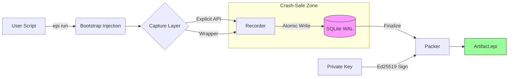

<p align="center">
  
  <br>
  <h1 align="center">EPI</h1>
  <p align="center"><strong>Verifiable Execution Evidence for AI Systems / AI Agents</strong></p>
  <p align="center">
    <em>A portable, cryptographically sealed artifact format for AI execution records.</em>
  </p>
</p>

<p align="center">
  <a href="https://pypi.org/project/epi-recorder/"></a>
  <a href="https://github.com/mohdibrahimaiml/epi-recorder"></a>
  <a href="LICENSE"></a>
</p>

---

## What is EPI?

EPI (Evidence Package for AI) is a **file format** for capturing and verifying AI execution evidence.

An `.epi` file is to AI execution what PDF is to documents:
- **Self-contained** — prompts, responses, environment, viewer — all in one file
- **Universally viewable** — opens in any browser, no software required
- **Tamper-evident** — Ed25519 signatures prove the record wasn't altered

EPI is designed for **adversarial review**: audits, incident response, compliance, litigation.

---

## Design Guarantees

EPI artifacts provide the following guarantees:

| Guarantee | Implementation |
|:----------|:---------------|
| **Explicitness** | Evidence capture is intentional and reviewable in source code |
| **Portability** | Single file, no external dependencies, works offline |
| **Offline Verifiability** | Signature verification requires no network or cloud services |
| **Adversarial Review** | Format assumes the reviewer does not trust the producer |

These are not features. They are **constraints** that define what EPI is.

---

## Quick Start

```bash
pip install epi-recorder
```

### Capture Evidence (Explicit API)

```python
from epi_recorder import record

with record("evidence.epi") as epi:
    response = client.chat.completions.create(model="gpt-4", messages=[...])
    epi.log_llm_call(response)  # Explicit capture
```

### Capture Evidence (Wrapper Client)

```python
from epi_recorder import record, wrap_openai
from openai import OpenAI

client = wrap_openai(OpenAI())

with record("evidence.epi"):
    response = client.chat.completions.create(...)  # Captured via wrapper
```

### Verify Evidence

```bash
epi verify evidence.epi
```

---

## The `.epi` Artifact Format

An `.epi` file is a ZIP archive with a defined structure. See [docs/EPI-SPEC.md](docs/EPI-SPEC.md) for the full specification.

```
evidence.epi
├── mimetype              # "application/epi+zip"
├── manifest.json         # Metadata + Ed25519 signature
├── steps.jsonl           # Execution steps (NDJSON)
├── env.json              # Runtime environment snapshot
└── viewer/
    └── index.html        # Self-contained offline viewer
```

The embedded viewer allows any recipient to:
- View the complete execution timeline
- Verify cryptographic integrity
- Inspect individual steps

No software installation required.

---

## ⭐ New in v2.3.0

### Async Support

EPI now supports both sync and async contexts for modern agent frameworks:

```python
# Async mode (NEW!)
async with record("agent.epi"):
    response = await async_client.chat.completions.create(...)
    await epi.alog_step("custom.event", {})
```

Perfect for LangGraph, AutoGen, and other async-first frameworks.

### Agent Analytics Engine

Analyze agent performance across multiple runs:

```python
from epi_recorder import AgentAnalytics

analytics = AgentAnalytics("./production_runs")
summary = analytics.performance_summary()

print(f"Success Rate: {summary['success_rate']:.1f}%")
print(f"Avg Cost: ${summary['avg_cost_per_run']:.3f}")

# Generate HTML dashboard
analytics.generate_report("performance.html")
```

**Features:**
- Success rate trends over time
- Cost analysis (daily/weekly/monthly)
- Error pattern detection
- Tool usage distribution
- Period-to-period comparisons

### Local LLM Support (Ollama)

Test with FREE local LLMs via Ollama:

```python
from openai import OpenAI
from epi_recorder import record, wrap_openai

# Point to Ollama (OpenAI-compatible API)
client = wrap_openai(OpenAI(
    base_url="http://localhost:11434/v1",
    api_key="ollama"
))

# Record just like any other LLM!
with record("test.epi"):
    response = client.chat.completions.create(
        model="deepseek-r1:7b",
        messages=[{"role": "user", "content": "Hello!"}]
    )
```

Benefits: Zero API costs, unlimited testing, complete privacy.

### LangGraph Integration

Native checkpoint saver for LangGraph agents:

```python
from langgraph.graph import StateGraph
from epi_recorder.integrations import EPICheckpointSaver

graph = StateGraph(...)

# Use EPI as checkpoint backend
checkpointer = EPICheckpointSaver("my_agent.epi")
result = graph.invoke(
    {"messages": [...]},
    {"configurable": {"thread_id": "1"}},
    checkpointer=checkpointer
)

# View state transitions in .epi viewer
# epi view my_agent.epi
```

Automatically captures:
- All state transitions
- Checkpoint metadata
- Agent decision points

---

## Architecture

How EPI turns execution into verifiable evidence:



1.  **Injection**: The `epi run` CLI bootstraps `sitecustomize.py`, injecting the recorder before user code loads.
2.  **Capture**: Calls are intercepted via explicit API `log_llm_call()` or wrappers.
3.  **Persistence**: Steps are written atomically to a Write-Ahead-Log (WAL) SQLite DB. If the process crashes (OOM), evidence is safe on disk.
4.  **Sealing**: On exit, the DB is converted to JSONL, hashed (Canonical CBOR), signed (Ed25519), and zipped.

---

## CLI Reference

### Primary Commands

| Command | Purpose |
|:--------|:--------|
| `epi run <script.py>` | Capture execution evidence to `.epi` |
| `epi verify <file.epi>` | Verify artifact integrity and signature |
| `epi view <file.epi>` | Open artifact in browser viewer |
| `epi keys list` | Manage signing keys |

### Secondary Tools

These tools consume evidence artifacts for analysis:

| Command | Purpose |
|:--------|:--------|
| `epi debug <file.epi>` | Heuristic analysis (loops, errors, inefficiencies) |
| `epi chat <file.epi>` | Natural language querying via LLM |

> **Note:** `debug` and `chat` are convenience tools built on top of the evidence format.
> They are not part of the core specification.

---

## Cryptographic Properties

| Property | Implementation |
|:---------|:---------------|
| **Signatures** | Ed25519 (RFC 8032) |
| **Hashing** | SHA-256 content addressing |
| **Key Storage** | Local keyring, user-controlled |
| **Verification** | Client-side, zero external dependencies |

Signatures are **optional but recommended**. Unsigned artifacts are still valid but cannot prove origin.

---

## When to Use EPI

### Appropriate Use Cases

- Post-incident forensics
- Compliance documentation
- Audit trails for autonomous systems
- Reproducibility evidence for research
- Litigation-grade execution records

### Not Designed For

- Real-time monitoring dashboards
- High-frequency telemetry
- System health metrics
- Application performance monitoring

EPI produces **artifacts**, not **streams**.

---

## Supported Providers

| Provider | Capture Method |
|:---------|:---------------|
| OpenAI | Wrapper client or explicit API |
| Anthropic | Explicit API |
| Google Gemini | Explicit API |
| Any HTTP-based LLM | Explicit API via `log_llm_call()` |

EPI does not depend on provider-specific integrations. The explicit API works with any response format.

---

## v2.3.0 — Design Correction

This release corrects EPI's evidence capture model.

| Before (v2.2.x) | After (v2.3.0) |
|:----------------|:---------------|
| Implicit monkey-patching | Explicit capture |
| Fragile to SDK changes | Stable across versions |
| Hidden instrumentation | Reviewable in source |

**Rationale:** Evidence systems must be intentional. Implicit capture was convenient but violated the explicitness guarantee.

**Migration:** Replace implicit capture with `epi.log_llm_call(response)` or `wrap_openai()`.

**Legacy mode:** `record(legacy_patching=True)` is deprecated and will be removed in v3.0.

---

## Release History

### Release History

| Version | Released | Theme | Key Improvements |
|:--------|:---------|:------|:-----------------|
| **2.3.0** | 2026-02-06 | **Explicitness** | Explicit `log_llm_call` API, Wrapper Clients (`wrap_openai`), Removal of implicit patching magic. |
| **2.2.1** | 2026-02-06 | **Fidelity** | Error visibility in Viewer (red badges), guaranteed `steps.jsonl` creation. |
| **2.2.0** | 2026-01-30 | **Architecture** | **SQLite WAL** for crash-safety, **Async** support, Thread-safe `ContextVars`. |
| **2.1.3** | 2026-01-24 | **Expansion** | **Google Gemini** support, `epi chat` for natural language querying of evidence. |
| **2.1.2** | 2026-01-17 | **Trust** | **Client-side Verification** (in-browser Ed25519), Canonical CBOR serialization. |
| **2.1.1** | 2025-12-16 | **Polish** | `epi doctor` diagnostic tool, Auto-repair for Windows PATH issues. |
| **2.1.0** | 2025-12-16 | **Usability** | Offline Viewer integration, Interactive CLI mode, improved Windows support. |
| **2.0.0** | 2025-12-16 | **MVP** | Official transition from prototype to MVP status. |
| **1.1.1** | 2025-12-16 | **Fixes** | Critical fixes for CLI execution and version display strings. |
| **1.1.0** | 2025-12-16 | **Metadata** | Added `Manifest` metadata support, `epi run` and `epi ls` commands introduced. |
| **1.0.0** | 2025-12-15 | **Genesis** | Initial Release. Defined `.epi` ZIP format, Ed25519 signing, and basic Viewer. |

See [CHANGELOG.md](./CHANGELOG.md) for detailed release notes.

---

## Contributing

```bash
git clone https://github.com/mohdibrahimaiml/epi-recorder.git
cd epi-recorder
pip install -e ".[dev]"
pytest
```

See [CONTRIBUTING.md](./CONTRIBUTING.md) for guidelines.

---

## License

MIT License. See [LICENSE](./LICENSE).
