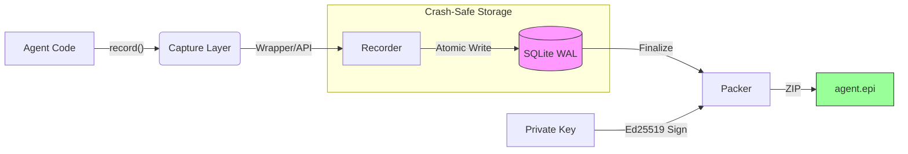

<p align="center">
  
  <br>
  <h1 align="center">EPI</h1>
  <p align="center"><strong>Execution recording and verification system for AI Agents/ AI Systems</strong></p>
  <p align="center">
    <em>Capture, replay, and audit agent runs as cryptographically sealed artifacts</em>
  </p>
</p>

<p align="center">
  <a href="https://pypi.org/project/epi-recorder/"></a>
  <a href="https://github.com/mohdibrahimaiml/epi-recorder"></a>
  <a href="LICENSE"></a>
  <a href="https://pepy.tech/project/epi-recorder"></a>
</p>

---

## What is EPI?

**EPI is not a logging service or monitoring dashboard.**

It's a **file format and recorder** that turns agent execution into durable, verifiable artifacts.

An `.epi` file is like a **flight recorder for AI systems**—it captures every decision, tool call, and state transition, sealed with cryptographic signatures.

**What this means:**
- **Capture once, inspect forever** (works offline, no cloud dependency)
- **Complete execution history** (prompts, responses, state, timestamps, costs)
- **Tamper-evident proof** (Ed25519 signatures for compliance and audits)
- **Replay production failures** (debug locally with full context)

---

## The Problem

**Production agents fail mysteriously. Debugging takes hours.**

**Real scenario:**
- Your LangGraph agent processed 47 steps overnight
- Step 31 made a bad decision that cascaded into failure
- CloudWatch logs expired after 7 days
- You have no idea what the agent was "thinking" at step 31
- Reproduce? Impossible—you don't have the exact state, prompts, or environment

**Traditional logs don't help:**
- ❌ Expire (context lost after 30 days)
- ❌ Incomplete (missing agent state, checkpoints, reasoning)
- ❌ Not reproducible (can't replay locally)
- ❌ Unverifiable (no cryptographic proof for audits)

**Engineers waste 4-8 hours per bug** reconstructing what happened.

---


## Quick Start

### 1. Install

```bash
pip install epi-recorder
```

### 2. Capture an Agent Run (3 lines of code)

```python
from epi_recorder import record, wrap_openai
from openai import OpenAI

# Just wrap your client
client = wrap_openai(OpenAI())

# Capture everything automatically
with record("my_agent.epi"):
    response = client.chat.completions.create(
        model="gpt-4",
        messages=[{"role": "user", "content": "Plan a trip to Tokyo"}]
    )
```

**That's it.** EPI captured:
- ✅ The full prompt & response
- ✅ Token usage & cost ($0.0023)
- ✅ Timestamp & model info
- ✅ Environment snapshot

### 3. View the Results

```bash
epi view my_agent.epi
```

**Opens in your browser**—no login, no cloud, works offline forever.

**See:**
- 📜 Full conversation timeline
- 💰 Cost breakdown per call
- 🔍 State transitions (if using LangGraph)
- 🔐 Cryptographic verification status

### 4. Analyze Performance (NEW in v2.4.0!)

```python
from epi_recorder import AgentAnalytics

analytics = AgentAnalytics("./production_runs")
summary = analytics.performance_summary()

print(f"Success rate: {summary['success_rate']:.1%}")
print(f"Avg cost: ${summary['avg_cost_per_run']:.3f}")
print(f"Most common error: {summary['top_errors'][0]}")

# Generate visual dashboard
analytics.generate_report("dashboard.html")  # Opens in browser
```

**[→ See Full Documentation](docs/)** | **[→ Download Example .epi File](examples/demo_agent.epi)**

---

## Real Incident: How EPI Saved 4 Hours

**Production scenario (fintech startup):**

An AutoGen agent processed customer refund requests overnight. One request was incorrectly approved for $12,000 (should have been $120).

**Without EPI:**
- Logs showed "refund approved" but not why
- LLM conversation history incomplete (truncated after 20 messages)
- No state captured (agent's reasoning chain lost)
- Took 4 hours to reproduce the exact scenario
- Never found root cause with certainty

**With EPI:**
- Opened `refund_agent_20260211.epi` (generated automatically)
- Viewed step 17: LLM misread "$120.00" as "$12000" (OCR preprocessing bug)
- Saw exact prompt, response, and intermediate state
- Fixed preprocessing logic in 15 minutes
- `.epi` artifact shared with compliance team as proof of fix

**Result:** 4 hours → 15 minutes. Plus cryptographic proof for regulators.

---

## 🚀 Beta Program

**Looking for 10 teams** to pilot EPI in production:

**You get:**
- Priority support (direct access to founders)
- Free forever (beta partners never pay)
- Custom integrations

**Ideal if you:**
- Run LangGraph/AutoGen/CrewAI in production
- Debug agent failures weekly
- Need audit trails for compliance

**[→ Apply for Beta Access](https://forms.gle/YOUR_FORM)**

---

## The Solution

**EPI captures everything, automatically.**

Every agent run becomes a `.epi` file containing:
- ✅ Full execution timeline (every prompt, response, tool call)
- ✅ Agent state at each step (memory, checkpoints, reasoning)
- ✅ Environment snapshot (model, temperature, libraries)
- ✅ Cryptographic signature (tamper-evident proof)
- ✅ Self-contained viewer (opens in any browser, works offline)

**Debug 10× faster:**
- Open `.epi` file from 3 months ago
- See exact state at step 31
- Replay failure locally
- Fix in minutes, not hours

---

## ⭐ New in v2.4.0

### Async Support

Perfect for LangGraph, AutoGen, and async-first agent frameworks:

```python
# Async mode (non-blocking I/O)
async with record("agent.epi"):
    response = await async_client.chat.completions.create(...)
    await epi.alog_step("custom.event", {"reasoning": "..."})
```

### Agent Analytics Engine

Track performance across 100s of agent runs:

```python
from epi_recorder import AgentAnalytics

analytics = AgentAnalytics("./production_runs")
summary = analytics.performance_summary()

# Get insights
print(f"Success Rate: {summary['success_rate']:.1f}%")
print(f"This Week Cost: ${summary['cost_this_week']:.2f}")
print(f"Avg Duration: {summary['avg_duration_seconds']:.1f}s")

# Visual dashboard
analytics.generate_report("performance.html")
```

**Features:**
- 📈 Success rate trends over time
- 💵 Cost analysis (daily/weekly/monthly)
- 🐛 Error pattern detection
- 🔧 Tool usage distribution
- 📊 Period-to-period comparisons

### Local LLM Support (Ollama)

Test with **FREE** local LLMs—zero API costs:

```python
from openai import OpenAI
from epi_recorder import record, wrap_openai

# Point to Ollama (OpenAI-compatible API)
client = wrap_openai(OpenAI(
    base_url="http://localhost:11434/v1",
    api_key="ollama"  # Doesn't matter for local
))

# Record just like any other LLM
with record("test.epi"):
    response = client.chat.completions.create(
        model="deepseek-r1:7b",
        messages=[{"role": "user", "content": "Debug this code..."}]
    )
```

**Benefits:** Unlimited testing, complete privacy, $0 API costs.

### LangGraph Integration

Native checkpoint saver for LangGraph state management:

```python
from langgraph.graph import StateGraph
from epi_recorder.integrations import EPICheckpointSaver

# Build your graph
graph = StateGraph(AgentState)
# ... define nodes and edges ...

# Use EPI as checkpoint backend
checkpointer = EPICheckpointSaver("my_agent.epi")

# Run with automatic state capture
result = graph.invoke(
    {"messages": [HumanMessage(content="...")]},
    {"configurable": {"thread_id": "user_123"}},
    checkpointer=checkpointer
)

# View all state transitions
# $ epi view my_agent.epi
```

**Automatically captures:**
- ✅ All state transitions between nodes
- ✅ Checkpoint metadata (thread_id, timestamp)
- ✅ Agent decision points
- ✅ Large state handling (hashes states >1MB)

---

## Why EPI vs. Alternatives?

**EPI is not an observability dashboard. It's a durable execution artifact system.**

Dashboards (LangSmith, Arize) give you live metrics. EPI gives you portable, offline-verifiable records that last forever.

### Comparison

| Feature | **EPI** | LangSmith | Arize | W&B |
|:--------|:--------|:----------|:------|:----|
| **Offline-first** | ✅ Works without internet | ❌ Cloud required | ❌ Cloud required | ❌ Cloud required |
| **Agent state capture** | ✅ Full checkpoints (LangGraph native) | ⚠️ Traces only | ⚠️ Predictions only | ⚠️ Experiments only |
| **Cryptographic proof** | ✅ Ed25519 signatures | ❌ None | ❌ None | ❌ None |
| **Format lock-in** | ✅ Open spec (`.epi` format) | ❌ Proprietary API | ❌ Proprietary | ❌ Proprietary |
| **Compliance-ready** | ✅ EU AI Act, FDA, litigation | ⚠️ Limited | ⚠️ Limited | ❌ Not designed |
| **Local LLM support** | ✅ Ollama, llama.cpp | ❌ Cloud only | ❌ Cloud only | ❌ Cloud only |
| **Cost** | ✅ Free (open source) | 💰 $99+/mo | 💰 Custom pricing | 💰 $50+/mo |
| **Data privacy** | ✅ Self-hosted, offline | ⚠️ Cloud-dependent | ⚠️ Cloud-dependent | ⚠️ Cloud-dependent |

### Use EPI When You Need:

- **Durable artifacts** (not just live dashboards that expire)
- **Agent state replay** (full checkpoints, not just LLM traces)
- **Regulatory compliance** (signatures, offline verification, audit trails)
- **No vendor lock-in** (open format, self-hosted, works forever)
- **Local development** (Ollama, no cloud dependency)

### Use LangSmith/Arize When You Need:

- Real-time monitoring dashboards (live metrics)
- Team collaboration features (built-in sharing, comments)
- Managed infrastructure (no self-hosting, SaaS convenience)

**EPI complements these tools**—use both for complete agent observability.

---

## Use Cases

### For Developers (Daily Workflow) — Primary Use Case

**You should use EPI if you:**
- 🔍 **Debug multi-step agent failures** (see exact decision tree)
- 🧪 **A/B test different prompts or models** (compare runs side-by-side)
- 📊 **Track agent performance over time** (success rates, costs, errors)
- 🔁 **Replay production failures locally** (with Ollama or real LLMs)
- 👥 **Collaborate on agent debugging** (share `.epi` files with team)

**Perfect for:**
- LangGraph / LangChain developers
- AutoGen / CrewAI users
- Custom agent framework builders
- ML engineers running production agents

### For Enterprises (Compliance) — Discovered Value

**As your agents scale, EPI provides:**
- 📝 **Audit trails for regulators** (EU AI Act, FDA, SEC filings)
- ⚖️ **Litigation-grade evidence** (cryptographically signed, tamper-evident)
- 🔐 **Data governance** (PII redaction, retention policies, GDPR compliance)
- 🏢 **Enterprise SLAs** (on-prem deployment, SSO, custom retention)

### Not a Replacement For

**EPI complements (doesn't replace):**
- **Real-time monitoring** (Datadog, New Relic) → EPI is for post-hoc forensics
- **Observability dashboards** (LangSmith, Arize) → EPI is for durable artifacts
- **Production logging** (CloudWatch, Splunk) → EPI preserves what logs lose (state, context)

---

## The `.epi` Artifact Format

An `.epi` file is a **self-contained ZIP archive** with a defined structure.

```
my_agent.epi
├── mimetype              # "application/epi+zip"
├── manifest.json         # Metadata + Ed25519 signature
├── steps.jsonl           # Execution timeline (NDJSON)
├── env.json              # Runtime environment snapshot
└── viewer/
    └── index.html        # Self-contained offline viewer
```

**Key properties:**
- **Self-contained:** All data in one file (no external dependencies)
- **Universally viewable:** Opens in any browser (like PDF)
- **Tamper-evident:** Ed25519 signatures prove integrity
- **Durable:** Works offline forever (no API keys, no cloud)

See **[EPI Specification](docs/EPI-SPEC.md)** for technical details.

---

## Architecture

How EPI turns execution into verifiable evidence:



**Key design choices:**

1. **Crash-safe:** SQLite WAL ensures no data loss (even if agent crashes)
2. **Explicit capture:** Evidence is intentional (reviewable in code)
3. **Cryptographic proof:** Ed25519 signatures (can't be forged)
4. **Offline-first:** No cloud dependency (works in air-gapped environments)

---

## Roadmap

**Current (v2.4.0):**
- ✅ Capture, verify, replay agent runs
- ✅ LangGraph checkpoint integration
- ✅ Agent analytics across runs

**Next 6 months:**
- Time-travel debugging (step through any past run)
- Team collaboration features
- Cloud platform (optional)


---

## CLI Reference

### Primary Commands

| Command | Purpose |
|:--------|:--------|
| `epi run <script.py>` | Capture execution evidence to `.epi` |
| `epi verify <file.epi>` | Verify artifact integrity and signature |
| `epi view <file.epi>` | Open artifact in browser viewer |
| `epi keys list` | Manage signing keys |
| `epi --version` | Show EPI version |

### Advanced Tools

These tools consume evidence artifacts for analysis:

| Command | Purpose |
|:--------|:--------|
| `epi debug <file.epi>` | Heuristic analysis (loops, errors, inefficiencies) |
| `epi chat <file.epi>` | Natural language querying via LLM |

> **Note:** `debug` and `chat` are convenience tools built on top of the evidence format.

---

## Cryptographic Properties

| Property | Implementation |
|:---------|:---------------|
| **Signatures** | Ed25519 (RFC 8032) |
| **Hashing** | SHA-256 content addressing |
| **Key Storage** | Local keyring, user-controlled |
| **Verification** | Client-side, zero external dependencies |

Signatures are **optional but recommended**. Unsigned artifacts are valid but can't prove origin.

---

## Supported Providers

| Provider | Capture Method |
|:---------|:---------------|
| OpenAI | Wrapper client (`wrap_openai`) or explicit API |
| Anthropic | Explicit API (`log_llm_call`) |
| Google Gemini | Explicit API |
| Ollama (local) | Wrapper client (OpenAI-compatible) |
| Any HTTP LLM | Explicit API via `log_llm_call()` |

EPI doesn't depend on provider-specific integrations—the explicit API works with any response format.

---

## Release History

| Version | Released | Theme | Key Improvements |
|:--------|:---------|:------|:-----------------|
| **2.4.0** | 2026-02-12 | **Agent Development** | **Agent Analytics** Engine, **Async/Await** support, **LangGraph** checkpoint integration, **Ollama** local LLM support. |
| **2.3.0** | 2026-02-06 | **Explicitness** | Explicit `log_llm_call` API, Wrapper Clients (`wrap_openai`), Removal of implicit patching magic. |
| **2.2.1** | 2026-02-06 | **Fidelity** | Error visibility in Viewer (red badges), guaranteed `steps.jsonl` creation. |
| **2.2.0** | 2026-01-30 | **Architecture** | **SQLite WAL** for crash-safety, **Async** support, Thread-safe `ContextVars`. |
| **2.1.3** | 2026-01-24 | **Expansion** | **Google Gemini** support, `epi chat` for natural language querying of evidence. |

See **[CHANGELOG.md](./CHANGELOG.md)** for detailed release notes.

---

## Documentation

### Core Documentation

| Document | Description |
|:---------|:------------|
| **[EPI Specification](docs/EPI-SPEC.md)** | Complete technical specification for the `.epi` file format |
| **[CLI Reference](docs/CLI.md)** | Full command-line interface documentation |
| **[CHANGELOG](CHANGELOG.md)** | Detailed release notes for all versions |
| **[Contributing Guide](CONTRIBUTING.md)** | How to contribute to EPI development |
| **[Security Policy](SECURITY.md)** | Security guidelines and vulnerability reporting |

### Feature Documentation

| Feature | Guide |
|:--------|:------|
| **Agent Analytics** | [ANALYTICS_DEPLOYMENT.md](ANALYTICS_DEPLOYMENT.md) - Track performance across runs |
| **LangGraph Integration** | [LANGGRAPH_DOCS_COMPLETE.md](LANGGRAPH_DOCS_COMPLETE.md) - Checkpoint saver setup |
| **Async & Ollama** | [ASYNC_OLLAMA_COMPLETE.md](ASYNC_OLLAMA_COMPLETE.md) - Async support + local LLMs |

### Examples & Testing

| Resource | Description |
|:---------|:------------|
| **[Examples Directory](examples/)** | 25+ working code examples |
| **[Test Results](TEST_RESULTS_V2_4_0.md)** | v2.4.0 comprehensive test report (21/21 passing) |
| **[Technical Overview](technical_overview.md)** | Architecture deep-dive |

### Quick Links

- 📖 **[Full Technical Docs](docs/COMPLETE_TECHNICAL_DOCUMENTATION.md)** - Everything in one place
- 🚀 **[Apply for Beta](https://forms.gle/YOUR_FORM)** - Get priority support
- 💬 **[GitHub Discussions](https://github.com/mohdibrahimaiml/epi-recorder/discussions)** - Ask questions
- 🐛 **[Report Issues](https://github.com/mohdibrahimaiml/epi-recorder/issues)** - Bug reports & feature requests

---

## Contributing

```bash
git clone https://github.com/mohdibrahimaiml/epi-recorder.git
cd epi-recorder
pip install -e ".[dev]"
pytest
```

We welcome contributions! See **[CONTRIBUTING.md](./CONTRIBUTING.md)** for guidelines.

---


## Traction

**6,500+ downloads** in 10 weeks | **v2.4.0** shipped Feb 2026

> *"EPI saved us 4 hours debugging a production agent failure."*  
> — ML Engineer, Fintech

> *"The LangGraph integration is killer. Zero config."*  
> — AI Platform Team Lead

---

## License

MIT License. See **[LICENSE](./LICENSE)**.

<p align="center">
  <strong>Built with ❤️ by <a href="https://epilabs.org">EPI Labs</a></strong><br>
  <em>Making AI agent execution verifiable, one `.epi` file at a time.</em>
</p>
