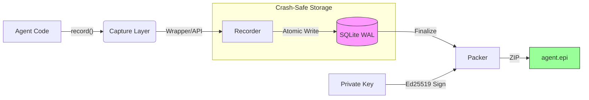

<p align="center">
  
  <br>
  <h1 align="center">EPI</h1>
  <p align="center"><strong>The flight recorder for AI agents</strong></p>
  <p align="center">
    <em>Capture, seal, and verify every decision your agents make — offline, tamper-proof, forever.</em>
  </p>
</p>

---

<h3 align="center">AI agents fail silently. Here is cryptographic replay.</h3>

<p align="center">
  <!-- TODO: Link this to the 60-second demo video -->
  <a href="#">
    
  </a>
</p>

---

<p align="center">
  <a href="https://pypi.org/project/epi-recorder/"></a>
  <a href="https://pepy.tech/project/epi-recorder"></a>
  <a href="https://github.com/mohdibrahimaiml/epi-recorder"></a>
  <a href="LICENSE"></a>
  <a href="https://github.com/mohdibrahimaiml/epi-recorder/stargazers"></a>
</p>

<p align="center">
  <strong>
    <a href="#quick-start">Quick Start</a> · 
    <a href="docs/EPI-SPEC.md">Specification</a> · 
    <a href="docs/CLI.md">CLI Reference</a> · 
    <a href="CHANGELOG.md">Changelog</a> · 
    <a href="https://epilabs.org">Website</a>
  </strong>
</p>

---

## Why EPI?

Production agents fail in ways traditional logging can't capture.

A LangGraph agent processes 47 steps overnight. Step 31 makes a bad decision that cascades into failure. CloudWatch logs expired. You have no idea what the agent was "thinking."

**EPI captures everything** — every prompt, every response, every tool call, every state transition — sealed into a single, portable, cryptographically signed file. Open it a year later. Debug it locally. Present it in an audit. No cloud required.

```python
pip install epi-recorder
```

---

## Quick Start

### Record any LLM call in 3 lines

```python
from epi_recorder import record, wrap_openai
from openai import OpenAI

client = wrap_openai(OpenAI())

with record("my_agent.epi"):
    response = client.chat.completions.create(
        model="gpt-4",
        messages=[{"role": "user", "content": "Plan a trip to Tokyo"}]
    )
```

**What gets captured:** full prompt & response, token usage & estimated cost, timestamps & model info, complete environment snapshot, and an Ed25519 signature.

### Inspect the results

```bash
epi view my_agent.epi    # Opens in browser — no login, no cloud, no internet
epi verify my_agent.epi  # Cryptographic integrity check
```

---

## 🆕 New in v2.6.0 — Framework Integrations

EPI now plugs directly into the tools you already use. **Zero refactoring required.**

### LiteLLM — 100+ Providers in One Line

```python
import litellm
from epi_recorder.integrations.litellm import EPICallback

litellm.callbacks = [EPICallback()]  # That's it — all calls are now recorded

response = litellm.completion(model="gpt-4", messages=[...])
response = litellm.completion(model="claude-3-opus", messages=[...])
response = litellm.completion(model="ollama/llama3", messages=[...])
# Every call → signed .epi evidence
```

### LangChain — Full Event Capture

```python
from langchain_openai import ChatOpenAI
from epi_recorder.integrations.langchain import EPICallbackHandler

llm = ChatOpenAI(model="gpt-4", callbacks=[EPICallbackHandler()])
result = llm.invoke("Analyze this contract for risk...")
# Captures: LLM calls, tool invocations, chain steps, retriever queries, agent decisions
```

### OpenAI Streaming — Real-Time Evidence

```python
from epi_recorder import record, wrap_openai
from openai import OpenAI

client = wrap_openai(OpenAI())

with record("stream_demo.epi"):
    stream = client.chat.completions.create(
        model="gpt-4", stream=True,
        messages=[{"role": "user", "content": "Write a poem"}]
    )
    for chunk in stream:
        print(chunk.choices[0].delta.content or "", end="")
# Chunks yielded in real-time, assembled response logged with full token usage
```

### pytest Plugin — Evidence per Test

```bash
pip install epi-recorder
pytest --epi                    # Generates signed .epi per test
pytest --epi --epi-dir=evidence # Custom output directory
```

```
======================== EPI Evidence Summary ========================
  ✓ test_auth_flow.epi (signed, 12 steps)
  ✓ test_payment.epi (signed, 8 steps)
  ✓ test_refund.epi (signed, 6 steps)
======================================================================
```

### GitHub Action — CI/CD Verification

```yaml
# .github/workflows/verify.yml
- name: Verify EPI evidence
  uses: mohdibrahimaiml/epi-recorder/.github/actions/verify-epi@main
  with:
    path: ./evidence
    fail-on-tampered: true
```

### OpenTelemetry — Bridge to Existing Infra

```python
from epi_recorder.integrations.opentelemetry import setup_epi_tracing

setup_epi_tracing(service_name="my-agent")
# All OTel spans → signed .epi files automatically
```

### Global Install — Record Everything

```bash
epi install --global    # All Python processes now auto-record
epi uninstall --global  # Clean removal, one command
```

Set `EPI_AUTO_RECORD=0` to disable without uninstalling.

---

## Architecture



**Design principles:**

| Principle | How |
|:----------|:----|
| **Crash-safe** | SQLite WAL — no data loss, even if agents crash mid-execution |
| **Explicit capture** | Evidence is intentional and reviewable in code |
| **Cryptographic proof** | Ed25519 signatures (RFC 8032) that can't be forged or backdated |
| **Offline-first** | Zero cloud dependency — works in air-gapped environments |
| **Framework-native** | Plugs into LiteLLM, LangChain, OpenTelemetry, pytest — no refactoring |

---

## Supported Providers & Frameworks

### Direct Wrappers

| Provider | Integration | Streaming |
|:---------|:------------|:----------|
| **OpenAI** | `wrap_openai()` | ✅ Real-time chunk capture |
| **Anthropic** | `wrap_anthropic()` | ✅ |
| **Google Gemini** | Explicit API | — |
| **Ollama** (local) | `wrap_openai()` with local endpoint | ✅ |
| **Any HTTP LLM** | `log_llm_call()` explicit API | — |

### Framework Integrations

| Framework | Integration | Coverage |
|:----------|:------------|:---------|
| **LiteLLM** | `EPICallback` | 100+ providers, one line |
| **LangChain** | `EPICallbackHandler` | LLM, tools, chains, retrievers, agents |
| **LangGraph** | `EPICheckpointSaver` | Native checkpoint backend |
| **OpenTelemetry** | `EPISpanExporter` | Span → .epi conversion |
| **pytest** | `--epi` flag | Signed evidence per test |
| **GitHub Actions** | `verify-epi` action | CI/CD pipeline verification |

---

## Key Features

### Async Support

Non-blocking I/O for LangGraph, AutoGen, and async-first frameworks:

```python
async with record("agent.epi"):
    response = await async_client.chat.completions.create(...)
    await epi.alog_step("custom.event", {"reasoning": "..."})
```

### Local LLM Support

Record against Ollama for free, unlimited development:

```python
client = wrap_openai(OpenAI(
    base_url="http://localhost:11434/v1",
    api_key="ollama"
))

with record("test.epi"):
    response = client.chat.completions.create(
        model="deepseek-r1:7b",
        messages=[{"role": "user", "content": "Debug this code..."}]
    )
```

### Agent Analytics

Track performance across hundreds of runs:

```python
from epi_recorder import AgentAnalytics

analytics = AgentAnalytics("./production_runs")
summary = analytics.performance_summary()

print(f"Success rate: {summary['success_rate']:.1%}")
print(f"Avg cost: ${summary['avg_cost_per_run']:.3f}")
print(f"Most common error: {summary['top_errors'][0]}")

analytics.generate_report("dashboard.html")  # Interactive HTML dashboard
```

### LangGraph Checkpoint Integration

```python
from langgraph.graph import StateGraph
from epi_recorder.integrations import EPICheckpointSaver

graph = StateGraph(AgentState)
checkpointer = EPICheckpointSaver("my_agent.epi")

result = graph.invoke(
    {"messages": [HumanMessage(content="...")]},
    {"configurable": {"thread_id": "user_123"}},
    checkpointer=checkpointer
)
# Captures all state transitions, checkpoint metadata, and agent decision points
```

---

## The `.epi` File Format

An `.epi` file is a self-contained ZIP archive:

```
my_agent.epi
├── mimetype              # "application/epi+zip"
├── manifest.json         # Metadata + Ed25519 signature + content hashes
├── steps.jsonl           # Execution timeline (NDJSON)
├── environment.json      # Runtime environment snapshot
├── *.db                  # Crash-safe SQLite storage
└── viewer.html           # Self-contained offline viewer (opens in any browser)
```

| Property | Detail |
|:---------|:-------|
| **Signatures** | Ed25519 (RFC 8032) |
| **Hashing** | SHA-256 content addressing |
| **Key Storage** | Local keyring, user-controlled |
| **Verification** | Client-side, zero external dependencies |
| **Viewer** | Embedded HTML — works offline forever |

See **[EPI Specification](docs/EPI-SPEC.md)** for technical details.

---

## Why EPI vs. Alternatives

EPI is not an observability dashboard. It's a **durable execution artifact system.**

| | **EPI** | LangSmith | Arize | W&B |
|:--|:--------|:----------|:------|:----|
| **Works offline** | ✅ Air-gapped ready | ❌ Cloud required | ❌ Cloud required | ❌ Cloud required |
| **Tamper-proof** | ✅ Ed25519 signatures | ❌ | ❌ | ❌ |
| **Open format** | ✅ `.epi` spec | ❌ Proprietary | ❌ Proprietary | ❌ Proprietary |
| **Agent state** | ✅ Full checkpoints | Traces only | Predictions only | Experiments only |
| **Compliance** | ✅ EU AI Act, FDA, SEC | Limited | Limited | Not designed |
| **Local LLMs** | ✅ Ollama, llama.cpp | ❌ | ❌ | ❌ |
| **CI/CD native** | ✅ GitHub Action + pytest | ❌ | ❌ | ❌ |
| **Framework hooks** | ✅ LiteLLM, LangChain, OTel | LangChain only | ❌ | ❌ |
| **Cost** | **Free** (MIT) | $99+/mo | Custom | $50+/mo |

> **EPI complements these tools.** Use LangSmith for live traces, EPI for durable evidence.

---

## Use Cases

### 🔧 Developer Workflow

- Debug multi-step agent failures with full decision tree visibility
- A/B test prompts and models with side-by-side `.epi` comparison
- Track agent performance over time (success rates, costs, errors)
- Replay production failures locally with Ollama
- Share `.epi` files with teammates — they open in any browser

### 🏢 Enterprise Compliance

- **EU AI Act** — tamper-evident audit trails with cryptographic proof
- **FDA / Healthcare** — signed decision records for AI-assisted diagnostics
- **Financial services (SEC)** — litigation-grade evidence for automated trading
- **Data governance** — automatic PII redaction with `security.redaction` steps
- **Air-gapped deployment** — no internet required, ever

### 🔌 Works With

LangGraph · LangChain · LiteLLM · AutoGen · CrewAI · OpenTelemetry · pytest · GitHub Actions · Ollama · Any Python agent

---

## CLI Reference

| Command | Purpose |
|:--------|:--------|
| `epi run <script.py>` | Record execution to `.epi` |
| `epi verify <file.epi>` | Verify integrity and signature |
| `epi view <file.epi>` | Open in browser viewer |
| `epi keys list` | Manage signing keys |
| `epi debug <file.epi>` | Heuristic analysis |
| `epi chat <file.epi>` | Natural language querying |
| `epi install --global` | Auto-record all Python processes |
| `epi uninstall --global` | Remove auto-recording |

See **[CLI Reference](docs/CLI.md)** for full documentation.

---

## Release History

| Version | Date | Highlights |
|:--------|:-----|:-----------|
| **2.6.0** | 2026-02-20 | **Framework integrations** — LiteLLM, LangChain, OpenTelemetry, pytest plugin, GitHub Action, streaming support, global install |
| **2.5.0** | 2026-02-13 | Anthropic Claude wrapper, path resolution fix |
| **2.4.0** | 2026-02-12 | Agent Analytics, async/await, LangGraph, Ollama |
| **2.3.0** | 2026-02-06 | Explicit API, wrapper clients |
| **2.2.0** | 2026-01-30 | SQLite WAL, async support, thread safety |
| **2.1.3** | 2026-01-24 | Google Gemini support |
| **1.0.0** | 2025-12-15 | Initial release |

See **[CHANGELOG.md](./CHANGELOG.md)** for detailed release notes.

---

## Roadmap

**Current (v2.6.0):**
- ✅ Framework-native integrations (LiteLLM, LangChain, OpenTelemetry)
- ✅ CI/CD verification (GitHub Action, pytest plugin)
- ✅ OpenAI streaming support
- ✅ Global install for automatic recording

**Next:**
- 🔜 Time-travel debugging (step through any past run)
- 🔜 Team collaboration features
- 🔜 Managed cloud platform (optional)
- 🔜 VS Code extension for `.epi` file viewing

---

## Documentation

| Document | Description |
|:---------|:------------|
| **[EPI Specification](docs/EPI-SPEC.md)** | Technical specification for `.epi` format |
| **[CLI Reference](docs/CLI.md)** | Command-line interface documentation |
| **[CHANGELOG](CHANGELOG.md)** | Release notes |
| **[Contributing](CONTRIBUTING.md)** | Contribution guidelines |
| **[Security](SECURITY.md)** | Security policy and vulnerability reporting |

---

## Beta Program

We're looking for teams running agents in production.

**You get:** priority support, free forever, custom integrations.

**[Apply for Beta Access →](https://www.epilabs.org/contact.html)**

---

## Contributing

```bash
git clone https://github.com/mohdibrahimaiml/epi-recorder.git
cd epi-recorder
pip install -e ".[dev]"
pytest
```

See **[CONTRIBUTING.md](./CONTRIBUTING.md)** for guidelines.

---

## Traction

**6,500+ downloads** in 10 weeks · **v2.6.0** shipped Feb 2026

> *"EPI saved us 4 hours debugging a production agent failure."*
> — ML Engineer, Fintech

> *"The LangGraph integration is killer. Zero config."*
> — AI Platform Team Lead

---

## License

MIT License. See **[LICENSE](./LICENSE)**.

<p align="center">
  <strong>Built by <a href="https://epilabs.org">EPI Labs</a></strong><br>
  <em>Making AI agent execution verifiable.</em>
</p>
