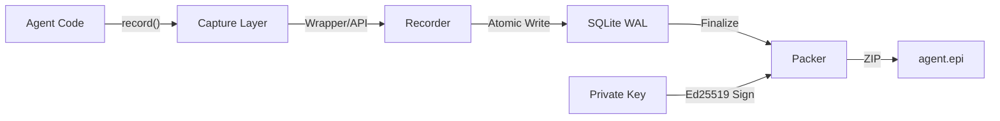

<p align="center">
  
  <br>
  <h1 align="center">EPI</h1>
  <p align="center"><strong>Capture any AI agent run into one portable <code>.epi</code> file you can open, share, and verify anywhere.</strong></p>
  <p align="center">
    <em>Use <code>.epi</code> as the bug report artifact for AI systems. No cloud. No login. No internet required.</em>
  </p>
</p>

---

<p align="center">
  <a href="https://pypi.org/project/epi-recorder/"></a>
  <a href="https://pepy.tech/project/epi-recorder"></a>
  <a href="https://pypi.org/project/epi-recorder/"></a>
  <a href="https://github.com/mohdibrahimaiml/epi-recorder/blob/main/LICENSE"></a>
  <a href="https://github.com/mohdibrahimaiml/epi-recorder/stargazers"></a>
</p>

<p align="center">
  <a href="https://colab.research.google.com/github/mohdibrahimaiml/epi-recorder/blob/main/examples/epi_recorder_colab_demo.ipynb">
    
  </a>
  &nbsp;
  <a href="https://epilabs.org/verify">
    
  </a>
</p>

<p align="center">
  <strong>
    <a href="#install">Install</a> ·
    <a href="#get-started-in-10-minutes">Get Started</a> ·
    <a href="#add-to-your-code">Add to Your Code</a> ·
    <a href="#pytest-plugin">pytest</a> ·
    <a href="#framework-integrations">Integrations</a> ·
    <a href="docs/SHARE-A-FAILURE.md">Share a Failure</a> ·
    <a href="docs/CONNECT.md">Team Review</a> ·
    <a href="docs/EPI-SPEC.md">Specification</a> ·
    <a href="docs/CLI.md">CLI Reference</a> ·
    <a href="docs/POLICY.md">Policy Guide</a> ·
    <a href="CHANGELOG.md">Changelog</a> ·
    <a href="https://epilabs.org">Website</a>
  </strong>
</p>

---

## Install

```bash
pip install epi-recorder
```

---

## Get Started in 10 Minutes

**Option A: On your machine (60 seconds)**

```bash
pip install epi-recorder
epi demo
```

Runs a sample refund workflow and gives you the full developer repro loop:

1. Capture an AI agent run into a portable `.epi` artifact
2. Open the flagged case in the browser review view
3. Approve, reject, or escalate — like a teammate reviewing a bug
4. Export and cryptographically verify the same `.epi` file

> Already have an OpenAI key? Set `OPENAI_API_KEY` and the demo uses the real API.

**Option B: In your browser (no install)**

[](https://colab.research.google.com/github/mohdibrahimaiml/epi-recorder/blob/main/examples/epi_recorder_colab_demo.ipynb)

Click the badge above. No local setup. The notebook runs `pip install epi-recorder` inside Colab and walks through the same engineering flow: clean run → failing run → browser review → verification → tamper check.

**Option C: Verify an existing .epi file**

Drag and drop any `.epi` file at [epilabs.org/verify](https://epilabs.org/verify) — no install, no login, verification runs entirely in your browser.

**Insurance design-partner demo**

```bash
cd examples/starter_kits/insurance_claim
python agent.py
epi view insurance_claim_case.epi
epi export-summary summary insurance_claim_case.epi
epi share insurance_claim_case.epi
```

Simulates a claim denial with fraud check, coverage review, human approval, denial reason capture, and a printable Decision Record.

---

## Use EPI as a Bug Report Artifact

When an agent run goes wrong, create one `.epi` file and hand it to the next engineer.

```text
capture the run → open it in the browser → verify it → attach it to an issue or PR
```

```bash
epi verify my_agent.epi
epi share my_agent.epi   # returns a browser link when the share service is deployed/configured
```

Guides:

- [Share one failure with `.epi`](docs/SHARE-A-FAILURE.md)
- [Use `pytest --epi` for agent regressions](docs/PYTEST-AGENT-REGRESSIONS.md)
- [Framework integrations in 5 minutes](docs/FRAMEWORK-INTEGRATIONS-5-MINUTES.md)

---

## Add to Your Code

```python
from epi_recorder import record, wrap_openai
from openai import OpenAI

client = wrap_openai(OpenAI())

with record("my_agent.epi"):
    response = client.chat.completions.create(
        model="gpt-4o-mini",
        messages=[{"role": "user", "content": "Plan a trip to Tokyo"}]
    )
```

Open it:

```bash
epi view my_agent.epi    # browser review view - offline, no login
epi view --extract ./review my_agent.epi   # writes a self-contained viewer.html for offline sharing
epi verify my_agent.epi  # cryptographic integrity check
```

### Record a full agent run with approvals and tool calls

```python
from epi_recorder import record

with record("refund_agent.epi", goal="Resolve customer refund safely") as epi:
    with epi.agent_run(
        "refund-agent",
        user_input="Refund order 123",
        session_id="sess-001",
        task_id="refund-123",
    ) as agent:
        agent.plan("Look up the order, confirm approval status, then decide.")
        agent.tool_call("lookup_order", {"order_id": "123"})
        agent.tool_result("lookup_order", {"status": "paid", "amount": 120})
        agent.approval_request("approve_refund", reason="Amount exceeds auto threshold")
        agent.approval_response("approve_refund", approved=True, reviewer="manager@company.com")
        agent.decision("approve_refund", confidence=0.91)
```

The resulting `.epi` shows lineage, approvals, tool calls, memory activity, and pause/resume checkpoints as one signed case file.

### Local LLM — free, unlimited development

```python
client = wrap_openai(OpenAI(
    base_url="http://localhost:11434/v1",
    api_key="ollama"
))

with record("test.epi"):
    response = client.chat.completions.create(model="llama3", messages=[...])
```

---

## What Compliance Buyers See

These are the three proof points for the insurance design-partner workflow.

### Decision Summary


### Human Review Flow


### Decision Record Export


---

## Three Common Developer Jobs

| Job | Start here |
|:----|:-----------|
| Debug one bad agent run | [`docs/SHARE-A-FAILURE.md`](docs/SHARE-A-FAILURE.md) |
| Attach `.epi` to a failing test or CI job | [`docs/PYTEST-AGENT-REGRESSIONS.md`](docs/PYTEST-AGENT-REGRESSIONS.md) |
| Capture runs from my framework with minimal code changes | [`docs/FRAMEWORK-INTEGRATIONS-5-MINUTES.md`](docs/FRAMEWORK-INTEGRATIONS-5-MINUTES.md) |

---

## Share With Your Team

```bash
epi connect open
```

The local team-review workspace starts on `http://localhost:8000`. Share the URL with a reviewer on the same machine, or use the LAN/ngrok patterns in [`docs/CONNECT.md`](docs/CONNECT.md) for remote review.

---

## pytest Plugin

One flag. Portable `.epi` repro for every failing test. No code changes.

```bash
pytest --epi                    # keeps signed .epi files for failing tests
pytest --epi --epi-dir=evidence # custom output directory
pytest --epi --epi-on-pass      # also keep passing test artifacts
```

Every test failure leaves a signed case file you can open, verify, and share. Attach the `.epi` to a GitHub issue or PR — the reviewer opens it in their browser, no EPI install required.

---

## The Full Loop

```text
define policy → run workflow → inspect fault analysis → confirm/dismiss in review → verify trust
```

```bash
epi policy init            # create epi_policy.json with control rules
python my_workflow.py      # run your instrumented script
epi view my_workflow.epi   # open in browser
epi review my_workflow.epi # add human review notes
epi verify my_workflow.epi # cryptographic check
```

---

## Starter Kits

Production-shaped examples for common consequential workflows. Pick one, run it, then adapt to your code.

| Kit | What it covers |
|:----|:---------------|
| [`examples/starter_kits/refund/`](examples/starter_kits/refund/) | Refund approval agent with human sign-off, policy rules, and full audit trail |
| [`examples/starter_kits/insurance_claim/`](examples/starter_kits/insurance_claim/) | Insurance claim denial workflow with fraud checks, coverage review, human approval, and Decision Record export |

More kits coming: underwriting and support escalation.

---

## Why Engineers Use EPI

EPI is a portable repro layer for AI systems. When an agent run goes wrong, logs tell you *something* happened. EPI gives you one file you can hand to another engineer so they can inspect the run, review what happened, and verify the file still matches the original capture.

One `.epi` file answers:

- What actually happened, step by step?
- Which rule was active at the time?
- Did a human reviewer confirm or dismiss it?
- Is this case file still trustworthy, or was it tampered with?

EPI is not an observability dashboard. It sits beside observability as the durable, shareable artifact layer for debugging, review, and later trust checks.

## Why EPI vs. Alternatives

| | **EPI** | LangSmith | Arize | W&B |
|:--|:--------|:----------|:------|:----|
| **Works offline** | Yes — air-gapped ready | No — cloud required | No — cloud required | No — cloud required |
| **Tamper-proof** | Yes — Ed25519 signatures | No | No | No |
| **Open format** | Yes — `.epi` spec | No — proprietary | No — proprietary | No — proprietary |
| **Agent state** | Yes — full checkpoints | Traces only | Predictions only | Experiments only |
| **Compliance** | Yes — EU AI Act, FDA, SEC | Limited | Limited | Not designed |
| **Local LLMs** | Yes — Ollama, llama.cpp | No | No | No |
| **CI/CD native** | Yes — GitHub Action + pytest | No | No | No |
| **Framework hooks** | Yes — LiteLLM, LangChain, OTel | LangChain only | No | No |
| **Cost** | **Free** (MIT) | $99+/mo | Custom | $50+/mo |

> **EPI complements these tools.** Use LangSmith for live traces, EPI for durable evidence.

---

## For Compliance and Governance Teams

EPI is designed for teams facing real regulatory pressure:

- **EU AI Act** — tamper-evident audit trails with cryptographic proof
- **FDA / Healthcare** — signed decision records for AI-assisted diagnostics
- **Financial services (SEC, ECOA)** — litigation-grade evidence for automated decisions
- **Data governance** — automatic PII redaction with `security.redaction` steps
- **Air-gapped deployment** — no internet required, ever

The portability advantage: you can hand a regulator a single `.epi` file. They verify it at [epilabs.org/verify](https://epilabs.org/verify) — drag and drop, no login, no install. Verification runs client-side in their browser.

For enterprise architecture, see [docs/OPEN-CORE-ARCHITECTURE.md](docs/OPEN-CORE-ARCHITECTURE.md).
For self-hosted deployment, see [docs/SELF-HOSTED-RUNBOOK.md](docs/SELF-HOSTED-RUNBOOK.md).
For the hosted insurance pilot path, see [docs/HOSTED-PILOT-RUNBOOK.md](docs/HOSTED-PILOT-RUNBOOK.md).

---

## Framework Integrations

EPI fits the stack your AI platform team already uses. **Start with one workflow, not a rewrite.**

### LiteLLM — 100+ Providers in One Line

```python
import litellm
from epi_recorder.integrations.litellm import EPICallback

litellm.callbacks = [EPICallback()]  # all calls are now recorded

response = litellm.completion(model="gpt-4", messages=[...])
response = litellm.completion(model="claude-3-opus", messages=[...])
response = litellm.completion(model="ollama/llama3", messages=[...])
# every call → signed .epi evidence
```

### LangChain — Full Event Capture

```python
from langchain_openai import ChatOpenAI
from epi_recorder.integrations.langchain import EPICallbackHandler

llm = ChatOpenAI(model="gpt-4", callbacks=[EPICallbackHandler()])
result = llm.invoke("Analyze this contract for risk...")
# captures: LLM calls, tool invocations, chain steps, retriever queries, agent decisions
```

### OpenAI Streaming — Real-Time Evidence

```python
from epi_recorder import record, wrap_openai
from openai import OpenAI

client = wrap_openai(OpenAI())

with record("stream_demo.epi"):
    stream = client.chat.completions.create(
        model="gpt-4", stream=True,
        messages=[{"role": "user", "content": "Write a poem"}]
    )
    for chunk in stream:
        print(chunk.choices[0].delta.content or "", end="")
# chunks yielded in real-time, assembled response logged with full token usage
```

### GitHub Action — CI/CD Verification

```yaml
# .github/workflows/verify.yml
- name: Verify EPI evidence
  uses: mohdibrahimaiml/epi-recorder/.github/actions/verify-epi@main
  with:
    path: ./evidence
    fail-on-tampered: true
```

### OpenTelemetry — Bridge to Existing Infra

```python
from epi_recorder.integrations.opentelemetry import setup_epi_tracing

setup_epi_tracing(service_name="my-agent")
# all OTel spans → signed .epi files automatically
```

### LangGraph Checkpoint Integration

```python
from langgraph.graph import StateGraph
from epi_recorder.integrations import EPICheckpointSaver

graph = StateGraph(AgentState)
checkpointer = EPICheckpointSaver("my_agent.epi")

result = graph.invoke(
    {"messages": [HumanMessage(content="...")]},
    {"configurable": {"thread_id": "user_123"}},
    checkpointer=checkpointer
)
# captures all state transitions, checkpoint metadata, and agent decision points
```

### OpenAI Agents Event Bridge

```python
from epi_recorder import record
from epi_recorder.integrations import OpenAIAgentsRecorder

with record("support_agent.epi") as epi:
    with OpenAIAgentsRecorder(epi, agent_name="support-agent", user_input="Reset customer password") as recorder:
        for event in streamed_result.stream_events():
            recorder.consume(event)
```

Maps stream events into `agent.message`, `tool.call`, `tool.response`, `agent.handoff`, `agent.approval.request/response`, `agent.memory.read/write`, and `agent.decision`.

### Global Install — Record Everything

```bash
epi install --global    # all Python processes now auto-record
epi uninstall --global  # clean removal, one command
```

Set `EPI_AUTO_RECORD=0` to disable without uninstalling.

---

## Advanced / Operator Workflows

### Gateway path for AI infrastructure teams

```bash
epi gateway serve
epi gateway serve --users-file config/gateway-users.example.json
```

Point SDKs, adapters, or proxies at one capture endpoint. Supports OpenAI-compatible `/v1/chat/completions`, Anthropic-compatible `/v1/messages`, LiteLLM, and generic LLM adapters.

### Windows double-click support

```text
Recommended for Windows users:
  install epi-setup-<version>.exe

Developer path:
  pip install epi-recorder
  epi associate --system   # or: epi associate
```

---

## The `.epi` File Format

An `.epi` file is a self-contained ZIP archive:

```
my_agent.epi
├── mimetype               # "application/vnd.epi+zip"
├── manifest.json          # metadata + Ed25519 signature + content hashes
├── steps.jsonl            # execution timeline (NDJSON)
├── environment.json       # runtime environment snapshot
├── analysis.json          # optional fault-analysis output
├── policy.json            # optional embedded rulebook
├── policy_evaluation.json # optional control outcomes
├── review.json            # optional human review record
└── viewer.html            # self-contained offline viewer shell
```

| Property | Detail |
|:---------|:-------|
| **Signatures** | Ed25519 (RFC 8032) |
| **Hashing** | SHA-256 content addressing |
| **Key storage** | Local keyring, user-controlled |
| **Verification** | Client-side, zero external dependencies |
| **Viewer** | Embedded HTML — works offline forever |

See **[EPI Specification](docs/EPI-SPEC.md)** for technical details.

---

## Architecture


```mermaid
flowchart LR
    A["Agent Code"] -->|"record()"| B["Capture Layer"]
    B -->|"Wrapper/API"| C["Recorder"]
    C -->|"Atomic Write"| D["SQLite WAL"]
    D -->|"Finalize"| E["Packer"]
    F["Private Key"] -->|"Ed25519 Sign"| E
    E -->|"ZIP"| G["agent.epi"]
```

| Principle | How |
|:----------|:----|
| **Crash-safe** | SQLite WAL — no data loss, even if agents crash mid-execution |
| **Explicit capture** | Evidence is intentional and reviewable in code |
| **Cryptographic proof** | Ed25519 signatures (RFC 8032) that can't be forged or backdated |
| **Offline-first** | Zero cloud dependency — works in air-gapped environments |
| **Framework-native** | Plugs into LiteLLM, LangChain, OpenTelemetry, pytest — no refactoring |

---

## Supported Providers & Frameworks

### Direct Wrappers

| Provider | Integration | Streaming |
|:---------|:------------|:----------|
| **OpenAI** | `wrap_openai()` | Yes — real-time chunk capture |
| **Anthropic** | `wrap_anthropic()` | Yes |
| **Google Gemini** | Explicit API | — |
| **Ollama** (local) | `wrap_openai()` with local endpoint | Yes |
| **Any HTTP LLM** | `log_llm_call()` explicit API | — |

### Framework Integrations

| Framework | Integration | Coverage |
|:----------|:------------|:---------|
| **OpenAI Agents** | `OpenAIAgentsRecorder` | Stream event bridge into agent-native EPI steps |
| **LiteLLM** | `EPICallback` | 100+ providers, one line |
| **LangChain** | `EPICallbackHandler` | LLM, tools, chains, retrievers, agents |
| **LangGraph** | `EPICheckpointSaver` | Native checkpoint backend |
| **OpenTelemetry** | `EPISpanExporter` | Span → .epi conversion |
| **pytest** | `--epi` flag | Signed evidence per test |
| **GitHub Actions** | `verify-epi` action | CI/CD pipeline verification |

---

## CLI Reference

| Command | Purpose |
|:--------|:--------|
| `epi run <script.py>` | Record execution to `.epi` |
| `epi verify <file.epi>` | Verify integrity and signature |
| `epi view <file.epi>` | Open in browser review view |
| `epi share <file.epi>` | Upload and return a hosted browser link |
| `epi export-summary summary <file.epi>` | Generate a printable HTML Decision Record |
| `epi keys list` | Manage signing keys |
| `epi debug <file.epi>` | Heuristic analysis for mistakes and loops |
| `epi chat <file.epi>` | Natural language querying |
| `epi install --global` | Auto-record all Python processes |
| `epi uninstall --global` | Remove auto-recording |
| `epi associate` | Register OS file association for double-clicking |
| `epi unassociate` | Remove OS file association |

See **[CLI Reference](docs/CLI.md)** for full documentation.

---

## What Changed in v3.0.2

- **Extracted viewer is now truly offline** - `epi view --extract` vendors JSZip directly into the generated `viewer.html`, so the extracted review surface has no remote script dependency and works in air-gapped environments
- **Viewer runtime packaging is now consistent** - the embedded artifact viewer, extracted viewer, and browser policy editor all use the same inlined browser runtime path
- **Release audit is stricter** - the packaged wheel now fails release audit if the vendored viewer runtime asset is missing

Older release notes live in [CHANGELOG.md](CHANGELOG.md).

---

## Roadmap

**Current (v3.0.2):**
- [x] Framework-native integrations (LiteLLM, LangChain, OpenTelemetry)
- [x] CI/CD verification (GitHub Action, pytest plugin)
- [x] OpenAI streaming support
- [x] Global install for automatic recording
- [x] Agent-first recording and review surfaces
- [x] Policy v2 schema with enforcement and fault analysis
- [x] Comprehensive Colab demo notebook

**Next:**
- [ ] Time-travel debugging (step through any past run)
- [ ] Team collaboration features
- [ ] Managed cloud platform (optional)
- [ ] VS Code extension for `.epi` file viewing

---

## Documentation

| Document | Description |
|:---------|:------------|
| **[EPI Specification](docs/EPI-SPEC.md)** | Technical specification for the `.epi` format |
| **[CLI Reference](docs/CLI.md)** | Command-line interface documentation |
| **[Policy Guide](docs/POLICY.md)** | How policy, fault analysis, and rulebooks work |
| **[Policy v2 Design](docs/POLICY-V2-DESIGN.md)** | Enterprise policy model with layers, enforcement modes, and richer control types |
| **[CHANGELOG](CHANGELOG.md)** | Release notes |
| **[Contributing](CONTRIBUTING.md)** | Contribution guidelines |
| **[Security](SECURITY.md)** | Security policy and vulnerability reporting |

---

## Contributing

```bash
git clone https://github.com/mohdibrahimaiml/epi-recorder.git
cd epi-recorder
pip install -e ".[dev]"
pytest
```

See **[CONTRIBUTING.md](./CONTRIBUTING.md)** for guidelines.

---

## License

MIT License. See **[LICENSE](./LICENSE)**.

<p align="center">
  <strong>Built by <a href="https://epilabs.org">EPI Labs</a></strong><br>
  <em>Making AI agent execution verifiable.</em>
</p>
