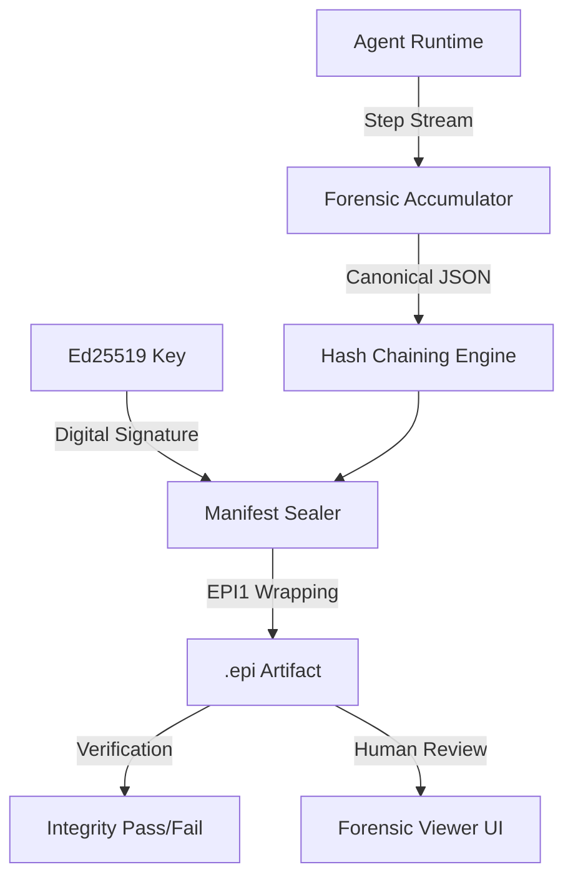

<p align="center">
  
  <br>
  <h1 align="center">EPI: Evidence Packaged Infrastructure</h1>
  <p align="center"><strong>The Forensic Protocol for Verifiable AI Execution.</strong></p>
  <p align="center">
    <em>EPI (v4.1.0) is a cryptographically sealed container format designed to transform autonomous AI agent runs into immutable, reviewable, and legally-defensible evidence.</em>
  </p>
</p>

<p align="center">
  <a href="https://pypi.org/project/epi-recorder/"></a>
  <a href="https://github.com/mohdibrahimaiml/epi-recorder/actions/workflows/release-gate.yml"></a>
  <a href="https://github.com/mohdibrahimaiml/epi-recorder/blob/main/LICENSE"></a>
  <a href="https://github.com/astral-sh/ruff"></a>
</p>

---

## 🏛️ The Institutional Standard for AI Accountability

Logs are transient. Evidence is permanent. As AI agents move from "chatbots" to "authorized operators" in banking, healthcare, and infrastructure, the industry requires a **Forensic Chain of Custody**. 

EPI (Evidence Packaged Infrastructure) provides a standardized binary container (`.epi`) that seals agent execution traces with the same rigor used in digital forensics and supply chain integrity (SCITT).

### 🇪🇺 Regulatory Readiness: EU AI Act & Beyond
EPI is engineered to meet the stringent "Record-Keeping" and "Technical Documentation" requirements of the **EU AI Act**:
- **Article 12 (Automated Logging)**: Continuous, tamper-evident capture of AI high-risk systems.
- **Article 13 (Transparency)**: Human-interpretable decision trails via the self-contained Forensic Viewer.
- **Article 14 (Human Oversight)**: Direct support for human attestation and "Approved By" metadata binding.
- **NIST AI RMF**: Evidence packaging for the MEASURE and MANAGE functions of AI Risk Management.

---

## 💎 Industry Use Cases

| Sector | High-Stakes Scenario | EPI's Value |
| :--- | :--- | :--- |
| **FinTech** | **Automated Underwriting** | Capture every credit decision into a signed `.epi` artifact to satisfy SEC/FINRA audits. |
| **LegalTech** | **Document Discovery** | Prove the provenance and reasoning of AI-assisted legal research for court admissibility. |
| **Cybersecurity** | **Incident Response** | Use EPI to record autonomous SOC agents, ensuring tool invocations are auditable after a breach. |
| **SaaS** | **The "10k Error" Debug** | Attach a 100% reproducible `.epi` repro to bug reports instead of raw, contextless logs. |
| **Enterprise** | **AGT Interoperability** | Bridge the gap between AGT evidence and portable, verifiable case files for global review. |

---

## 📦 Protocol Quick Start

```bash
pip install epi-recorder
```

**The 60-Second Demo:**
```bash
epi demo
```
This simulates a real-world refund agent, generates a signed artifact, opens the **Forensic Viewer**, and validates the **Ed25519/SHA-256** hash chain.

---

## 🛠️ Developer SDK

EPI integrates at the protocol layer, capturing logic without restructuring your application.

```python
from epi_recorder import record, wrap_openai
from openai import OpenAI

# 1. Seamless Instrumentation
client = wrap_openai(OpenAI())

# 2. Immutable Context Recording
with record("compliance-case.epi", workflow_name="Treasury-Move-V1"):
    response = client.chat.completions.create(
        model="gpt-4o",
        messages=[{"role": "user", "content": "Execute high-value wire transfer."}]
    )
```

**Forensic Operations:**
```bash
epi verify case.epi  # Validate hash chain, signatures, and temporal consistency
epi view case.epi    # Launch the air-gapped Forensic Viewer UI
epi keys list        # Manage organizational Ed25519 signing keys
```

---

## 🏗️ Technical Architecture: The Forensic Envelope

EPI artifacts are **Polyglot Binary Containers**—they are valid `.epi` files (MIME: `application/vnd.epi`) that encapsulate a forensic ZIP payload.

```text
artifact.epi
├── [Envelope] EPI1 Binary Header (Envelope Version, Payload SHA-256)
└── [Payload] Signed Forensic Archive
    ├── mimetype (MUST be first, uncompressed: "application/vnd.epi+zip")
    ├── manifest.json (Metadata + Ed25519 Signatures + Content Hashes)
    ├── steps.jsonl (Immutable Timeline with prev_hash Chaining)
    ├── environment.json (Verified Host, Runtime, and OS Snapshot)
    └── viewer.html (Baked-in, Self-Contained Offline UI)
```


```mermaid
graph TD
    A[Agent Runtime] -->|Step Stream| B[Forensic Accumulator]
    B -->|Canonical JSON| C[Hash Chaining Engine]
    D[Ed25519 Key] -->|Digital Signature| E[Manifest Sealer]
    C --> E
    E -->|EPI1 Wrapping| F[.epi Artifact]
    F -->|Verification| G[Integrity Pass/Fail]
    F -->|Human Review| H[Forensic Viewer UI]
```

---

## 🔌 Ecosystem Integrations

EPI acts as a universal evidence layer for the entire AI stack:

- **Frameworks**: Native support for **LiteLLM**, **LangChain**, **LangGraph**, **CrewAI**, and **AutoGen**.
- **Observability**: **OpenTelemetry** exporter for turning spans into signed artifacts.
- **Testing**: **pytest --epi** plugin for capturing forensic evidence on test failures.
- **Identity**: **DID:WEB** binding to prove organizational ownership of evidence.
- **Enterprise**: Microsoft **AGT** importer/exporter and **SCITT** supply-chain alignment.

---

## 📑 Technical Documentation

- 📄 **[Protocol Specification](docs/EPI-SPEC.md)**: Deep dive into the `EPI1` wire format.
- 🏛️ **[Governance Guide](docs/POLICY.md)**: How to define and enforce "Governance Controls".
- 🇪🇺 **[Regulatory Prep](docs/EU-AI-ACT-EVIDENCE-PREP.md)**: Artifact workflows for the EU AI Act.
- 🛠️ **[CLI Reference](docs/CLI.md)**: Comprehensive guide for the `epi` toolchain.

---

## 🤝 Community & Institutional Support

Built by **EPI Labs**.  
*Ensuring that as AI moves faster, accountability stays ahead.*

[MIT License](LICENSE) | [Contributing](CONTRIBUTING.md) | [Security Policy](SECURITY.md)
