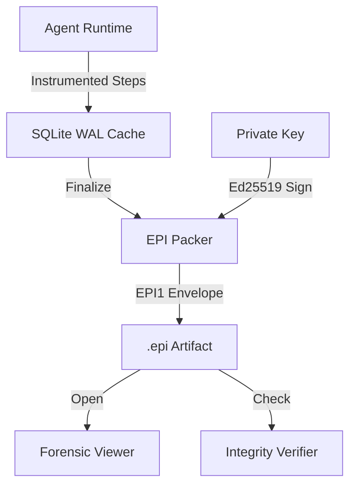

<p align="center">
  
  <br>
  <h1 align="center">EPI: Evidence Packaged Infrastructure</h1>
  <p align="center"><strong>The forensic bug report artifact for AI systems.</strong></p>
  <p align="center">
    <em>Capture any AI agent run into one portable <code>.epi</code> file you can open, share, and verify anywhere.</em>
  </p>
</p>

<p align="center">
  <a href="https://pypi.org/project/epi-recorder/"></a>
  <a href="https://github.com/mohdibrahimaiml/epi-recorder/actions/workflows/release-gate.yml"></a>
  <a href="https://github.com/mohdibrahimaiml/epi-recorder/blob/main/LICENSE"></a>
  <a href="https://github.com/astral-sh/ruff"></a>
</p>

---

## 🚀 Why EPI?

Logs are **brittle, non-portable, and easily tampered with**. In high-stakes AI applications—finance, healthcare, legal—standard logging isn't enough. 

EPI turns AI execution into a **forensic artifact**:
- **Portable**: One file contains the trace, environment, policy, and a self-contained viewer.
- **Verifiable**: Cryptographically sealed with **Ed25519** and **SHA-256**.
- **Offline-First**: No cloud, no login, no internet required to view or verify.
- **Governance-Ready**: Designed for **EU AI Act** transparency and **NIST AI RMF** compliance.

---

## 📦 Install

```bash
pip install epi-recorder
```

## ⏱️ Get Started in 60 Seconds

```bash
epi demo
```

This runs a sample workflow and demonstrates the full **Capture → View → Verify** loop:
1. **Capture**: Records a multi-step agent run into `refund_case.epi`.
2. **View**: Opens the **Forensic Viewer** in your browser (offline).
3. **Verify**: Checks the cryptographic integrity and signature.

---

## 🛠️ Core API

Capture any LLM-backed workflow with minimal code changes.

```python
from epi_recorder import record, wrap_openai
from openai import OpenAI

# 1. Wrap your client
client = wrap_openai(OpenAI())

# 2. Record the session
with record("my_agent.epi", workflow_name="Insurance Claim V4"):
    response = client.chat.completions.create(
        model="gpt-4o",
        messages=[{"role": "user", "content": "Assess this claim for risk."}]
    )
```

### Review and Verify
```bash
epi view my_agent.epi    # Open forensic investigation UI
epi verify my_agent.epi  # Run Ed25519 & hash-chain integrity check
```

---

## 🏗️ The `.epi` Forensic Container

EPI artifacts use a **binary envelope** (EPI1) that wraps a signed, forensic ZIP payload.

```text
my_run.epi
├── [Header] EPI1 (Magic, Length, SHA-256)
└── [Payload] Signed ZIP
    ├── mimetype (Forensic marker: must be first, uncompressed)
    ├── manifest.json (Metadata + Ed25519 Signature + File Hashes)
    ├── steps.jsonl (Immutable Timeline with prev_hash chaining)
    ├── environment.json (Host & Python snapshot)
    ├── governance_basis.json (The rulebook applied)
    └── viewer.html (Self-contained Offline UI)
```


```mermaid
graph TD
    A[Agent Runtime] -->|Instrumented Steps| B[SQLite WAL Cache]
    B -->|Finalize| C[EPI Packer]
    D[Private Key] -->|Ed25519 Sign| C
    C -->|EPI1 Envelope| E[.epi Artifact]
    E -->|Open| F[Forensic Viewer]
    E -->|Check| G[Integrity Verifier]
```

---

## 🔌 Framework Integrations

EPI acts as a universal evidence layer for the entire AI ecosystem.

- **LiteLLM**: `litellm.callbacks = [EPICallback()]`
- **LangChain**: `ChatOpenAI(..., callbacks=[EPICallbackHandler()])`
- **LangGraph**: `EPICheckpointSaver()` for stateful graph history.
- **OpenTelemetry**: `setup_epi_tracing()` to turn spans into artifacts.
- **pytest**: `pytest --epi` (automatic artifacts for failing tests).
- **Microsoft AGT**: `epi import agt <bundle>` (import external evidence).

---

## 🏛️ Governance & Compliance

EPI is built for the **Enterprise AI Stack**.

- **EU AI Act**: Direct support for **Article 12 (Logging)** and **Article 13 (Transparency)**.
- **NIST AI RMF**: Evidence packaging for MEASURE and MANAGE functions.
- **Forensic Redaction**: Automatic scrubbing of `sk-...` keys, bearer tokens, and PII.
- **DID:WEB Identity**: Bind artifacts to organizational identities (e.g., `did:web:gov.acme.com`).

---

## 📑 Documentation

- 📖 **[EPI Specification](docs/EPI-SPEC.md)**: The technical wire format.
- ⚖️ **[Governance Guide](docs/POLICY.md)**: Defining and enforcing AI rulebooks.
- 🇪🇺 **[EU AI Act Prep](docs/EU-AI-ACT-EVIDENCE-PREP.md)**: Regulatory evidence workflows.
- 🔌 **[Integration Guide](docs/FRAMEWORK-INTEGRATIONS-5-MINUTES.md)**: 5-minute setup for any stack.

---

## 🤝 Contributing

```bash
git clone https://github.com/mohdibrahimaiml/epi-recorder.git
pip install -e ".[dev]"
pytest
```

MIT License. Built by **EPI Labs**.  
*Making AI agent execution verifiable, portable, and trustworthy.*
