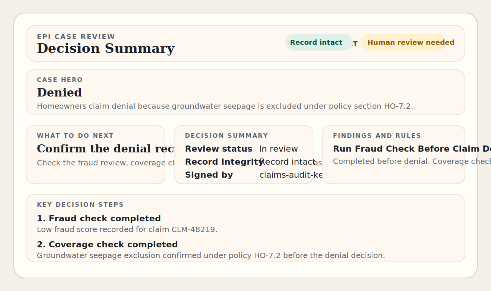
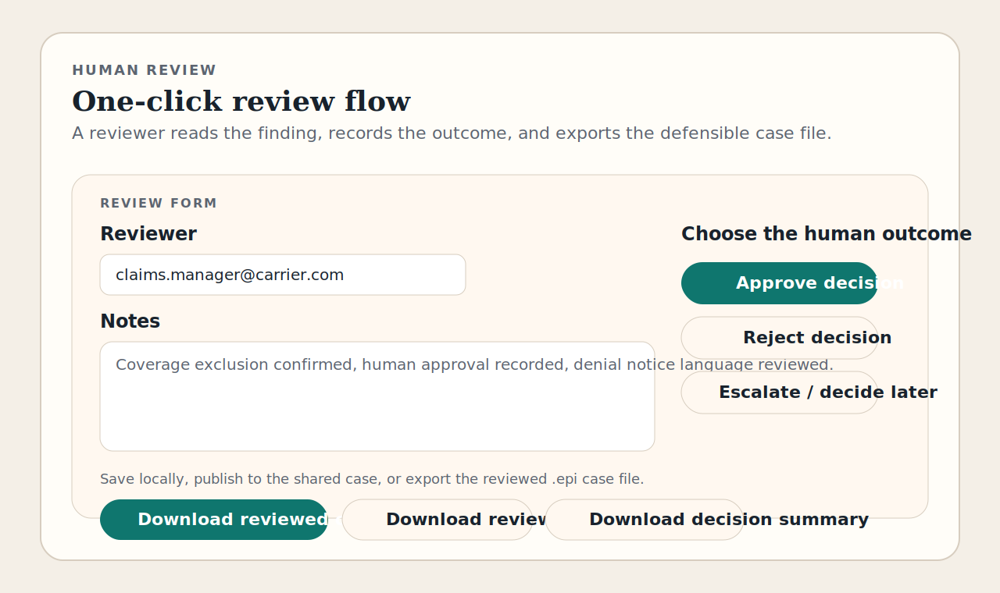
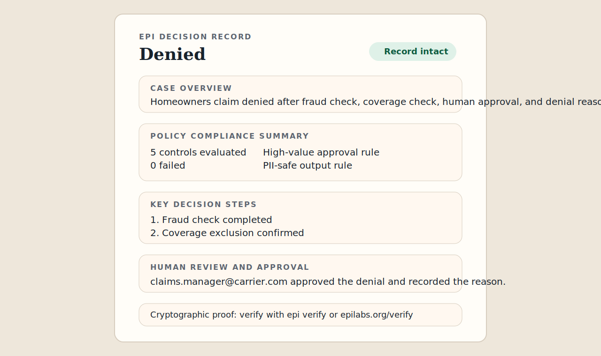
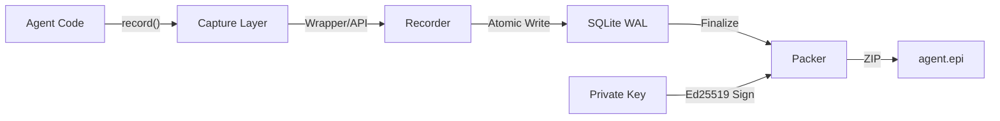

<p align="center">
  
  <br>
  <h1 align="center">EPI</h1>
  <p align="center"><strong>Capture any AI agent run into one portable <code>.epi</code> file you can open, share, and verify anywhere.</strong></p>
  <p align="center">
    <em>Use <code>.epi</code> as the bug report artifact for AI systems. No cloud. No login. No internet required.</em>
  </p>
</p>

---

<p align="center">
  <a href="https://pypi.org/project/epi-recorder/"></a>
  <a href="https://pepy.tech/project/epi-recorder"></a>
  <a href="https://pypi.org/project/epi-recorder/"></a>
  <a href="https://github.com/mohdibrahimaiml/epi-recorder/blob/main/LICENSE"></a>
  <a href="https://github.com/mohdibrahimaiml/epi-recorder/stargazers"></a>
</p>

<p align="center">
  <a href="https://colab.research.google.com/github/mohdibrahimaiml/epi-recorder/blob/main/colab_demo.ipynb">
    
  </a>
  &nbsp;
  <a href="https://epilabs.org/verify">
    
  </a>
</p>

<p align="center">
  <strong>
    <a href="#install">Install</a> ·
    <a href="#debug-a-run-in-10-minutes--no-api-key">Debug a Run</a> ·
    <a href="#use-epi-as-a-bug-report-artifact">Share a Failure</a> ·
    <a href="#add-to-your-code">Add to Your Code</a> ·
    <a href="#pytest-plugin">pytest</a> ·
    <a href="#framework-integrations">Integrations</a> ·
    <a href="docs/SHARE-A-FAILURE.md">Bug Reports</a> ·
    <a href="docs/CONNECT.md">Team Review</a> ·
    <a href="docs/EPI-SPEC.md">Specification</a> ·
    <a href="docs/CLI.md">CLI Reference</a> ·
    <a href="docs/POLICY.md">Policy Guide</a> ·
    <a href="CHANGELOG.md">Changelog</a> ·
    <a href="https://epilabs.org">Website</a>
  </strong>
</p>

---

## Install

```bash
pip install epi-recorder
```

---

## Debug a Run in 10 Minutes — No API Key

**Option A: On your machine (60 seconds)**

```bash
pip install epi-recorder
epi demo
```

This runs a sample refund workflow and gives you the full developer repro loop:

1. Capture one AI agent run into a portable `.epi` artifact
2. Open the flagged case in the browser review view
3. Approve, reject, or escalate it like a teammate reviewing a bug
4. Export and cryptographically verify the same `.epi` file

The refund flow is a concrete sample workflow, not the whole product. The point of the demo is to show how EPI turns one weird run into a portable repro you can open and share.

> Already have an OpenAI key? Set `OPENAI_API_KEY` and the demo uses the real API instead.

**Insurance design-partner demo**

If you want the insurance-specific workflow from the current design-partner push, run the starter kit instead:

```bash
cd examples/starter_kits/insurance_claim
python agent.py
epi view insurance_claim_case.epi
epi export-summary summary insurance_claim_case.epi
epi share insurance_claim_case.epi
```

That flow simulates a claim denial with a fraud check, coverage check, human approval, denial reason capture, and a printable Decision Record. By default the starter kit writes the artifact into `./epi-recordings/`; the `epi` commands above resolve the bare filename for you.

**Option B: In your browser (no install)**

[](https://colab.research.google.com/github/mohdibrahimaiml/epi-recorder/blob/main/colab_demo.ipynb)

Click the badge above to open [`colab_demo.ipynb`](https://github.com/mohdibrahimaiml/epi-recorder/blob/main/colab_demo.ipynb) from this repo in Google Colab. No local setup. The notebook installs `epi-recorder` inside the Colab runtime and walks through the same engineering flow: clean run → failing run → browser review → verification → tamper check.

**Option C: Verify an existing .epi file**

Drag and drop any `.epi` file at [epilabs.org/verify](https://epilabs.org/verify) — no install, no login, verification runs entirely in your browser.

---

## Use EPI as a Bug Report Artifact

When an agent run goes weird, create one `.epi` file and hand that to the next engineer.

```text
capture the run -> open it in the browser -> verify it -> attach it to an issue or PR
```

Typical pattern:

1. Run `epi demo`, `epi run my_agent.py`, `pytest --epi`, or a framework wrapper
2. Open the resulting `.epi` with `epi view`
3. Verify it with `epi verify`
4. Share it with `epi share my_agent.epi` or attach the raw file to a GitHub issue, PR discussion, Slack thread, or incident doc

Hosted share loop:

```bash
epi verify my_agent.epi
epi share my_agent.epi
```

When the hosted share service is configured, `epi share` uploads the already-validated case file and returns a browser link at `https://epilabs.org/cases/?id=...`.
The default hosted API target is `https://api.epilabs.org`; for self-hosted or staging setups, point `EPI_SHARE_API_URL` at your gateway.
Use it when a teammate needs the fastest possible "open the repro in a browser" path.

Guides:

- [Share one failure with `.epi`](docs/SHARE-A-FAILURE.md)
- [Use `pytest --epi` for agent regressions](docs/PYTEST-AGENT-REGRESSIONS.md)
- [Framework integrations in 5 minutes](docs/FRAMEWORK-INTEGRATIONS-5-MINUTES.md)

---

## Add to Your Code

```python
from epi_recorder import record, wrap_openai
from openai import OpenAI

client = wrap_openai(OpenAI())

with record("my_agent.epi"):
    response = client.chat.completions.create(
        model="gpt-4o-mini",
        messages=[{"role": "user", "content": "Plan a trip to Tokyo"}]
    )
```

**What EPI creates:** a portable `.epi` bug-report artifact with the decision timeline, environment snapshot, browser review view, and trust metadata. When rules are present, EPI also embeds `policy.json` and `analysis.json`. Human review can later add review notes without rewriting the original record.

Open it:

```bash
epi view my_agent.epi    # browser review view — offline, no login
epi verify my_agent.epi  # cryptographic integrity check
```

`epi view` is the canonical EPI review experience. Older desktop viewer surfaces remain legacy/internal compatibility paths and are not the recommended front door.

## What Compliance Buyers See

These are the three proof points for the insurance design-partner workflow.

### Decision Summary



### Human Review Flow



### Decision Record Export



## Three Common Developer Jobs

| Job | Start here |
|:----|:-----------|
| Debug one bad agent run | [`docs/SHARE-A-FAILURE.md`](docs/SHARE-A-FAILURE.md) |
| Attach `.epi` to a failing test or CI job | [`docs/PYTEST-AGENT-REGRESSIONS.md`](docs/PYTEST-AGENT-REGRESSIONS.md) |
| Capture runs from my framework with minimal code changes | [`docs/FRAMEWORK-INTEGRATIONS-5-MINUTES.md`](docs/FRAMEWORK-INTEGRATIONS-5-MINUTES.md) |

## Share With Your Team

```bash
epi connect open
```

The local team-review workspace starts on `http://localhost:8000` and talks to the local gateway on `http://127.0.0.1:8765`.
Share the opened browser URL with a same-machine reviewer, or use the LAN/ngrok patterns in [`docs/CONNECT.md`](docs/CONNECT.md) when someone else needs to open the workspace remotely.

---

### Record a full agent run with approvals and tool calls

```python
from epi_recorder import record

with record("refund_agent.epi", goal="Resolve customer refund safely") as epi:
    with epi.agent_run(
        "refund-agent",
        user_input="Refund order 123",
        session_id="sess-001",
        task_id="refund-123",
    ) as agent:
        agent.plan("Look up the order, confirm approval status, then decide.")
        agent.tool_call("lookup_order", {"order_id": "123"})
        agent.tool_result("lookup_order", {"status": "paid", "amount": 120})
        agent.approval_request("approve_refund", reason="Amount exceeds auto threshold")
        agent.approval_response("approve_refund", approved=True, reviewer="manager@company.com")
        agent.decision("approve_refund", confidence=0.91)
```

The resulting `.epi` shows lineage, approvals, tool calls, memory activity, and pause/resume checkpoints as one signed case file.

### Local LLM — free, unlimited development

```python
client = wrap_openai(OpenAI(
    base_url="http://localhost:11434/v1",
    api_key="ollama"
))

with record("test.epi"):
    response = client.chat.completions.create(model="llama3", messages=[...])
```

---

## pytest Plugin

One flag. Portable `.epi` repro for failing tests by default. No code changes.

```bash
pytest --epi                    # keeps signed .epi files for failing tests
pytest --epi --epi-dir=evidence # custom output directory
pytest --epi --epi-on-pass      # also keep passing test artifacts
```

Every test failure leaves a signed case file you can open, verify, and share. This is the fastest way to make `.epi` part of CI and PR debugging for multi-step agent behavior.

**Share a test failure**: Attach the `.epi` file to a GitHub issue or PR. Anyone can open it in their browser. No EPI install required on their end — the review view is embedded inside the file.

---

## The Full Loop

```text
define policy → run workflow → inspect fault analysis → confirm/dismiss in review → verify trust
```

```bash
epi policy init          # create epi_policy.json with control rules
python my_workflow.py    # run your instrumented script
epi view my_workflow.epi   # open in browser
epi review my_workflow.epi # add human review notes
epi verify my_workflow.epi # cryptographic check
```

---

## Starter Kits

Production-shaped examples for common consequential workflows. Pick one, run it, then adapt to your code.

| Kit | What it covers |
|:----|:---------------|
| [`examples/starter_kits/refund/`](examples/starter_kits/refund/) | Refund approval agent with human sign-off, policy rules, and full audit trail |
| [`examples/starter_kits/insurance_claim/`](examples/starter_kits/insurance_claim/) | Insurance claim denial workflow with fraud checks, coverage review, human approval, and Decision Record export |

More kits coming: underwriting and support escalation.

---

## Why Engineers Use EPI

EPI is a portable repro layer for AI systems. When an agent run goes wrong, logs tell you something happened. EPI gives you one file you can hand to another engineer so they can inspect the run, review what happened, and verify the file still matches the original capture.

One `.epi` file answers:

- What actually happened, step by step?
- Which rule was active at the time?
- Did a human reviewer confirm or dismiss it?
- Is this case file still trustworthy, or was it tampered with?

EPI is not an observability dashboard. It sits beside observability as the durable, shareable artifact layer for debugging, review, and later trust checks.

### Why EPI vs. Alternatives

| | **EPI** | LangSmith | Arize | W&B |
|:--|:--------|:----------|:------|:----|
| **Works offline** | Yes — air-gapped ready | No — cloud required | No | No |
| **Tamper-proof** | Yes — Ed25519 signatures | No | No | No |
| **Open format** | Yes — `.epi` spec | No — proprietary | No | No |
| **Cost** | **Free** (MIT) | $99+/mo | Custom | $50+/mo |

> EPI complements these tools. Use LangSmith for live traces, EPI for portable repro artifacts you can share later.

---

## For Compliance and Governance Teams

EPI is designed for teams facing real regulatory pressure:

- **EU AI Act** — tamper-evident audit trails with cryptographic proof
- **FDA / Healthcare** — signed decision records for AI-assisted diagnostics
- **Financial services (SEC, ECOA)** — litigation-grade evidence for automated decisions
- **Data governance** — automatic PII redaction with `security.redaction` steps
- **Air-gapped deployment** — no internet required, ever

The portability advantage: you can hand a regulator a single `.epi` file. They verify it at [epilabs.org/verify](https://epilabs.org/verify) — drag and drop, no login, no install, no calling you back. Verification runs client-side in their browser.

For the enterprise architecture boundary, see [docs/OPEN-CORE-ARCHITECTURE.md](docs/OPEN-CORE-ARCHITECTURE.md).
For self-hosted deployment and operator runbook, see [docs/SELF-HOSTED-RUNBOOK.md](docs/SELF-HOSTED-RUNBOOK.md).
For the hosted insurance pilot path on `epilabs.org` + `api.epilabs.org`, see [docs/HOSTED-PILOT-RUNBOOK.md](docs/HOSTED-PILOT-RUNBOOK.md).

---

## Advanced / Operator Workflows

### Gateway path for AI infrastructure teams

```bash
epi gateway serve
epi gateway serve --users-file config/gateway-users.example.json
```

Point SDKs, adapters, or proxies at one capture endpoint. Supports OpenAI-compatible `/v1/chat/completions`, Anthropic-compatible `/v1/messages`, LiteLLM, and generic LLM adapters. Keeps the `.epi` export path for proof and audit.

### Windows double-click support

`.epi` files contain an embedded offline viewer, but Windows needs a registered handler to open them by double-click.

```text
Recommended for Windows users:
  install epi-setup-<version>.exe

Developer path:
  pip install epi-recorder
  epi associate --system   # or: epi associate
```

---

## What Changed in v3.0.0

- **Notebook packaging correction**
  - `colab_demo.ipynb` and `EPI NEXUA VENTURES.ipynb` now ship in the GitHub repo and source distribution
  - the wheel remains focused on runtime/package code instead of installing demo notebooks into the environment
- **Release audit hardening**
  - the release gate now audits the source tarball and fails if the required notebooks are missing or old notebook snapshots leak into the release
- **2.8.9 runtime hotfixes preserved**
  - the Colab notebooks still walk through the current browser review and verification flow for generated artifacts
  - reusable approval policies still accept both `approval_id` and `id`
  - `applies_at` still accepts either a single intervention point or a list

EPI still stores the machine-readable rulebook as `epi_policy.json`, and `v3.0.0` rolls the current capture, sharing, policy, and reviewer work into the next major release line.

Older release notes live in [CHANGELOG.md](CHANGELOG.md).

For policy placement and rule design, see [docs/POLICY.md](docs/POLICY.md).

## Framework Integrations

EPI fits the stack your AI platform team already uses. **Start with one workflow, not a rewrite.**

### LiteLLM - 100+ Providers in One Line

```python
import litellm
from epi_recorder.integrations.litellm import EPICallback

litellm.callbacks = [EPICallback()]  # That's it - all calls are now recorded

response = litellm.completion(model="gpt-4", messages=[...])
response = litellm.completion(model="claude-3-opus", messages=[...])
response = litellm.completion(model="ollama/llama3", messages=[...])
# Every call -> signed .epi evidence
```

### LangChain - Full Event Capture

```python
from langchain_openai import ChatOpenAI
from epi_recorder.integrations.langchain import EPICallbackHandler

llm = ChatOpenAI(model="gpt-4", callbacks=[EPICallbackHandler()])
result = llm.invoke("Analyze this contract for risk...")
# Captures: LLM calls, tool invocations, chain steps, retriever queries, agent decisions
```

### OpenAI Streaming - Real-Time Evidence

```python
from epi_recorder import record, wrap_openai
from openai import OpenAI

client = wrap_openai(OpenAI())

with record("stream_demo.epi"):
    stream = client.chat.completions.create(
        model="gpt-4", stream=True,
        messages=[{"role": "user", "content": "Write a poem"}]
    )
    for chunk in stream:
        print(chunk.choices[0].delta.content or "", end="")
# Chunks yielded in real-time, assembled response logged with full token usage
```

### pytest Plugin - Evidence per Test

```bash
pip install epi-recorder
pytest --epi                    # Keeps signed .epi files for failing tests
pytest --epi --epi-dir=evidence # Custom output directory
pytest --epi --epi-on-pass      # Keep passing test artifacts too
```

### GitHub Action - CI/CD Verification

```yaml
# .github/workflows/verify.yml
- name: Verify EPI evidence
  uses: mohdibrahimaiml/epi-recorder/.github/actions/verify-epi@main
  with:
    path: ./evidence
    fail-on-tampered: true
```

### OpenTelemetry - Bridge to Existing Infra

```python
from epi_recorder.integrations.opentelemetry import setup_epi_tracing

setup_epi_tracing(service_name="my-agent")
# All OTel spans -> signed .epi files automatically
```

### Global Install - Record Everything

```bash
epi install --global    # All Python processes now auto-record
epi uninstall --global  # Clean removal, one command
```

Set `EPI_AUTO_RECORD=0` to disable without uninstalling.

---

## Architecture


```mermaid
flowchart LR
    A["Agent Code"] -->|"record()"| B["Capture Layer"]
    B -->|"Wrapper/API"| C["Recorder"]
    C -->|"Atomic Write"| D["SQLite WAL"]
    D -->|"Finalize"| E["Packer"]
    F["Private Key"] -->|"Ed25519 Sign"| E
    E -->|"ZIP"| G["agent.epi"]
```

**Design principles:**

| Principle | How |
|:----------|:----|
| **Crash-safe** | SQLite WAL - no data loss, even if agents crash mid-execution |
| **Explicit capture** | Evidence is intentional and reviewable in code |
| **Cryptographic proof** | Ed25519 signatures (RFC 8032) that can't be forged or backdated |
| **Offline-first** | Zero cloud dependency - works in air-gapped environments |
| **Framework-native** | Plugs into LiteLLM, LangChain, OpenTelemetry, pytest - no refactoring |

---

## Supported Providers & Frameworks

### Direct Wrappers

| Provider | Integration | Streaming |
|:---------|:------------|:----------|
| **OpenAI** | `wrap_openai()` | Yes - Real-time chunk capture |
| **Anthropic** | `wrap_anthropic()` | Yes |
| **Google Gemini** | Explicit API | - |
| **Ollama** (local) | `wrap_openai()` with local endpoint | Yes |
| **Any HTTP LLM** | `log_llm_call()` explicit API | - |

### Framework Integrations

| Framework | Integration | Coverage |
|:----------|:------------|:---------|
| **OpenAI Agents-style events** | `OpenAIAgentsRecorder` | Stream event bridge into agent-native EPI steps |
| **LiteLLM** | `EPICallback` | 100+ providers, one line |
| **LangChain** | `EPICallbackHandler` | LLM, tools, chains, retrievers, agents |
| **LangGraph** | `EPICheckpointSaver` | Native checkpoint backend |
| **OpenTelemetry** | `EPISpanExporter` | Span -> .epi conversion |
| **pytest** | `--epi` flag | Signed evidence per test |
| **GitHub Actions** | `verify-epi` action | CI/CD pipeline verification |

---

## Key Features

### Async Support

Non-blocking I/O for LangGraph, AutoGen, and async-first frameworks:

```python
async with record("agent.epi"):
    response = await async_client.chat.completions.create(...)
    await epi.alog_step("custom.event", {"reasoning": "..."})
```

### Local LLM Support

Record against Ollama for free, unlimited development:

```python
client = wrap_openai(OpenAI(
    base_url="http://localhost:11434/v1",
    api_key="ollama"
))

with record("test.epi"):
    response = client.chat.completions.create(
        model="deepseek-r1:7b",
        messages=[{"role": "user", "content": "Debug this code..."}]
    )
```

### Agent Analytics

Track performance across hundreds of runs:

```python
from epi_recorder import AgentAnalytics

analytics = AgentAnalytics("./production_runs")
summary = analytics.performance_summary()

print(f"Success rate: {summary['success_rate']:.1%}")
print(f"Avg cost: ${summary['avg_cost_per_run']:.3f}")
print(f"Most common error: {summary['top_errors'][0]}")

analytics.generate_report("dashboard.html")  # Interactive HTML dashboard
```

### LangGraph Checkpoint Integration

```python
from langgraph.graph import StateGraph
from epi_recorder.integrations import EPICheckpointSaver

graph = StateGraph(AgentState)
checkpointer = EPICheckpointSaver("my_agent.epi")

result = graph.invoke(
    {"messages": [HumanMessage(content="...")]},
    {"configurable": {"thread_id": "user_123"}},
    checkpointer=checkpointer
)
# Captures all state transitions, checkpoint metadata, and agent decision points
```

### OpenAI Agents Event Bridge

```python
from epi_recorder import record
from epi_recorder.integrations import OpenAIAgentsRecorder

with record("support_agent.epi") as epi:
    with OpenAIAgentsRecorder(epi, agent_name="support-agent", user_input="Reset customer password") as recorder:
        for event in streamed_result.stream_events():
            recorder.consume(event)
```

This starter adapter maps common agent stream events into:
- `agent.message`
- `tool.call` / `tool.response`
- `agent.handoff`
- `agent.approval.request` / `agent.approval.response`
- `agent.memory.read` / `agent.memory.write`
- `agent.decision`

---

## The `.epi` File Format

An `.epi` file is a self-contained ZIP archive. The core layout looks like this, with several files included only when that workflow captured them:

```
my_agent.epi
|- mimetype              # "application/vnd.epi+zip"
|- manifest.json         # Metadata + Ed25519 signature + content hashes
|- steps.jsonl           # Execution timeline (NDJSON)
|- environment.json      # Runtime environment snapshot
|- analysis.json         # Optional fault-analysis output
|- policy.json           # Optional embedded rulebook
|- policy_evaluation.json # Optional control outcomes
|- review.json           # Optional human review record
`- viewer.html           # Self-contained offline viewer shell
```

| Property | Detail |
|:---------|:-------|
| **Signatures** | Ed25519 (RFC 8032) |
| **Hashing** | SHA-256 content addressing |
| **Key Storage** | Local keyring, user-controlled |
| **Verification** | Client-side, zero external dependencies |
| **Viewer** | Embedded HTML - works offline forever |

The embedded viewer is part of the artifact, but operating systems do not
execute code from inside a file automatically. Double-click support requires a
registered external handler such as the Windows installer or `epi associate`.

See **[EPI Specification](docs/EPI-SPEC.md)** for technical details.

---

## Why EPI vs. Alternatives

EPI is not an observability dashboard. It is **AI evidence infrastructure for consequential AI decisions.**

| | **EPI** | LangSmith | Arize | W&B |
|:--|:--------|:----------|:------|:----|
| **Works offline** | Yes - Air-gapped ready | No - Cloud required | No - Cloud required | No - Cloud required |
| **Tamper-proof** | Yes - Ed25519 signatures | No | No | No |
| **Open format** | Yes - `.epi` spec | No - Proprietary | No - Proprietary | No - Proprietary |
| **Agent state** | Yes - Full checkpoints | Traces only | Predictions only | Experiments only |
| **Compliance** | Yes - EU AI Act, FDA, SEC | Limited | Limited | Not designed |
| **Local LLMs** | Yes - Ollama, llama.cpp | No | No | No |
| **CI/CD native** | Yes - GitHub Action + pytest | No | No | No |
| **Framework hooks** | Yes - LiteLLM, LangChain, OTel | LangChain only | No | No |
| **Cost** | **Free** (MIT) | $99+/mo | Custom | $50+/mo |

> **EPI complements these tools.** Use LangSmith for live traces, EPI for durable evidence.

---

## Use Cases

### Developer Workflow

- Debug multi-step agent failures with full decision tree visibility
- A/B test prompts and models with side-by-side `.epi` comparison
- Track agent performance over time (success rates, costs, errors)
- Replay production failures locally with Ollama
- Share `.epi` files with teammates - they open in any browser

### Enterprise Compliance

- **EU AI Act** - tamper-evident audit trails with cryptographic proof
- **FDA / Healthcare** - signed decision records for AI-assisted diagnostics
- **Financial services (SEC)** - litigation-grade evidence for automated trading
- **Data governance** - automatic PII redaction with `security.redaction` steps
- **Air-gapped deployment** - no internet required, ever

### Works With

LangGraph · LangChain · LiteLLM · AutoGen · CrewAI · OpenTelemetry · pytest · GitHub Actions · Ollama · Any Python agent

---

## CLI Reference

| Command | Purpose |
|:--------|:--------|
| `epi run <script.py>` | Record execution to `.epi` |
| `epi verify <file.epi>` | Verify integrity and signature |
| `epi view <file.epi>` | Open in browser review view |
| `epi share <file.epi>` | Upload a hosted browser link for the case file |
| `epi keys list` | Manage signing keys |
| `epi debug <file.epi>` | Heuristic analysis |
| `epi chat <file.epi>` | Natural language querying |
| `epi install --global` | Auto-record all Python processes |
| `epi uninstall --global` | Remove auto-recording |
| `epi associate` | Register OS file association for double-clicking |
| `epi unassociate` | Remove OS file association |

See **[CLI Reference](docs/CLI.md)** for full documentation.

---

## Release History

| Version | Date | Highlights |
|:--------|:-----|:-----------|
| **2.8.10** | 2026-03-24 | **Notebook packaging correction** - ship the two supported Colab notebooks in the source release, add sdist audit coverage, and keep the wheel runtime-focused |
| **2.8.9** | 2026-03-24 | **Colab viewer and policy schema hotfix** - real embedded viewer rendering in notebooks, approval-policy ID alias support, list-valued `applies_at`, and refreshed Colab demos |
| **2.8.8** | 2026-03-24 | **Tight release hardening** - better `epi policy validate` diagnostics, OpenAI Agents-style event bridge, viewer auto-expand on control jumps, and installer regression guard |
| **2.8.7** | 2026-03-24 | **Policy v2 foundation and trust hardening** - control outcomes in artifacts, `tool_permission_guard`, viewer jump-to-step review flow, desktop viewer signature verification, and release/version consistency fixes |
| **2.8.6** | 2026-03-22 | **Agent-first product hardening** - clearer reviewer UX, stronger first-run onboarding, print capture in `epi run`, better viewer guidance, and agent-shaped evidence with approvals and lineage |
| **2.8.5** | 2026-03-20 | **Reliability patch** - guided policy UX, stable `epi review` CLI invocation, bootstrap manual-step support in `epi run`, and stronger Windows association repair paths |
| **2.8.4** | 2026-03-18 | **Windows double-click stability** - stronger association repair and diagnostics for desktop opening workflows |
| **2.8.3** | 2026-03-18 | **Viewer consistency and Colab-friendly packaging** - remove contradictory fault states, fix manifest fact fallback, clarify analyzer wording, and cap dependencies for cleaner installs |
| **2.8.2** | 2026-03-18 | **Front-door reliability and version consistency** - Fail loudly on zero-step `epi run`, report `No data to analyze` for empty artifacts, generate an instrumented `epi init` demo, and align package version surfaces |
| **2.8.1** | 2026-03-17 | **Viewer trust fixes and policy clarifications** - Correct `Signed` / `Unsigned` / `Tampered` rendering, embed the current viewer in new artifacts, and document `epi_policy.json` more clearly |
| **2.8.0** | 2026-03-16 | **Policy-grounded fault analysis and Windows file UX** - Enforced threshold/prohibition policy rules, sealed policy + analysis workflow, stronger `.epi` opening and icon behavior |
| **2.7.2** | 2026-03-14 | **Verification reliability & CLI polish** - Legacy signature compatibility, analytics import safety, missing exports, CLI exit code fixes |
| **2.7.1** | 2026-03-12 | **Decentralized trust & Self-healing** - Zero-config verification, OS registry self-repair, SQL integrity fixes, cryptographic symmetry |
| **2.7.0** | 2026-03-11 | **Zero-friction desktop integration** - Double-click `.epi` files to open, cross-platform file association, Unicode path safety |
| **2.6.0** | 2026-02-20 | **Framework integrations** - LiteLLM, LangChain, OpenTelemetry, pytest plugin, GitHub Action, streaming support, global install |
| **2.5.0** | 2026-02-13 | Anthropic Claude wrapper, path resolution fix |
| **2.4.0** | 2026-02-12 | Agent Analytics, async/await, LangGraph, Ollama |
| **2.3.0** | 2026-02-06 | Explicit API, wrapper clients |
| **2.2.0** | 2026-01-30 | SQLite WAL, async support, thread safety |
| **2.1.3** | 2026-01-24 | Google Gemini support |
| **1.0.0** | 2025-12-15 | Initial release |

See **[CHANGELOG.md](./CHANGELOG.md)** for detailed release notes.

---

## Roadmap

**Current (v3.0.0):**
- [Done] Framework-native integrations (LiteLLM, LangChain, OpenTelemetry)
- [Done] CI/CD verification (GitHub Action, pytest plugin)
- [Done] OpenAI streaming support
- [Done] Global install for automatic recording
- [Done] Agent-first recording and review surfaces
- [Done] Actionable policy validation and OpenAI Agents-style event bridge
- [Done] Real embedded viewer rendering in Colab demos and Policy v2 schema hotfixes
- [Done] Ship the supported Colab notebooks in the source release with audit coverage

**Next:**
- [Planned] Time-travel debugging (step through any past run)
- [Planned] Team collaboration features
- [Planned] Managed cloud platform (optional)
- [Planned] VS Code extension for `.epi` file viewing

---

## Documentation

| Document | Description |
|:---------|:------------|
| **[EPI Specification](docs/EPI-SPEC.md)** | Technical specification for `.epi` format |
| **[CLI Reference](docs/CLI.md)** | Command-line interface documentation |
| **[Policy Guide](docs/POLICY.md)** | How policy, fault analysis, and rulebooks work |
| **[Policy v2 Design](docs/POLICY-V2-DESIGN.md)** | Proposed enterprise policy model with layers, enforcement modes, and richer control types |
| **[CHANGELOG](CHANGELOG.md)** | Release notes |
| **[Contributing](CONTRIBUTING.md)** | Contribution guidelines |
| **[Security](SECURITY.md)** | Security policy and vulnerability reporting |

---

## Contributing

```bash
git clone https://github.com/mohdibrahimaiml/epi-recorder.git
cd epi-recorder
pip install -e ".[dev]"
pytest
```

See **[CONTRIBUTING.md](./CONTRIBUTING.md)** for guidelines.

---

## License

MIT License. See **[LICENSE](./LICENSE)**.

<p align="center">
  <strong>Built by <a href="https://epilabs.org">EPI Labs</a></strong><br>
  <em>Making AI agent execution verifiable.</em>
</p>
