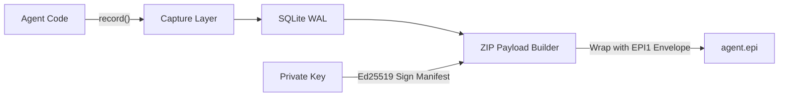

<p align="center">
  
  <br>
  <h1 align="center">EPI</h1>
  <p align="center"><strong>Capture any AI agent run into one portable <code>.epi</code> file you can open, share, and verify anywhere.</strong></p>
  <p align="center">
    <em>The forensic bug report artifact for AI systems. No cloud. No login. No internet required.</em>
  </p>
</p>

<p align="center">
  <a href="https://pypi.org/project/epi-recorder/"></a>
  <a href="https://github.com/mohdibrahimaiml/epi-recorder/actions/workflows/release-gate.yml"></a>
  <a href="https://github.com/mohdibrahimaiml/epi-recorder/blob/main/LICENSE"></a>
</p>

Reference implementation of **EPI (Evidence Packaged Infrastructure) v4.1.0** — the open format for packaging AI execution as tamper-evident, portable evidence.

---

## Install

```bash
pip install epi-recorder
```

## Get Started in 60 Seconds

```bash
epi demo
```

Runs a sample refund workflow and gives you the full developer repro loop:
1. **Capture** an AI agent run into a portable `.epi` artifact.
2. **View** the case in a browser with `Overview`, `Evidence`, `Policy`, and `Trust`.
3. **Verify** the cryptographic integrity of the file.

---

## Core API

```python
from epi_recorder import record, wrap_openai
from openai import OpenAI

client = wrap_openai(OpenAI())

with record("my_agent.epi", workflow_name="Investigation"):
    response = client.chat.completions.create(
        model="gpt-4o-mini",
        messages=[{"role": "user", "content": "Analyze this data."}]
    )
```

Open and verify the artifact:

```bash
epi view my_agent.epi    # Browser review (offline)
epi verify my_agent.epi  # Ed25519 integrity check
```

---

## The `.epi` Format

```
my_agent.epi
|- EPI1 header            # outer identity, payload length, SHA-256
`- ZIP evidence payload
   |- manifest.json        # metadata + Ed25519 signature + content hashes
   |- steps.jsonl          # execution timeline (NDJSON)
   |- environment.json     # runtime snapshot
   `- viewer.html          # self-contained offline viewer
```


```mermaid
flowchart LR
    A["Agent Code"] -->|"record()"| B["Capture Layer"]
    B --> C["SQLite WAL"]
    C --> D["ZIP Payload Builder"]
    E["Private Key"] -->|"Ed25519 Sign Manifest"| D
    D -->|"Wrap with EPI1 Envelope"| G["agent.epi"]
```

See [EPI Specification](docs/EPI-SPEC.md) for details. EPI supports evidence workflows for EU AI Act, FDA, and financial services; it does not provide legal advice and is not a compliance guarantee.

---

## Framework Integrations

EPI provides native hooks for major AI frameworks:

- **LiteLLM**: `litellm.callbacks = [EPICallback()]`
- **LangChain**: `ChatOpenAI(..., callbacks=[EPICallbackHandler()])`
- **Guardrails AI**: `instrument(output_path="audit.epi")`
- **OpenTelemetry**: `setup_epi_tracing(service_name="my-agent")`
- **pytest**: `pytest --epi` (records signed evidence for failing tests)

See [Framework Integrations Guide](docs/FRAMEWORK-INTEGRATIONS-5-MINUTES.md) for details.

---

## CLI Reference

| Command | Purpose |
|:--------|:--------|
| `epi run <script.py>` | Record execution to `.epi` |
| `epi view <file.epi>` | Open in browser review view |
| `epi verify <file.epi>` | Verify integrity and signature |
| `epi import agt <bundle>` | Convert AGT evidence to `.epi` |
| `epi export-summary` | Generate a printable Decision Record |
| `epi init` | Initialize a starter demo |
| `epi keys list` | Manage signing keys |

Full reference: [docs/CLI.md](docs/CLI.md)

---

## Technical Documentation

- **[EPI Specification](docs/EPI-SPEC.md)**: Technical details of the `.epi` format.
- **[Policy Guide](docs/POLICY.md)**: How policy, fault analysis, and rulebooks work.
- **[EU AI Act Evidence Prep](docs/EU-AI-ACT-EVIDENCE-PREP.md)**: Evidence workflow guide.
- **[AGT Import Quickstart](docs/AGT-IMPORT-QUICKSTART.md)**: `AGT -> EPI` path.

---

## Contributing

```bash
git clone https://github.com/mohdibrahimaiml/epi-recorder.git
cd epi-recorder
pip install -e ".[dev]"
pytest
```

MIT License. Built by [EPI Labs](https://epilabs.org).
Making AI agent execution verifiable.
