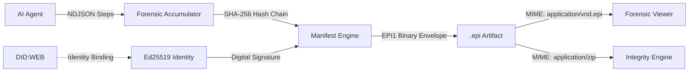

<p align="center">
  
  <br>
  <h1 align="center">EPI: Evidence Packaged Infrastructure</h1>
  <p align="center"><strong>The Forensic Standard for Verifiable AI Execution.</strong></p>
  <p align="center">
    <em>EPI (v4.1.0) is a protocol-level container format for capturing, sealing, and verifying AI agent workflows as immutable evidence.</em>
  </p>
</p>

<p align="center">
  <a href="https://pypi.org/project/epi-recorder/"></a>
  <a href="https://github.com/mohdibrahimaiml/epi-recorder/actions/workflows/release-gate.yml"></a>
  <a href="https://github.com/mohdibrahimaiml/epi-recorder/blob/main/LICENSE"></a>
</p>

---

## 🏛️ The Infrastructure for Trusted AI

In the era of autonomous AI, logs are insufficient. Infrastructure requires **evidence**. EPI provides a standardized, tamper-evident container (`.epi`) that transforms transient LLM calls into durable, verifiable records.

### 🇪🇺 EU AI Act & Regulatory Alignment
EPI is engineered to satisfy the rigorous transparency requirements of modern AI regulation:
- **Article 12 (Logging)**: Automated generation of event logs for high-risk AI systems.
- **Article 13 (Transparency)**: Human-interpretable presentation of AI decision paths via the Forensic Viewer.
- **Article 14 (Human Oversight)**: Built-in human-in-the-loop review and attestation layers.
- **NIST AI RMF / ISO 42001**: Mapping evidence to risk management and governance frameworks.

---

## 💎 Core Use Cases

| Industry | Application | Value Proposition |
| :--- | :--- | :--- |
| **Enterprise** | **Post-Hoc Debugging** | Package a failing agent run into a portable `.epi` repro for 100% reproducible debugging. |
| **Finance/Insurance** | **Claim Auditing** | Generate a signed, immutable record of every AI-driven refund or claim decision. |
| **Legal/Compliance** | **Admissible Evidence** | Maintain a cryptographic chain of custody for AI outputs in sensitive legal workflows. |
| **Cybersecurity** | **Adversarial Analysis** | Inspect agent tool-use and model logic in a secure, air-gapped forensic environment. |
| **Healthcare** | **Clinical Audit Trails** | Capture the reasoning behind AI-assisted medical triage for regulatory review. |

---

## 📦 Installation

```bash
pip install epi-recorder
```

## ⏱️ 60-Second Proof of Concept

```bash
epi demo
```

Run the built-in simulator to witness the **Capture → Seal → Verify** lifecycle. This command generates a signed `.epi` artifact, opens the **Forensic Viewer**, and performs a cryptographic integrity check.

---

## 🛠️ The SDK: Capture Everything

EPI integrates at the protocol layer, allowing you to instrument entire agent populations with zero friction.

```python
from epi_recorder import record, wrap_openai
from openai import OpenAI

# 1. High-Fidelity Wrapper (Captures Request/Response/Metadata)
client = wrap_openai(OpenAI())

# 2. Forensic Context (Seals Trace, Env, and Governance Basis)
with record("forensic_case.epi", workflow_name="Underwriting V4"):
    response = client.chat.completions.create(
        model="gpt-4o",
        messages=[{"role": "user", "content": "Analyze applicant #421"}]
    )
```

---

## 🏗️ Protocol Architecture

EPI artifacts are **Polyglot Containers**—valid as both a binary envelope and a self-contained offline investigation UI.


```mermaid
graph LR
    A[AI Agent] -->|NDJSON Steps| B[Forensic Accumulator]
    B -->|SHA-256 Hash Chain| C[Manifest Engine]
    D[Ed25519 Identity] -->|Digital Signature| C
    C -->|EPI1 Binary Envelope| E[.epi Artifact]
    E -->|MIME: application/vnd.epi| F[Forensic Viewer]
    E -->|MIME: application/zip| G[Integrity Engine]
    H[DID:WEB] -.->|Identity Binding| D
```

### Forensic Features:
- **EPI1 Envelope**: High-performance binary header for fast verification and MIME detection.
- **Strict Ordering**: The `mimetype` file is strictly stored as the first uncompressed entry (Forensic Standard).
- **Step-Level Chaining**: Each execution step is cryptographically bound to the previous step.
- **Automatic Redaction**: Built-in regex engines scrub API keys, tokens, and PII before sealing.

---

## 🔌 The Ecosystem Hub

EPI is a framework-agnostic evidence layer.

- **Integrations**: LiteLLM, LangChain, LangGraph, CrewAI, AutoGen, and OpenTelemetry.
- **CLI Toolchain**: `epi view`, `epi verify`, `epi keys`, `epi import agt`.
- **Decentralized Identity**: Bind evidence to organizations using **DID:WEB**.
- **SCITT Integration**: Align with the IETF Supply Chain Integrity, Transparency, and Trust standard.

---

## 📑 Resources & Governance

- 📄 **[Technical Specification](docs/EPI-SPEC.md)**: The wire-format and envelope protocol.
- 🏛️ **[Governance Framework](docs/POLICY.md)**: Managing rulebooks and compliance evaluation.
- 🇪🇺 **[Regulatory Compliance Guide](docs/EU-AI-ACT-EVIDENCE-PREP.md)**: Article mapping for EU AI Act.
- 🛠️ **[CLI Reference](docs/CLI.md)**: Comprehensive operator guide.

---

## 🤝 Community & Enterprise

Built by **EPI Labs**.  
*Standardizing the world's AI evidence infrastructure.*

[MIT License](LICENSE) | [Contributing](CONTRIBUTING.md) | [Security Policy](SECURITY.md)
