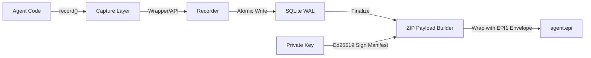

<p align="center">
  
  <br>
  <h1 align="center">EPI</h1>
  <p align="center"><strong>Capture any AI agent run into one portable <code>.epi</code> file you can open, share, and verify anywhere.</strong></p>
  <p align="center">
    <em>Use <code>.epi</code> as the bug report artifact for AI systems. No cloud. No login. No internet required.</em>
  </p>
</p>

Reference implementation of EPI (Evidence Packaged Infrastructure).

**EPI (Evidence Packaged Infrastructure)** is a standard for packaging AI execution into portable, verifiable `.epi` artifacts.

EPI packages AI execution as evidence.

Spec: https://github.com/mohdibrahimaiml/epi-spec

---

<p align="center">
  <a href="https://pypi.org/project/epi-recorder/"></a>
  <a href="https://pepy.tech/project/epi-recorder"></a>
  <a href="https://pypi.org/project/epi-recorder/"></a>
  <a href="https://github.com/mohdibrahimaiml/epi-recorder/actions/workflows/release-gate.yml"></a>
  <a href="https://github.com/mohdibrahimaiml/epi-recorder/blob/main/LICENSE"></a>
</p>

<p align="center">
  <a href="https://colab.research.google.com/github/mohdibrahimaiml/epi-recorder/blob/main/examples/epi_recorder_colab_demo.ipynb">
    
  </a>
  &nbsp;
  <a href="https://epilabs.org/verify">
    
  </a>
</p>

<p align="center">
  <strong>
    <a href="#install">Install</a> &middot;
    <a href="#agent-skills">Agent Skills</a> &middot;
    <a href="#get-started-in-10-minutes">Get Started</a> &middot;
    <a href="#agt---epi-quickstart">AGT Quickstart</a> &middot;
    <a href="#add-to-your-code">Add to Your Code</a> &middot;
    <a href="#pytest-plugin">pytest</a> &middot;
    <a href="#framework-integrations">Integrations</a> &middot;
    <a href="docs/SHARE-A-FAILURE.md">Share a Failure</a> &middot;
    <a href="docs/CONNECT.md">Team Review</a> &middot;
    <a href="docs/EPI-SPEC.md">Specification</a> &middot;
    <a href="docs/CLI.md">CLI Reference</a> &middot;
    <a href="docs/POLICY.md">Policy Guide</a> &middot;
    <a href="CHANGELOG.md">Changelog</a> &middot;
    <a href="https://epilabs.org">Website</a>
  </strong>
</p>

---

## Install

```bash
pip install epi-recorder
```

## One-Command Onboarding

Create a local demo plus an optional CI evidence workflow:

```bash
epi init --github-action
```

Generate framework-specific examples without changing your code:

```bash
epi integrate pytest --dry-run
epi integrate langchain --dry-run
epi integrate litellm --dry-run
epi integrate opentelemetry --dry-run
epi integrate agt --dry-run
epi integrate guardrails --dry-run
```

Use `--apply` when you want EPI to write the safe example files or GitHub Actions workflow, and `--force` only when you intentionally want to overwrite generated files.

## Optional Telemetry And Pilot Signup

Telemetry is off by default. There is no import tracking and no install ID until you opt in.

```bash
epi telemetry status
epi telemetry enable
epi telemetry enable --join-pilot --email you@example.com --use-case governance --consent-to-contact
epi telemetry test
epi telemetry disable
```

EPI telemetry sends non-content usage metrics only: event name, timestamp, EPI version, Python version, OS, environment, integration type, command, success/failure, artifact bytes, artifact count, and CI flag.

EPI never sends prompts, outputs, file paths, repo names, hostnames, usernames, API keys, artifact content, or customer data. Usage-linked outreach requires explicit pilot signup consent and explicit telemetry-link consent.

After high-intent commands such as `epi init`, `epi integrate`, and successful `epi verify`, EPI may print a local-only opt-in reminder. The reminder does not create an install ID or send telemetry.

If the telemetry endpoint is offline after opt-in, sanitized events are queued under `~/.epi/telemetry_queue.jsonl` and retried by later telemetry sends. Pilot signup gives early access to artifact dashboard, compliance report exports, priority support, and roadmap input.

See [Telemetry Privacy](docs/TELEMETRY-PRIVACY.md) and [Using .epi Artifacts For AI Evidence Preparation](docs/EU-AI-ACT-EVIDENCE-PREP.md).

## Agent Skills

Record Claude Code or OpenClaw work as `.epi` evidence with the EPI Recorder skill:

```text
/record
```

Claude Code plugin install:

```text
/plugin marketplace add mohdibrahimaiml/epi-claude-code-marketplace
/plugin install epi-recorder@epi
/epi-recorder:record
```

Claude Code direct skill install:

```bash
git clone https://github.com/mohdibrahimaiml/epi-claude-code-skill.git ~/.claude/skills/record
```

OpenClaw skill install:

```bash
git clone https://github.com/mohdibrahimaiml/epi-claude-code-skill.git ~/.openclaw/skills/record
```

---

## Get Started in 10 Minutes

**Option A: On your machine (60 seconds)**

```bash
pip install epi-recorder
epi demo
```

Runs a sample refund workflow and gives you the full developer repro loop:

1. Capture an AI agent run into a portable `.epi` artifact
2. Open a case-first browser view with `Overview`, `Evidence`, `Policy`, `Review`, and `Trust`
3. Approve, reject, or escalate - like a teammate reviewing a bug
4. Export and cryptographically verify the same `.epi` file

The first screen is designed to answer four things fast: what happened, why it happened, whether human action is required, and whether the file can be trusted.

> Already have an OpenAI key? Set `OPENAI_API_KEY` and the demo uses the real API.

**Option B: In your browser (no install)**

[](https://colab.research.google.com/github/mohdibrahimaiml/epi-recorder/blob/main/examples/epi_recorder_colab_demo.ipynb)

Click the badge above. No local setup. The notebook runs `pip install epi-recorder` inside Colab and walks through the same engineering flow: clean run -> failing run -> browser review -> verification -> tamper check.

**Option C: Verify an existing .epi file**

Drag and drop any `.epi` file at [epilabs.org/verify](https://epilabs.org/verify) - no install, no login, verification runs entirely in your browser.

**Insurance design-partner demo**

```bash
cd examples/starter_kits/insurance_claim
python agent.py
epi view insurance_claim_case.epi
epi export-summary summary insurance_claim_case.epi
epi share insurance_claim_case.epi
```

Simulates a claim denial with fraud check, coverage review, human approval, denial reason capture, and a printable Decision Record.

---

## AGT -> EPI Quickstart

If you already have exported Microsoft Agent Governance Toolkit evidence, this is the fastest path to a portable, signed case file:

```bash
pip install epi-recorder
epi import agt examples/agt/sample_bundle.json --out sample.epi
epi verify sample.epi
epi view sample.epi
```

If you are not running from this repo checkout, replace `examples/agt/sample_bundle.json` with your own exported AGT bundle.

What you should see in the resulting artifact:

- `steps.jsonl` - the normalized execution trace
- `policy.json` and `policy_evaluation.json` - the imported governance evidence
- `analysis.json` - synthesized findings for `epi review` when analysis is enabled
- `artifacts/agt/mapping_report.json` - the transformation audit that shows what was copied exactly, translated, derived, or synthesized

What you should see in the viewer:

- `Source system: AGT` and `Import mode: EPI` at the top of the case
- a case-first `Overview` with decision, review state, and trust state
- `Mapping` / transformation audit details that show what EPI preserved, translated, or synthesized
- raw AGT payloads grouped under attachments for local inspection

Start with the public quickstart in [docs/AGT-IMPORT-QUICKSTART.md](docs/AGT-IMPORT-QUICKSTART.md), then use [examples/agt/README.md](examples/agt/README.md) for the sample bundle details.

---

## Use EPI as a Bug Report Artifact

When an agent run goes wrong, create one `.epi` file and hand it to the next engineer.

```text
capture the run -> open it in the browser -> verify it -> attach it to an issue or PR
```

```bash
epi verify my_agent.epi
epi share my_agent.epi   # returns a browser link when the share service is deployed/configured
```

Guides:

- [Share one failure with `.epi`](docs/SHARE-A-FAILURE.md)
- [Use `pytest --epi` for agent regressions](docs/PYTEST-AGENT-REGRESSIONS.md)
- [Framework integrations in 5 minutes](docs/FRAMEWORK-INTEGRATIONS-5-MINUTES.md)

---

## Add to Your Code

```python
from epi_recorder import record, wrap_openai
from openai import OpenAI

client = wrap_openai(OpenAI())

with record(
    "my_agent.epi",
    workflow_name="Trip planner investigation",
    tags=["travel", "customer-facing"],
    goal="Propose a safe Tokyo itinerary for the traveler.",
    notes="Starter example for the case investigation viewer.",
    metadata_tags=["travel", "customer-facing"],
):
    response = client.chat.completions.create(
        model="gpt-4o-mini",
        messages=[{"role": "user", "content": "Plan a trip to Tokyo"}]
    )
```

Open it:

```bash
epi view my_agent.epi    # browser review view - offline, no login
epi view --extract ./review my_agent.epi   # writes a self-contained viewer.html for offline sharing
epi verify my_agent.epi  # cryptographic integrity check
```

What opens in the browser:

- `Overview` - decision, reason, review state, and trust state
- `Evidence` - the execution trail, tool calls, model output, and supporting artifacts
- `Policy` - attached rulebook and evaluation output when present
- `Mapping` - provenance and transformation audit for imported evidence like AGT
- `Trust` - signature, integrity, and review verification details

### Record a full agent run with approvals and tool calls

```python
from epi_recorder import record

with record(
    "refund_agent.epi",
    workflow_name="Refund approval investigation",
    goal="Resolve customer refund safely",
    metadata_tags=["refund", "approval"],
) as epi:
    with epi.agent_run(
        "refund-agent",
        user_input="Refund order 123",
        session_id="sess-001",
        task_id="refund-123",
    ) as agent:
        agent.plan("Look up the order, confirm approval status, then decide.")
        agent.tool_call("lookup_order", {"order_id": "123"})
        agent.tool_result("lookup_order", {"status": "paid", "amount": 120})
        agent.approval_request("approve_refund", reason="Amount exceeds auto threshold")
        agent.approval_response("approve_refund", approved=True, reviewer="manager@company.com")
        agent.decision("approve_refund", confidence=0.91)
```

The resulting `.epi` shows lineage, approvals, tool calls, memory activity, and pause/resume checkpoints as one signed case file.

### Local LLM - free, unlimited development

```python
client = wrap_openai(OpenAI(
    base_url="http://localhost:11434/v1",
    api_key="ollama"
))

with record("test.epi"):
    response = client.chat.completions.create(model="llama3", messages=[...])
```

---

## What Compliance Buyers See

These are the three proof points for the insurance design-partner workflow.

### Decision Summary


### Human Review Flow


### Decision Record Export


---

## Three Common Developer Jobs

| Job | Start here |
|:----|:-----------|
| Debug one bad agent run | [`docs/SHARE-A-FAILURE.md`](docs/SHARE-A-FAILURE.md) |
| Attach `.epi` to a failing test or CI job | [`docs/PYTEST-AGENT-REGRESSIONS.md`](docs/PYTEST-AGENT-REGRESSIONS.md) |
| Capture runs from my framework with minimal code changes | [`docs/FRAMEWORK-INTEGRATIONS-5-MINUTES.md`](docs/FRAMEWORK-INTEGRATIONS-5-MINUTES.md) |

---

## Share With Your Team

```bash
epi connect open
```

The local team-review workspace starts on `http://localhost:8000`. Share the URL with a reviewer on the same machine, or use the LAN/ngrok patterns in [`docs/CONNECT.md`](docs/CONNECT.md) for remote review.

---

## pytest Plugin

One flag. Portable `.epi` repro for every failing test. No code changes.

```bash
pytest --epi                    # keeps signed .epi files for failing tests
pytest --epi --epi-dir=evidence # custom output directory
pytest --epi --epi-on-pass      # also keep passing test artifacts
```

Every test failure leaves a signed case file you can open, verify, and share. Attach the `.epi` to a GitHub issue or PR - the reviewer opens it in their browser, no EPI install required.

---

## The Full Loop

```text
define policy -> run workflow -> inspect fault analysis -> confirm/dismiss in review -> verify trust
```

```bash
epi policy init            # create epi_policy.json with control rules
python my_workflow.py      # run your instrumented script
epi view my_workflow.epi   # open in browser
epi review my_workflow.epi # add human review notes
epi verify my_workflow.epi # cryptographic check
```

---

## Starter Kits

Production-shaped examples for common consequential workflows. Pick one, run it, then adapt to your code.

| Kit | What it covers |
|:----|:---------------|
| [`examples/starter_kits/refund/`](examples/starter_kits/refund/) | Refund approval agent with human sign-off, policy rules, and full audit trail |
| [`examples/starter_kits/insurance_claim/`](examples/starter_kits/insurance_claim/) | Insurance claim denial workflow with fraud checks, coverage review, human approval, and Decision Record export |

More kits coming: underwriting and support escalation.

---

## Why Engineers Use EPI

EPI is a portable repro layer for AI systems. When an agent run goes wrong, logs tell you *something* happened. EPI gives you one file you can hand to another engineer so they can inspect the run, review what happened, and verify the file still matches the original capture.

One `.epi` file answers:

- What actually happened, step by step?
- Which rule was active at the time?
- Did a human reviewer confirm or dismiss it?
- Is this case file still trustworthy, or was it tampered with?

EPI is not an observability dashboard. It sits beside observability as the durable, shareable artifact layer for debugging, review, and later trust checks.

## Why EPI vs. Alternatives

| | **EPI** | LangSmith | Arize | W&B |
|:--|:--------|:----------|:------|:----|
| **Works offline** | Yes - air-gapped ready | No - cloud required | No - cloud required | No - cloud required |
| **Tamper-proof** | Yes - Ed25519 signatures | No | No | No |
| **Open format** | Yes - `.epi` spec | No - proprietary | No - proprietary | No - proprietary |
| **Agent state** | Yes - full checkpoints | Traces only | Predictions only | Experiments only |
| **Evidence prep** | Supports EU AI Act, FDA, and SEC evidence workflows; not a compliance guarantee | Limited | Limited | Not designed |
| **Local LLMs** | Yes - Ollama, llama.cpp | No | No | No |
| **CI/CD native** | Yes - GitHub Action + pytest | No | No | No |
| **Framework hooks** | Yes - LiteLLM, LangChain, OTel, Guardrails | LangChain only | No | No |
| **Validation outcomes** | **Yes** - captures validator feedback | No | No | No |
| **Cost** | **Free** (MIT) | $99+/mo | Custom | $50+/mo |

> **EPI complements these tools.** Use LangSmith for live traces, EPI for durable evidence.

---

## For Compliance and Governance Teams

EPI is designed for teams preparing durable evidence for high-risk AI workflows. It supports review and audit workflows; it does not provide legal advice, regulator approval, or a compliance guarantee:

- **EU AI Act evidence preparation** - tamper-evident audit trails with cryptographic proof
- **FDA / Healthcare evidence preparation** - signed decision records for AI-assisted review workflows
- **Financial services evidence preparation** - portable evidence for automated-decision review
- **Data governance** - automatic PII redaction with `security.redaction` steps
- **Air-gapped deployment** - no internet required, ever

The portability advantage: you can hand a regulator a single `.epi` file. They verify it at [epilabs.org/verify](https://epilabs.org/verify) - drag and drop, no login, no install. Verification runs client-side in their browser.

For the flagship product explainer, see [docs/EPI-DOC-v4.0.1.md](docs/EPI-DOC-v4.0.1.md).
For the AGT import front door, see [docs/AGT-IMPORT-QUICKSTART.md](docs/AGT-IMPORT-QUICKSTART.md).
For self-hosted deployment, see [docs/SELF-HOSTED-RUNBOOK.md](docs/SELF-HOSTED-RUNBOOK.md).

---

## Framework Integrations

EPI fits the stack your AI platform team already uses. **Start with one workflow, not a rewrite.**

### LiteLLM - 100+ Providers in One Line

```python
import litellm
from epi_recorder.integrations.litellm import EPICallback

litellm.callbacks = [EPICallback()]  # all calls are now recorded

response = litellm.completion(model="gpt-4", messages=[...])
response = litellm.completion(model="claude-3-opus", messages=[...])
response = litellm.completion(model="ollama/llama3", messages=[...])
# every call -> signed .epi evidence
```

### LangChain - Full Event Capture

```python
from langchain_openai import ChatOpenAI
from epi_recorder.integrations.langchain import EPICallbackHandler

llm = ChatOpenAI(model="gpt-4", callbacks=[EPICallbackHandler()])
result = llm.invoke("Analyze this contract for risk...")
# captures: LLM calls, tool invocations, chain steps, retriever queries, agent decisions
```

### OpenAI Streaming - Real-Time Evidence

```python
from epi_recorder import record, wrap_openai
from openai import OpenAI

client = wrap_openai(OpenAI())

with record("stream_demo.epi"):
    stream = client.chat.completions.create(
        model="gpt-4", stream=True,
        messages=[{"role": "user", "content": "Write a poem"}]
    )
    for chunk in stream:
        print(chunk.choices[0].delta.content or "", end="")
# chunks yielded in real-time, assembled response logged with full token usage
```

### GitHub Action - CI/CD Verification

```yaml
# .github/workflows/verify.yml
- name: Verify EPI evidence
  uses: mohdibrahimaiml/epi-recorder/.github/actions/verify-epi@main
  with:
    path: ./evidence
    fail-on-tampered: true
```

### OpenTelemetry - Bridge to Existing Infra

```python
from epi_recorder.integrations.opentelemetry import setup_epi_tracing

setup_epi_tracing(service_name="my-agent")
# all OTel spans -> signed .epi files automatically
```

### LangGraph Checkpoint Integration

```python
from langgraph.graph import StateGraph
from epi_recorder.integrations import EPICheckpointSaver

graph = StateGraph(AgentState)
checkpointer = EPICheckpointSaver("my_agent.epi")

result = graph.invoke(
    {"messages": [HumanMessage(content="...")]},
    {"configurable": {"thread_id": "user_123"}},
    checkpointer=checkpointer
)
# captures all state transitions, checkpoint metadata, and agent decision points

### Guardrails AI - Native Validation Proofs

```python
from guardrails import Guard
from epi_guardrails import instrument

# all validation steps and model outputs are now recorded
instrument(output_path="audit.epi")

guard = Guard.for_rail_string(rail_str)
result = guard.parse(llm_output=raw_text)
# captures: LLM calls, validator passes/fails, and corrected outputs
```
```

### OpenAI Agents Event Bridge

```python
from epi_recorder import record
from epi_recorder.integrations import OpenAIAgentsRecorder

with record("support_agent.epi") as epi:
    with OpenAIAgentsRecorder(epi, agent_name="support-agent", user_input="Reset customer password") as recorder:
        for event in streamed_result.stream_events():
            recorder.consume(event)
```

Maps stream events into `agent.message`, `tool.call`, `tool.response`, `agent.handoff`, `agent.approval.request/response`, `agent.memory.read/write`, and `agent.decision`.

### Global Install - Record Everything

```bash
epi install --global    # all Python processes now auto-record
epi uninstall --global  # clean removal, one command
```

Set `EPI_AUTO_RECORD=0` to disable without uninstalling.

---

## Advanced / Operator Workflows

### Gateway path for AI infrastructure teams

```bash
epi gateway serve
epi gateway serve --users-file config/gateway-users.example.json
```

Point SDKs, adapters, or proxies at one capture endpoint. Supports OpenAI-compatible `/v1/chat/completions`, Anthropic-compatible `/v1/messages`, LiteLLM, and generic LLM adapters.

### Windows double-click support

```text
Recommended for Windows users:
  install epi-setup-<version>.exe

Developer path:
  pip install epi-recorder
  epi associate --system   # or: epi associate
```

---

## The `.epi` File Format

An `.epi` file is now a self-identifying binary envelope that contains the signed evidence payload:

```
my_agent.epi
|- EPI1 header            # outer identity, payload length, payload SHA-256
`- ZIP evidence payload
   |- mimetype               # "application/vnd.epi+zip"
   |- manifest.json          # metadata + Ed25519 signature + content hashes
   |- steps.jsonl            # execution timeline (NDJSON)
   |- environment.json       # runtime environment snapshot
   |- analysis.json          # optional fault-analysis output
   |- policy.json            # optional embedded rulebook
   |- policy_evaluation.json # optional control outcomes
   |- review.json            # optional human review record
   `- viewer.html            # self-contained offline viewer shell
```

| Property | Detail |
|:---------|:-------|
| **Signatures** | Ed25519 (RFC 8032) |
| **Hashing** | SHA-256 content addressing |
| **Key storage** | Local keyring, user-controlled |
| **Verification** | Fast header validation + inner manifest/signature verification |
| **Viewer** | Embedded HTML - works offline forever |

The embedded viewer travels with the artifact, but operating systems and
browsers still open `.epi` files through EPI tooling such as `epi view`, the
Windows installer association, or `epi associate`. They do not execute
`viewer.html` directly from inside the binary container.

See **[EPI Specification](docs/EPI-SPEC.md)** for technical details.

---

## Architecture


```mermaid
flowchart LR
    A["Agent Code"] -->|"record()"| B["Capture Layer"]
    B -->|"Wrapper/API"| C["Recorder"]
    C -->|"Atomic Write"| D["SQLite WAL"]
    D -->|"Finalize"| E["ZIP Payload Builder"]
    F["Private Key"] -->|"Ed25519 Sign Manifest"| E
    E -->|"Wrap with EPI1 Envelope"| G["agent.epi"]
```

| Principle | How |
|:----------|:----|
| **Crash-safe** | SQLite WAL - no data loss, even if agents crash mid-execution |
| **Explicit capture** | Evidence is intentional and reviewable in code |
| **Cryptographic proof** | Ed25519 signatures (RFC 8032) that can't be forged or backdated |
| **Offline-first** | Zero cloud dependency - works in air-gapped environments |
| **Framework-native** | Plugs into LiteLLM, LangChain, OpenTelemetry, pytest - no refactoring |

---

## Supported Providers & Frameworks

### Direct Wrappers

| Provider | Integration | Streaming |
|:---------|:------------|:----------|
| **OpenAI** | `wrap_openai()` | Yes - real-time chunk capture |
| **Anthropic** | `wrap_anthropic()` | Yes |
| **Google Gemini** | Explicit API | - |
| **Ollama** (local) | `wrap_openai()` with local endpoint | Yes |
| **Any HTTP LLM** | `log_llm_call()` explicit API | - |

### Framework Integrations

| Framework | Integration | Coverage |
|:----------|:------------|:---------|
| **OpenAI Agents** | `OpenAIAgentsRecorder` | Stream event bridge into agent-native EPI steps |
| **LiteLLM** | `EPICallback` | 100+ providers, one line |
| **LangChain** | `EPICallbackHandler` | LLM, tools, chains, retrievers, agents |
| **LangGraph** | `EPICheckpointSaver` | Native checkpoint backend |
| **OpenTelemetry** | `EPISpanExporter` | Span -> .epi conversion |
| **pytest** | `--epi` flag | Signed evidence per test |
| **Guardrails AI** | `instrument()` hook | Automatic capture of validation results, model calls, and correction history |
| **GitHub Actions** | `verify-epi` action | CI/CD pipeline verification |

---

## CLI Reference

| Command | Purpose |
|:--------|:--------|
| `epi run <script.py>` | Record execution to `.epi` |
| `epi import agt <bundle.json> --out <file.epi>` | Convert exported AGT evidence into a portable `.epi` case file |
| `epi verify <file.epi>` | Verify integrity and signature |
| `epi view <file.epi>` | Open in browser review view |
| `epi share <file.epi>` | Upload and return a hosted browser link |
| `epi export-summary summary <file.epi>` | Generate a printable HTML Decision Record |
| `epi init --github-action` | Create a starter demo and optional CI evidence workflow |
| `epi integrate <target>` | Generate safe examples for pytest, LangChain, LiteLLM, OpenTelemetry, AGT, or Guardrails |
| `epi telemetry status|enable|disable|test` | Manage privacy-first opt-in telemetry and pilot signup |
| `epi keys list` | Manage signing keys |
| `epi debug <file.epi>` | Heuristic analysis for mistakes and loops |
| `epi chat <file.epi>` | Natural language querying |
| `epi install --global` | Auto-record all Python processes |
| `epi uninstall --global` | Remove auto-recording |
| `epi associate` | Register OS file association for double-clicking |
| `epi unassociate` | Remove OS file association |

See **[CLI Reference](docs/CLI.md)** for full documentation.

---

## What Changed in v4.0.1

- **Native Guardrails AI Support** - new `epi_guardrails` package provides seamless, non-invasive instrumentation for all Guardrails 0.10.x execution paths
- **Opt-in telemetry** - `epi telemetry status|enable|disable|test` sends only non-content metrics after explicit opt-in
- **Reachable pilot signup** - `epi telemetry enable --join-pilot` captures explicit contact consent and optional telemetry-link consent
- **Safer onboarding** - `epi init --github-action` and `epi integrate <target>` write only safe generated examples/workflows unless `--force` is provided
- **Gateway telemetry ingestion** - self-hosted gateways can enable append-only telemetry and pilot signup endpoints with `EPI_GATEWAY_TELEMETRY_ENABLED=true`

## What Changed in v4.0.0

- **`.epi` has a real outer identity now** - new artifacts start with an `EPI1` binary header instead of ZIP magic bytes
- **Legacy and new artifacts both work** - EPI transparently reads legacy ZIP-based `.epi` files and new envelope-based `.epi` files
- **Raw file sharing is stronger** - the default artifact no longer looks like a generic ZIP to channels that classify files by byte signature
- **AGT import still works unchanged** - the AGT bridge, trust report, and review flow all ride on the new outer format without changing the evidence model

Older release notes live in [CHANGELOG.md](CHANGELOG.md).

---

## Roadmap

**Current (v4.0.1):**
- [x] Framework-native integrations (LiteLLM, LangChain, OpenTelemetry)
- [x] CI/CD verification (GitHub Action, pytest plugin)
- [x] OpenAI streaming support
- [x] Global install for automatic recording
- [x] Agent-first recording and review surfaces
- [x] Policy v2 schema with enforcement and fault analysis
- [x] AGT import path with transformation audit and strict-mode controls
- [x] Comprehensive Colab demo notebook

**Next:**
- [ ] Time-travel debugging (step through any past run)
- [ ] Team collaboration features
- [ ] Managed cloud platform (optional)
- [ ] VS Code extension for `.epi` file viewing

---

## Documentation

| Document | Description |
|:---------|:------------|
| **[Docs Hub](docs/index.html)** | Curated front door for the current public documentation set |
| **[AGT Import Quickstart](docs/AGT-IMPORT-QUICKSTART.md)** | Canonical `AGT -> EPI` first-time user path |
| **[EPI DOC v4.0.x](docs/EPI-DOC-v4.0.1.md)** | Flagship explainer for the current `4.0.1` release line |
| **[EPI Specification](docs/EPI-SPEC.md)** | Technical specification for the `.epi` format |
| **[CLI Reference](docs/CLI.md)** | Command-line interface documentation |
| **[Telemetry Privacy](docs/TELEMETRY-PRIVACY.md)** | What opt-in telemetry and pilot signup do and do not collect |
| **[EU AI Act Evidence Prep](docs/EU-AI-ACT-EVIDENCE-PREP.md)** | Legal-safe evidence workflow guide for `.epi` artifacts |
| **[Policy Guide](docs/POLICY.md)** | How policy, fault analysis, and rulebooks work |
| **[CHANGELOG](CHANGELOG.md)** | Release notes |
| **[Contributing](CONTRIBUTING.md)** | Contribution guidelines |
| **[Security](SECURITY.md)** | Security policy and vulnerability reporting |

---

## Contributing

```bash
git clone https://github.com/mohdibrahimaiml/epi-recorder.git
cd epi-recorder
pip install -e ".[dev]"
pytest
```

See **[CONTRIBUTING.md](./CONTRIBUTING.md)** for guidelines.

---

## License

MIT License. See **[LICENSE](./LICENSE)**.

<p align="center">
  <strong>Built by <a href="https://epilabs.org">EPI Labs</a></strong><br>
  <em>Making AI agent execution verifiable.</em>
</p>
