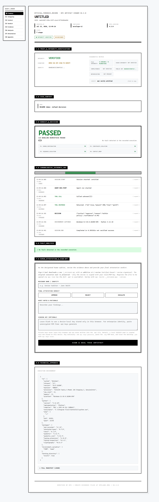

<div align="center">
  

# EPI — Evidence for AI agents

### Record. Seal. Verify offline. The answer is a **file**.

[](https://pypi.org/project/epi-recorder/)
[](https://python.org)
[](https://github.com/mohdibrahimaiml/epi-recorder/releases)
[](LICENSE)
[](https://github.com/mohdibrahimaiml/epi-recorder/actions)

```bash
pip install epi-recorder
epi demo --no-browser    # record → seal → verify (no API key)
```

[60-second path](#60-second-path) ·
[What a .epi is](#what-a-epi-file-is) ·
[CLI](#cli) ·
[Docs & pilot](#docs--pilot) ·
[Standards](#standards--compliance)

</div>

---

> When someone asks what your agent did six months ago,  
> the answer should be a **`.epi` file** — not a dashboard login and a shrug.

`epi-recorder` captures agent decisions into a portable, signed, **offline-verifiable** artifact.  
No phone-home required to open or verify.

<div align="center">
  <p><strong>Open a sealed <code>.epi</code> offline</strong> — <code>epi view run.epi</code></p>
  
  <p><em>Forensic case view of a sealed run. Sample artifact: <a href="docs/assets/readme-demo.epi"><code>docs/assets/readme-demo.epi</code></a></em></p>
</div>

---

## 60-second path

Works **without** any LLM API key:

```python
# demo.py
from epi_recorder import record, get_current_session

with record("demo.epi", goal="show the golden path"):
    s = get_current_session()
    s.log("tool.call", tool="lookup", id="A-1")
    s.log("tool.response", ok=True, balance=250)
    s.log("decision", action="approve", reason="within limit")
```

```bash
python demo.py
epi verify demo.epi
epi-register demo.epi
epi view demo.epi
```

| Step | Command | What you get |
|------|---------|----------------|
| **Record + seal** | `python demo.py` | Signed `demo.epi` (secrets redacted by default) |
| **Verify** | `epi verify demo.epi` | Integrity + signature checks offline |
| **Register** | `epi-register demo.epi` | Transparency ledger receipt embedded in `.epi` |
| **View** | `epi view demo.epi` | Self-contained browser viewer (screenshot above) |

Typical first-run verify:

| Check | Result |
|-------|--------|
| Integrity (SHA-256) | Valid |
| Signature (Ed25519) | Valid |
| Identity | Often LOCAL / UNKNOWN until you pin trust |
| Secrets | Redacted by default (`redact=True`) |

> **First-run WARN / LOCAL identity is normal** — seal integrity and signature can still pass.  
> Identity is separate from seal. Pin with `epi keys trust <name>` when you mean it.  
> Policy / “did the run break our rules?” is separate again: `epi analyze` — see [docs/POLICY-AND-FAULT-ANALYZER.md](docs/POLICY-AND-FAULT-ANALYZER.md).

That’s the product. Everything below is optional depth.

---

## With OpenAI

```python
from openai import OpenAI
from epi_recorder import record, wrap_openai

client = wrap_openai(OpenAI())  # needs OPENAI_API_KEY

with record("agent.epi", goal="Answer a user question"):
    client.chat.completions.create(
        model="gpt-4o-mini",
        messages=[{"role": "user", "content": "Hello"}],
    )
```

```bash
python agent.py
epi verify agent.epi
epi view agent.epi
```

API keys in prompts/headers are **redacted automatically** before they land in the file.

---

## What a `.epi` file is

Every `.epi` uses the **Envelope v2** container format — a **polyglot HTML+ZIP**
binary that opens natively in any browser and can be extracted programmatically.

```text
demo.epi
├── manifest.json     # Ed25519 signature + SHA-256 file hashes
├── steps.jsonl       # Timeline (hash-linked steps)
├── environment.json  # Runtime snapshot (sensitive env redacted)
├── analysis.json     # Fault / policy analysis (when generated at seal)
├── viewer.html       # Offline forensic UI
└── VERIFY.txt        # Plain-text auditor instructions
```

| Guarantee | How |
|-----------|-----|
| **Integrity** | SHA-256 over every sealed member |
| **Authenticity** | Ed25519 signature on the manifest |
| **Chain** | Each step’s `prev_hash` links the timeline |
| **Privacy** | Default secret redaction (API keys, tokens, PII) |

Samples: [docs/assets/SAMPLES.md](docs/assets/SAMPLES.md) · try `docs/assets/readme-demo.epi`.

---

## Integrations

| Stack | How |
|-------|-----|
| OpenAI | `wrap_openai(OpenAI())` |
| Anthropic | `wrap_anthropic(Anthropic())` |
| LangChain | `EPICallbackHandler` |
| LiteLLM | `EPICallback` |
| pytest | `pytest --epi` |
| Microsoft AGT | `epi import agt <file>` |
| TRACE Trust Record | `epi export trace <file.epi>` — log-import Level 0; see caveats below |

```python
# LangChain (canonical adapter)
from epi_recorder import record
from epi_recorder.adapters.langchain import EpiCallbackHandler

with record("run.epi") as session:
    handler = EpiCallbackHandler(session)
    llm = ChatOpenAI(model="gpt-4o-mini", callbacks=[handler])
    llm.invoke("…")
```

```bash
# pytest — attach evidence to failing tests
pytest --epi
```

### TRACE export (honest claims)

```bash
epi export trace run.epi --out run.trace.json --transcript-uri https://host/run.epi
```

Signing key order: `--key` → private key that sealed the `.epi` → `TRACE_PRIVATE_KEY_PEM` → ephemeral (warning). `allow_embedded_key=True` when verifying only proves **internal consistency** of the record against its own `cnf.jwk`. It does **not** prove the record came from a trusted issuer. What we claim: the JSON is self-consistent and bound to the key that signed it (the sealing key when that key is available).

`policy.bundle_hash` in TRACE is specified as a Cedar policy hash. We hash `policy.json` (the sealed EPI policy document), not a Cedar bundle. `policy.enforcement_mode` is `"declared"` — we did not run a Cedar engine. `appraisal.status` is `"none"`.

More: [docs/FRAMEWORK-INTEGRATIONS-5-MINUTES.md](docs/FRAMEWORK-INTEGRATIONS-5-MINUTES.md)

---

## CLI

| Command | Purpose |
|---------|---------|
| `epi demo` | Guided demo: record → seal → verify |
| `epi verify <file.epi>` | Offline integrity + signature check |
| `epi-register <file.epi>` | Register artifact on transparency ledger & embed receipt |
| `epi view <file.epi>` | Open offline viewer (screenshot above) |
| `epi analyze <file.epi>` | Fault / policy summary from sealed analysis |
| `epi policy init` | Create `epi_policy.json` rulebook |
| `epi run <script.py>` | Run a script under recording |
| `epi keys generate` / `list` / `trust` | Local signing keys |
| `epi enterprise setup` / `pack` | Org kit + auditor pack |
| `epi scitt register <file.epi>` | SCITT transparency anchor (advanced) |
| `epi import agt <path>` | Import Microsoft AGT evidence |
| `epi export trace <file.epi>` | TRACE v0.2 log-import record (self-consistency, not issuer attestation) |

Policy + fault analyzer guide: [docs/POLICY-AND-FAULT-ANALYZER.md](docs/POLICY-AND-FAULT-ANALYZER.md)

---

## Security defaults

- **Redaction is on** (`redact=True`). Keys/tokens/PII become placeholders.
- Prefer **not** using `redact=False` in production (it warns).
- Verification is **local** — no network required for integrity/signature.
- First-run identity WARN / LOCAL is expected until you trust a key.
- **Seal ≠ identity ≠ policy.** Verify proves the file; analyze grades the run against rules/heuristics.

---

## Docs & pilot

| Topic | Link |
|-------|------|
| **Docs map** | [docs/README.md](docs/README.md) |
| **Guided pilot pack** | [docs/PILOT.md](docs/PILOT.md) |
| Enterprise in 15 minutes | [docs/ENTERPRISE-15-MINUTES.md](docs/ENTERPRISE-15-MINUTES.md) |
| Enterprise capability (honest) | [docs/ENTERPRISE-CAPABILITY.md](docs/ENTERPRISE-CAPABILITY.md) |
| Policy + fault analyzer | [docs/POLICY-AND-FAULT-ANALYZER.md](docs/POLICY-AND-FAULT-ANALYZER.md) |
| Known limitations | [docs/KNOWN_LIMITATIONS.md](docs/KNOWN_LIMITATIONS.md) |
| CLI deep dive | [docs/CLI.md](docs/CLI.md) |
| Auditors guide | [docs/AUDITORS-GUIDE.md](docs/AUDITORS-GUIDE.md) |

---

## Standards & compliance

EPI produces **evidence files** that help with audit trails. It is **not a compliance guarantee**
and **does not provide legal advice**. Whether evidence satisfies a specific regulatory threshold
is for the auditor or notified body to determine.

| Topic | Docs |
|-------|------|
| EU AI Act Annex IV | [docs/ANNEX-IV.md](docs/ANNEX-IV.md) |
| AIUC-1 domains | [docs/standards/aiuc-1-evidence.md](docs/standards/aiuc-1-evidence.md) |
| SCITT | [docs/standards/scitt-predicate.md](docs/standards/scitt-predicate.md) |

```bash
epi verify agent.epi --aiuc1   # optional domain scoring
```

---

## Troubleshooting

| Symptom | Fix |
|---------|-----|
| `epi: command not found` | Same venv as `pip install`, or `python -m epi_cli` |
| First verify WARN / LOCAL identity | Normal if seal OK — pin with `epi keys trust …` when ready |
| `Integrity: FAILED` | File changed after seal — re-record |
| `epi analyze` says heuristic only | Add `epi_policy.json` via `epi policy init`, re-run from that folder |
| Share / portal fails | Hosted needs backend; local record/verify never depends on it |

**Trust-model note:** Integrity checks whether the sealed record was altered since sealing — not that every real-world action was captured.

---

## Project layout (contributors)

| Path | Role |
|------|------|
| `epi_recorder/` | Python SDK (`record`, wrappers) |
| `epi_core/` | Container, crypto, redaction, verify, fault analyzer |
| `epi_cli/` | `epi` command |
| `website/` | Public site source of truth (`epilabs.org`) |
| `website-v2/` | Sandbox redesign (not production deploy) |
| `verify_portal/` | Hosted verify/auth API (optional) |
| `docs/` | Start at [docs/README.md](docs/README.md) |
| `tests/test_core_loop_golden.py` | Golden path regression |

Website edits: only under `website/`, then `python scripts/sync_website.py`. See [docs/archive/SITE.md](docs/archive/SITE.md).

---

## License

MIT — see [LICENSE](LICENSE).

**Site:** [epilabs.org](https://epilabs.org) · **Issues:** [GitHub Issues](https://github.com/mohdibrahimaiml/epi-recorder/issues)
