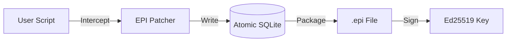

<p align="center">
  
  <br>
  <h1 align="center">EPI Recorder</h1>
</p>

[](https://github.com/mohdibrahimaiml/epi-recorder/releases)
[](https://pypi.org/project/epi-recorder/)
[](LICENSE)
[](https://pypi.org/project/epi-recorder/)
[](#)

**The Flight Recorder for AI Agents**
*The PDF for AI Evidence*

Debug production failures in LangChain, CrewAI, and custom agents with one command.
Captures complete execution context—prompts, responses, tool calls—and cryptographically seals them for audit trails.

&#128214; [Documentation](https://epilabs.org) • &#128640; [Quick Start](#quick-start) • &#128272; [Security](#security-compliance)

> "EPI Recorder provides the missing observability layer we needed for our autonomous agents. The flight recorder approach is a game changer."
> — Lead AI Engineer, Early Adopter

---

## Traction
- **6,000+** developers using EPI for daily debugging
- **20,000+** agent executions recorded
- **99.9%** atomic capture rate (zero data loss on crashes)

---

## Why EPI?

Your AI agent failed in production. It hallucinated. It looped infinitely. It cost you $50 in API calls.

**You can't reproduce it.** LLMs are non-deterministic. Your logs don't show the full prompt context. You're taking screenshots and pasting JSON into Slack.

**EPI is the black box.** One command captures everything. Debug locally. Prove what happened.

---

## Quick Start

```bash
pip install epi-recorder

# Record your agent (zero config)
epi run agent.py

# Debug the failure (opens browser viewer)
epi view recording.epi

# Verify integrity (cryptographic proof)
epi verify recording.epi
```


---

## Features

- **⚡ Zero Config**: `epi run` intercepts OpenAI, LangChain, CrewAI automatically—no code changes.
- **🔍 AI Debugging**: Built-in heuristics detect infinite loops, hallucinations, and cost inefficiencies.
- **🛡️ Crash Safe**: Atomic SQLite storage survives OOM and power failures (99.9% capture rate).
- **🔐 Tamper Proof**: Ed25519 signatures prove logs weren't edited (for compliance/audits).
- **🌐 Framework Agnostic**: Works with any Python agent (LangChain, CrewAI, AutoGPT, or 100 lines of raw code).

---

## How It Works

EPI acts as a **Parasitic Observer**—injecting instrumentation at the Python runtime level via `sitecustomize.py`.

1.  **Intercept**: Captures LLM calls at the HTTP layer (`requests.Session`) and library level.
2.  **Store**: Atomic SQLite WAL ensures zero data loss on crashes.
3.  **Analyze**: `epi debug` uses local heuristics + AI to find root causes.
4.  **Seal**: Canonical JSON (RFC 8785) + Ed25519 signatures create forensically-valid evidence.



---

## Security & Compliance

While EPI is built for daily debugging, it provides the cryptographic infrastructure required for regulated environments:

-   **Signatures**: Ed25519 with client-side verification (zero-knowledge).
-   **Standards**: Supports EU AI Act Article 6 logging requirements.
-   **Privacy**: Automatic PII redaction, air-gapped operation (no cloud required).

*[Enterprise support available](mailto:enterprise@epilabs.org) for SOC2/ISO27001 environments.*

---

---
## Release History

| Version | Date | Highlights |
|:---|:---|:---|
| **v2.2.0** | 2026-01-30 | 🚀 **Agent Debugging**, SQLite Crash Safety, Thread-Safe Context, MIT License, Async Support |
| **v2.1.3** | 2026-01-24 | ♊ **Gemini Support**, `epi chat` (AI querying), Windows fixes |
| **v2.1.2** | 2026-01-17 | 🔐 **Client-Side Verification**, Ed25519 offline checks, Viewer security update |
| **v2.1.1** | 2025-12-16 | 🛠️ **Installation Fixes**, Auto-PATH repair, `epi doctor` |
| **v2.1.0** | 2025-12-XX | ✨ **Major Release**, `epi run` zero-config, Ed25519 signatures, new Viewer |

---

## Contributing

We welcome contributions! Please see [CONTRIBUTING.md](./CONTRIBUTING.md) for details.

```bash
git clone https://github.com/mohdibrahimaiml/epi-recorder.git
cd epi-recorder
pip install -e ".[dev]"
pytest
```

## License

MIT License. See [LICENSE](./LICENSE) for details.


 
