# EPI-Recorder: Complete Technical Documentation

## 📋 Table of Contents

1. [Project Overview](#project-overview)
2. [Architecture](#architecture)
3. [Core Modules](#core-modules)
4. [Directory Structure](#directory-structure)
5. [Functionality Deep Dive](#functionality-deep-dive)
6. [Cryptographic Implementation](#cryptographic-implementation)
7. [API Interception Mechanism](#api-interception-mechanism)
8. [Verification System](#verification-system)
9. [Deployment & Integration](#deployment--integration)
10. [Use Cases](#use-cases)

---

## 1. Project Overview

### What is EPI-Recorder?

**EPI-Recorder** is a **cryptographic evidence infrastructure** for autonomous AI systems. It creates tamper-proof, digitally signed records (`.epi` files) of AI behavior—think "PDF for AI evidence."

### Core Value Proposition

- **Problem**: AI systems make critical decisions, but there's no standardized, verifiable proof of what they did
- **Solution**: Cryptographically signed execution snapshots that are:
  - Tamper-proof (Ed25519 signatures)
  - Self-contained (single `.epi` file)
  - Offline-verifiable (browser-based verification)
  - Regulation-ready (audit trails for compliance)

### Key Capabilities

1. **Automatic Recording** - Intercepts OpenAI, Gemini, and generic Python code
2. **Cryptographic Signing** - Ed25519 signatures (same as Signal, SSH)
3. **Smart Redaction** - Auto-masks API keys, secrets, PII
4. **Offline Verification** - Client-side verification in browser (zero-knowledge)
5. **Enterprise Gateway** - Centralized recording for organizations

---

## 2. Architecture

### High-Level Components

```
┌─────────────────────────────────────────────────────────────┐
│                     EPI-RECORDER SYSTEM                      │
├─────────────────────────────────────────────────────────────┤
│                                                               │
│  ┌──────────────┐ ┌──────────────┐ ┌──────────────┐         │
│  │   epi_cli    │ │ epi_recorder │ │   epi_core   │         │
│  │  (Interface) │ │  (Capture)   │ │  (Crypto)    │         │
│  └──────┬───────┘ └──────┬───────┘ └──────┬───────┘         │
│         │                │                │                  │
│         └────────────────┴────────────────┘                  │
│                          │                                   │
│                          ▼                                   │
│                    ┌───────────┐                             │
│                    │ .epi File │                             │
│                    └─────┬─────┘                             │
│                          │                                   │
│         ┌────────────────┴────────────────┐                 │
│         ▼                                  ▼                 │
│  ┌──────────────┐                  ┌──────────────┐         │
│  │ Web Verifier │                  │  CLI Viewer  │         │
│  │  (Browser)   │                  │  (Desktop)   │         │
│  └──────────────┘                  └──────────────┘         │
│                                                               │
└─────────────────────────────────────────────────────────────┘
```

### Package Dependencies

```toml
Core Dependencies:
- pydantic ≥2.0.0      # Data validation & schemas
- cryptography ≥41.0.0 # Ed25519 signing
- cbor2 ≥5.6.0         # Canonical serialization
- typer[all] ≥0.12.0   # CLI framework
- rich ≥13.0.0         # Terminal formatting
- google-generativeai  # Gemini API support

Dev Dependencies:
- pytest ≥8.0.0
- pytest-asyncio
- pytest-cov
- black, ruff          # Code quality
```

---

## 3. Core Modules

### 3.1 `epi_core/` - Cry ptographic Engine

**Purpose**: Core cryptographic operations, data schemas, and serialization

**Files**:

#### `trust.py` (7,964 bytes)
**Ed25519 Cryptographic Operations**

```python
# Key Functions:
- generate_keypair() → (PrivateKey, PublicKey)
  Creates Ed25519 key pairs for signing

- sign_manifest(manifest, private_key) → SignedManifest
  Signs manifest with Ed25519, SHA-256 hash

- verify_signature(manifest, public_key_bytes) → (bool, str)
  Verifies cryptographic signature integrity

- tamper_check(epi_path) → bool
  Detects any modifications to .epi files
```

**Cryptographic Stack**:
- Algorithm: Ed25519 (RFC 8032)
- Hash: SHA-256
- Library: Python `cryptography` package


#### `schemas.py` (4,728 bytes)
**Pydantic Data Models**

```python
class ManifestModel(BaseModel):
    # Core metadata
    epi_version: str = "2.2.0"
    created_at: str  # ISO 8601 timestamp
    cli_command: str  # Original trigger command
    
    # Execution data
    steps: List[StepModel]  # Recorded steps
    environment: Dict  # Runtime context
    
    # Cryptography
    signature: Optional[str]  # Ed25519 signature (hex)
    public_key_base64: Optional[str]  # Verification key

class StepModel(BaseModel):
    index: int
    timestamp: str
    step_type: str  # "api_call", "output", etc.
    provider: str  # "openai", "gemini", etc.
    content: Dict  # Request/response data
```

#### `serialize.py` (5,685 bytes)
**Canonical CBOR Serialization**

```python
# Key Functions:
- canonical_hash(data) → bytes
  Creates deterministic SHA-256 hash using CBOR

- serialize_manifest(manifest) → bytes
  Converts manifest to canonical CBOR format

- deserialize_manifest(cbor_bytes) → ManifestModel
  Reconstructs manifest from CBOR
```

**Why CBOR?**  
Canonical serialization ensures identical binary representation for identical data, critical for signature verification.

#### `redactor.py` (9,886 bytes)
**Automatic Secret Masking**

```python
# Detects & redacts:
- API Keys: OpenAI, Anthropic, Google, AWS, Azure
- Auth Tokens: Bearer tokens, JWTs
- Credentials: Passwords, secret keys
- Environment vars: Any key containing "KEY", "SECRET", "TOKEN"

# Pattern-based detection:
REDACTION_PATTERNS = [
    r'sk-[a-zA-Z0-9]{48}',      # OpenAI keys
    r'Bearer [a-zA-Z0-9-_\.]+', # Bearer tokens
    r'AIza[a-zA-Z0-9_-]{35}',   # Google API keys
    # ... 20+ patterns
]
```

#### `container.py` (12,687 bytes)
**EPI File Management**

```python
# .epi file structure (ZIP container):
.epi/
├── mimetype          # "application/x-epi+zip"
├── manifest.cbor     # Signed manifest
├── steps.jsonl       # Step-by-step data
├── stdout.log        # Captured stdout
└── stderr.log        # Captured stderr

# Key Functions:
- create_epi_file(manifest, steps, output_path)
  Packages everything into .epi ZIP

- extract_epi_file(epi_path) → (manifest, steps)
  Unpacks and validates .epi structure

- verify_integrity(epi_path) → VerificationResult
  Full cryptographic + structural validation
```

---

### 3.2 `epi_recorder/` - Workflow Capture

**Purpose**: Intercepts API calls and records execution

#### `patcher.py` (18,924 bytes)
**Monkey-Patching Magic**

```python
# Patches these APIs at runtime:
SUPPORTED_APIS = [
    "openai.ChatCompletion.create",
    "openai.Completion.create",
    "google.generativeai.GenerativeModel.generate_content",
    "requests.request",  # Generic HTTP
]

# How it works:
1. Imports target library (e.g., openai)
2. Saves original function reference
3. Replaces with wrapper that:
   - Calls original function
   - Records request + response
   - Returns original result
4. Restores original on exit

# Core state management:
_recording_context = {
    "active": False,
    "session_name": "",
    "steps": [],
    "start_time": None
}

# Critical: NOT thread-safe! Single-session only.
```

**Limitations**:
- Breaks if library version changes internals
- No async/await support yet
- Silent failures (returns `False`, no exceptions)

#### `api.py` (21,561 bytes)
**High-Level Recording API**

```python
# Context manager usage:
with EpiRecorderSession("trading_bot"):
    # All API calls auto-recorded
    response = openai.ChatCompletion.create(...)

# Decorator usage:
@record(session_name="analysis")
def analyze_data(data):
    # Function automatically recorded
    pass

# Features:
- Auto-signing on exit
- Redaction before storage
- Configurable output paths
```

#### `bootstrap.py` (1,845 bytes)
**Installer/Setup Automation**

```python
# Post-install tasks:
- Creates ~/.epi/ directory
- Generates default Ed25519 keypair
- Sets up directory structure:
  ~/.epi/
  ├── keys/
  │   ├── private.pem  (600 permissions)
  │   └── public.pem
  └── recordings/
```

#### `environment.py` (6,598 bytes)
**Runtime Context Capture**

```python
# Captures:
{
    "python_version": "3.11.2",
    "platform": "linux",
    "cwd": "/home/user/project",
    "git_commit": "abc123...",  # If in git repo
    "packages": {  # Installed versions
        "openai": "1.3.0",
        "numpy": "1.24.0"
    },
    "env_vars": {  # Redacted
        "PATH": "/usr/bin:...",
        "API_KEY": "***REDACTED***"
    }
}
```

---

### 3.3 `epi_cli/` - Command-Line Interface

**Purpose**: User-facing CLI built with Typer + Rich

#### `main.py` (12,165 bytes)
**CLI Entry Point**

```python
# Main commands:
epi run <script.py>       # Record Python script
epi record <command>      # Record any command
epi view <file.epi>       # Open viewer
epi verify <file.epi>     # Verify signature
epi ls                    # List recordings
epi chat <file.epi>       # AI chat about evidence
epi keys generate         # Generate keypair
```

#### `run.py` (14,101 bytes)
**`epi run` Implementation**

```python
# Execution flow:
1. Parse arguments
2. Activate patcher (monkey-patch APIs)
3. Execute target script in subprocess
4. Capture stdout/stderr
5. Collect recorded steps
6. Generate manifest
7. Sign with private key
8. Package into .epi file
9. Auto-open viewer (optional)

# Features:
- Environment isolation
- Error handling
- Progress indicators (Rich)
- Auto-cleanup on failure
```

#### `chat.py` (6,693 bytes)
**`epi chat` - AI Evidence Analysis**

```python
# Uses Gemini AI to analyze .epi files:
epi chat evidence.epi "What API calls were made?"

# Workflow:
1. Extract .epi contents
2. Parse manifest + steps
3. Send to Gemini with structured prompt
4. Stream response with syntax highlighting

# Prompts include:
- Full execution timeline
- API requests/responses
- Environment context
- "You are an AI auditor analyzing..."
```

#### `verify.py` (8,238 bytes)
**`epi verify` - Cryptographic Verification**

```python
# Verification checks:
1. File structure integrity (ZIP valid?)
2. CBOR deserialization (manifest parseable?)
3. Public key extraction
4. Signature verification (Ed25519)
5. Hash comparison (tampering check)

# Output:
✓ Signature Valid
✓ No Tampering Detected
  Signer: EPI Labs (mohdibrahim@epilabs.org)
  Signed: 2026-01-29T04:22:15Z
  Steps: 42
```

#### `keys.py` (9,111 bytes)
**Key Management**

```python
# Commands:
epi keys generate        # Create new keypair
epi keys list            # Show public key
epi keys verify <key>    # Validate key format

# Key storage:
~/.epi/keys/private.pem  (PEM format, 600 perms)
~/.epi/keys/public.pem   (PEM format, 644 perms)
```

---

### 3.4 `epi_viewer_static/` - Web Viewer

**Purpose**: Lightweight, client-side .epi viewer

#### `index.html` (3,298 bytes)
**Single-Page Viewer**

```html
<!-- Features: -->
- Drag & drop .epi files
- No server required (runs offline)
- Signature verification in browser
- Syntax-highlighted JSON
- Trust badges (green/yellow/red)

<!-- Loads: -->
<script src="crypto.js"></script>  <!-- Ed25519 verification -->
<script src="app.js"></script>      <!-- File parsing -->
```

#### `crypto.js` (19,078 bytes)
**Client-Side Ed25519**

```javascript
// Uses @noble/ed25519 (bundled)
async function verifySignature(publicKey, message, signature) {
    // Pure JavaScript Ed25519 verification
    // No external dependencies - works air-gapped!
    return await ed25519.verify(signature, message, publicKey);
}

// Hash computation:
function sha256(data) {
    return crypto.subtle.digest('SHA-256', data);
}
```

**Security**: All crypto happens in browser. No data sent to servers.

#### `app.js` (14,723 bytes)
**Viewer Logic**

```javascript
// Workflow:
1. Read .epi file (ZIP)
2. Extract manifest.cbor
3. Parse CBOR -> JSON
4. Verify signature with crypto.js
5. Render timeline UI:
   - Step index
   - Timestamp
   - Provider (OpenAI/Gemini)
   - Request/response
   - Collapsible JSON

// Trust indicators:
🟢 GREEN:  Valid signature, no tampering
🟡 YELLOW: Unsigned (no public key)
🔴 RED:    Invalid signature, tampered!
```

---

### 3.5 `epi_web_verifier/` - PWA Verifier

**Purpose**: Progressive Web App for verification

#### `verify.html` (33,636 bytes)
**Full-Featured Verifier**

```html
<!-- Features beyond basic viewer: -->
- Progressive Web App (installable)
- Service worker (offline support)
- Batch verification (multiple files)
- Export verification reports
- QR code generation for sharing

<!-- UI: -->
- Material Design-inspired
- Step-by-step verification wizard
- Detailed trust metrics
- Export to PDF/JSON
```

#### `sw.js` (1,283 bytes)
**Service Worker**

```javascript
// Enables:
- Offline functionality
- Cache verification app
- Background sync (future)

// Cached assets:
[
    '/verify.html',
    '/crypto.js',
    '/app.js',
    '/logo.svg'
]
```

#### `manifest.json` (824 bytes)
**PWA Manifest**

```json
{
    "name": "EPI Verifier",
    "short_name": "EPI",
    "start_url": "/verify.html",
    "display": "standalone",
    "background_color": "#ffffff",
    "theme_color": "#1976d2",
    "icons": [...]
}
```

**Result**: "Add to Home Screen" on mobile, works offline!

---

### 3.6 `epi_gateway/` - Enterprise Gateway

**Purpose**: Centralized recording server for organizations

#### `main.py` (2,301 bytes)
**FastAPI Server**

```python
# Endpoints:
POST /record     # Submit recording from client
GET /verify      # Verify .epi signature
GET /list        # List all recordings
POST /search     # Search by criteria

# Use case:
# Company deploys gateway, all agents record through it
# Centralized audit trail + compliance
```

#### `worker.py` (4,945 bytes)
**Background Processing**

```python
# Async tasks:
- Sign recordings with org keypair
- Store to S3/cloud storage
- Index for search
- Send compliance notifications
```

#### `Dockerfile` (575 bytes)
```dockerfile
FROM python:3.11-slim
WORKDIR /app
COPY requirements.txt .
RUN pip install -r requirements.txt
COPY . .
CMD ["uvicorn", "main:app", "--host", "0.0.0.0"]
```

**Deployment**: AWS ECS, GCP Cloud Run, Kubernetes

---

### 3.7 `epi-viewer/` - Desktop App (Electron)

**Purpose**: Native desktop viewer for .epi files

#### `main.js` (9,808 bytes)
**Electron Main Process**

```javascript
// Features:
- File association (.epi files open in app)
- Native file dialogs
- Tray icon & notifications
- Auto-updates

// Tech stack:
- Electron (Chromium + Node.js)
- React renderer (renderer/)
- Native crypto (node-crypto vs WASM)
```

#### `renderer/viewer.js`
**UI Logic**

```javascript
// Same viewer as web version, but:
- Faster (native Node.js crypto)
- Better UX (native dialogs)
- Offline by default
- System integration (notifications)
```

#### `package.json` (1,993 bytes)
```json
{
    "dependencies": {
        "electron": "^28.0.0",
        "jszip": "^3.10.1",
        "cbor": "^9.0.1",
        "@noble/ed25519": "^2.0.0"
    },
    "scripts": {
        "start": "electron main.js",
        "build": "electron-builder"
    }
}
```

**Distribution**: Windows/Mac/Linux installers

---

## 4. Directory Structure

### Complete Tree

```
epi-recorder/
├── .github/
│   ├── ISSUE_TEMPLATE/
│   │   ├── bug_report.yml
│   │   └── feature_request.yml
│   └── PULL_REQUEST_TEMPLATE.md
│
├── docs/
│   ├── ARCHITECTURE.md
│   ├── API_REFERENCE.md
│   └── CLI_REFERENCE.md
│
├── epi_core/                # Cryptographic engine
│   ├── __init__.py
│   ├── trust.py             # Ed25519 signing/verification
│   ├── schemas.py           # Pydantic models
│   ├── serialize.py         # CBOR serialization
│   ├── redactor.py          # Secret masking
│   └── container.py         # .epi file management
│
├── epi_recorder/            # Recording mechanism
│   ├── __init__.py
│   ├── patcher.py           # API monkey-patching
│   ├── api.py               # High-level API
│   ├── environment.py       # Context capture
│   └── bootstrap.py         # Setup automation
│
├── epi_cli/                 # CLI interface
│   ├── __init__.py
│   ├── __main__.py
│   ├── main.py              # CLI entry point
│   ├── run.py               # epi run
│   ├── record.py            # epi record
│   ├── view.py              # epi view
│   ├── verify.py            # epi verify
│   ├── chat.py              # epi chat
│   ├── keys.py              # epi keys
│   └── ls.py                # epi ls
│
├── epi_viewer_static/       # Web viewer
│   ├── index.html
│   ├── app.js
│   ├── crypto.js            # Client-side Ed25519
│   └── viewer_lite.css
│
├── epi_web_verifier/        # PWA verifier
│   ├── verify.html
│   ├── sw.js                # Service worker
│   ├── manifest.json        # PWA manifest
│   └── logo.svg
│
├── epi_gateway/             # Enterprise server
│   ├── main.py              # FastAPI server
│   ├── worker.py            # Background jobs
│   ├── Dockerfile
│   └── test_gateway_local.py
│
├── epi-viewer/              # Desktop app (Electron)
│   ├── main.js              # Electron main
│   ├── preload.js
│   ├── package.json
│   ├── renderer/
│   │   ├── index.html
│   │   └── viewer.js
│   └── node_modules/
│
├── tests/                   # 54 test files
│   ├── test_trust.py        # Crypto tests
│   ├── test_patcher.py      # Patching tests
│   ├── test_redactor.py     # Redaction tests
│   └── ...
│
├── examples/                # Usage examples
│   ├── openai_basic.py
│   ├── gemini_example.py
│   ├── financial_agent.py
│   └── ...
│
├── scripts/                 # Utilities (67 files)
│   ├── install.sh           # Unix installer
│   ├── install.ps1          # Windows installer
│   └── ...
│
├── demos/                   # Public demos
│   ├── accel_demo_colab.py
│   └── underwriter_agent.py
│
├── pyproject.toml           # Package config
├── setup.py                 # Setup script
├── README.md                # Main docs
├── CONTRIBUTING.md          # Contribution guide
├── SECURITY.md              # Security policy
├── CHANGELOG.md             # Version history
├── LICENSE                  # Apache 2.0
└── MANIFEST.in              # Package manifest
```

---

## 5. Functionality Deep Dive

### 5.1 Recording Workflow


### 5.2 Verification Workflow

```mermaid
sequenceDiagram
    participant User
    participant Browser
    participant Crypto
    participant EPI File

    User->>Browser: Drop .epi file
    Browser->>EPI File: Read ZIP
    EPI File->>Browser: Extract manifest.cbor
    Browser->>crypto: Parse CBOR
    Crypto->>Crypto: Extract public key
    Crypto->>Crypto: Compute SHA-256 hash
    Crypto->>Crypto: Verify Ed25519 signature
    Crypto->>Browser: Valid ✓ / Invalid ✗
    Browser->>User: Display trust badge
```



### 5.3 Data Flow

```
┌──────────────┐
│  User Code   │
│ (OpenAI API) │
└──────┬───────┘
       │
       ▼
┌──────────────┐
│   Patcher    │ ◄── Intercepts function calls
│ (monkey-patch)
└──────┬───────┘
       │
       ▼
┌──────────────┐
│  Redactor    │ ◄── Masks secrets
│ (pattern match)
└──────┬───────┘
       │
       ▼
┌──────────────┐
│   Signer     │ ◄── Ed25519 signature
│ (trust.py)   │
└──────┬───────┘
       │
       ▼
┌──────────────┐
│ .epi File    │ ◄── CBOR + ZIP container
│ (container.py)
└──────────────┘
```

---

## 6. Cryptographic Implementation

### 6.1 Ed25519 Signature Scheme

**Why Ed25519?**
- Fast: 64,000 signatures/sec
- Small: 32-byte keys, 64-byte signatures
- Secure: 128-bit security level
- Standard: RFC 8032, used by Signal, SSH

**Implementation**:

```python
from cryptography.hazmat.primitives.asymmetric import ed25519

# 1. Key generation
private_key = ed25519.Ed25519PrivateKey.generate()
public_key = private_key.public_key()

# 2. Signing
message = canonical_hash(manifest)  # SHA-256 of CBOR
signature = private_key.sign(message)

# 3. Verification
try:
    public_key.verify(signature, message)
    return True  # Valid signature
except:
    return False  # Invalid
```

### 6.2 Canonical Hashing

**Problem**: JSON has multiple valid representations  
**Solution**: CBOR (Canonical Binary Object Representation)

```python
import cbor2
import hashlib

def canonical_hash(data):
    # Sort keys, deterministic encoding
    cbor_bytes = cbor2.dumps(data, canonical=True)
    return hashlib.sha256(cbor_bytes).digest()
```

**Result**: Same data → Same hash (always)

### 6.3 Signature Format

```python
# Manifest signature structure:
{
    "manifest": {
        "epi_version": "2.1.3",
        "created_at": "2026-01-29T04:22:15Z",
        "steps": [...],
        "signature": null  # Not signed yet
    }
}

# Signing process:
1. Remove signature field
2. Compute canonical hash
3. Sign hash with private key
4. Insert signature (hex encoded)

# Final:
{
    "manifest": {
        ...
        "signature": "a1b2c3...",  # 128 hex chars (64 bytes)
        "public_key_base64": "LS0t..."  # Embedded for verification
    }
}
```

---

## 7. API Interception Mechanism

### 7.1 Monkey-Patching Technique

**Concept**: Replace library functions at runtime

```python
# Original function:
original_create = openai.ChatCompletion.create

# Wrapper:
def recording_wrapper(*args, **kwargs):
    # 1. Record request
    record_request({"args": args, "kwargs": kwargs})
    
    # 2. Call original
    result = original_create(*args, **kwargs)
    
    # 3. Record response
    record_response(result)
    
    # 4. Return original result (transparent!)
    return result

# Replace:
openai.ChatCompletion.create = recording_wrapper
```

**Advantage**: No code changes required  
**Disadvantage**: Fragile (breaks if library changes)

### 7.2 Supported APIs

```python
PATCHERS = {
    "openai": {
        "ChatCompletion.create": patch_openai_chat,
        "Completion.create": patch_openai_completion,
    },
    "google.generativeai": {
        "GenerativeModel.generate_content": patch_gemini,
    },
    "requests": {
        "request": patch_requests,  # Generic HTTP
    }
}
```

### 7.3 Recording Format

```json
{
    "index": 0,
    "timestamp": "2026-01-29T04:22:15.123Z",
    "step_type": "api_call",
    "provider": "openai",
    "content": {
        "request": {
            "model": "gpt-4",
            "messages": [
                {"role": "user", "content": "Hello"}
            ]
        },
        "response": {
            "choices": [
                {"message": {"role": "assistant", "content": "Hi!"}}
            ],
            "usage": {"total_tokens": 25}
        },
        "duration_ms": 1234
    }
}
```

---

## 8. Verification System

### 8.1 Verification Levels

**Level 1: Structural Integrity**
- Is .epi a valid ZIP?
- Contains manifest.cbor?
- CBOR parseable?

**Level 2: Signature Validity**
- Public key present?
- Signature format valid?
- Ed25519 verification passes?

**Level 3: Tampering Detection**
- Recompute canonical hash
- Compare with signed hash
- Any mismatch = tampering

### 8.2 Verification Code Flow

```python
def verify_integrity(epi_path):
    # 1. Extract
    with zipfile.ZipFile(epi_path) as z:
        manifest_cbor = z.read('manifest.cbor')
    
    # 2. Deserialize
    manifest = cbor2.loads(manifest_cbor)
    
    # 3. Extract crypto material
    signature = bytes.fromhex(manifest['signature'])
    public_key = base64.b64decode(manifest['public_key_base64'])
    
    # 4. Recompute hash (without signature)
    manifest_copy = manifest.copy()
    del manifest_copy['signature']
    expected_hash = canonical_hash(manifest_copy)
    
    # 5. Verify signature
    try:
        public_key_obj = ed25519.Ed25519PublicKey.from_public_bytes(public_key)
        public_key_obj.verify(signature, expected_hash)
        return VerificationResult(valid=True, tampering=False)
    except:
        return VerificationResult(valid=False, tampering=True)
```

### 8.3 Trust Indicators

```
🟢 TRUSTED
   ✓ Valid signature
   ✓ No tampering
   ✓ Signed by: EPI Labs

🟡 UNSIGNED
   ⚠ No signature present
   ⚠ Cannot verify authenticity
   (Content may still be accurate)

🔴 INVALID
   ✗ Signature verification failed
   ✗ Possible tampering detected
   ⚠ DO NOT TRUST THIS EVIDENCE
```

---

## 9. Deployment & Integration

### 9.1 Installation Methods

**PyPI (Production)**:
```bash
pip install epi-recorder
```

**Source (Development)**:
```bash
git clone https://github.com/epilabs/epi-recorder
cd epi-recorder
pip install -e ".[dev]"
```

**Scripts (Users)**:
```bash
# Unix/Mac:
curl -sSL https://raw.githubusercontent.com/epilabs/epi-recorder/main/scripts/install.sh | sh

# Windows:
iwr https://raw.githubusercontent.com/epilabs/epi-recorder/main/scripts/install.ps1 -useb | iex
```

### 9.2 CLI Integration Patterns

**Pattern 1: Wrap existing script**
```bash
# Before:
python trading_bot.py

# After:
epi run trading_bot.py
# Creates: trading_bot_2026_01_29.epi
```

**Pattern 2: Inline recording**
```python
from epi_recorder import record

@record
def analyze_market():
    # Your code
    pass
```

**Pattern 3: Context manager**
```python
with EpiRecorderSession("my_session"):
    # Everything here is recorded
    openai.ChatCompletion.create(...)
```

### 9.3 Enterprise Deployment

**Architecture**:

```
┌──────────────┐
│   AI Agent   │
│  (Python)    │
└──────┬───────┘
       │ HTTP POST
       ▼
┌──────────────┐
│ EPI Gateway  │ ◄── FastAPI server
│ (AWS ECS)    │
└──────┬───────┘
       │
       ├────▶ S3 (storage)
       ├────▶ RDS (index)
       └────▶ CloudWatch (logs)

# Compliance dashboard:
└──────────────┐
│ Verifier UI  │
│ (React SPA)  │
└──────────────┘
```

**Config**:
```yaml
# config.yml
gateway:
  url: https://epi-gateway.company.com
  api_key: ${EPI_API_KEY}
  
signing:
  key_path: /secrets/epi-org-key.pem
  
storage:
  type: s3
  bucket: company-epi-evidence
  region: us-east-1
```

---

## 10. Use Cases

### 10.1 Financial Services

**Scenario**: Algorithmic Trading Bot

```python
from epi_recorder import record

@record(session_name="trade_execution")
def execute_trade(symbol, action, quantity):
    # 1. Get market data
    quote = broker_api.get_quote(symbol)
    
    # 2. Risk check
    risk_score = calculate_risk(quote, quantity)
    
    # 3. Execute if approved
    if risk_score < 0.3:
        order = broker_api.place_order(
            symbol=symbol,
            action=action,
            quantity=quantity
        )
        return order
    else:
        return {"status": "rejected", "reason": "risk_too_high"}

# Result: trade_execution_2026_01_29.epi
# Contains: ALL API calls, decisions, timestamps
# Regulation: Satisfies MiFID II, Dodd-Frank audit requirements
```

### 10.2 Healthcare

**Scenario**: AI Diagnostic Assistant

```python
with EpiRecorderSession("diagnosis_session"):
    # 1. Get patient data
    patient = ehr_api.get_patient(patient_id)
    
    # 2. AI analysis
    diagnosis = openai.ChatCompletion.create(
        model="gpt-4-medical",
        messages=[{
            "role": "system",
            "content": "You are a medical AI assistant."
        }, {
            "role": "user",
            "content": f"Analyze symptoms: {patient.symptoms}"
        }]
    )
    
    # 3. Recommend treatment
    treatment = recommend_treatment(diagnosis)
    
    # Result: diagnosis_session.epi
    # Contains: Patient symptoms, AI reasoning, recommendations
    # HIPAA: Compliant (PHI redacted automatically)
    # Liability: Cryptographic proof of AI decision process
```

### 10.3 Legal & Compliance

**Scenario**: Contract Analysis

```python
@record
def analyze_contract(contract_text):
    # 1. Extract clauses
    clauses = gemini.generate_content(
        f"Extract all clauses from: {contract_text}"
    )
    
    # 2. Risk analysis
    risks = gemini.generate_content(
        f"Identify risks in: {clauses}"
    )
    
    # 3. Recommendations
    recommendations = generate_recommendations(risks)
    
    return {
        "clauses": clauses,
        "risks": risks,
        "recommendations": recommendations
    }

# Result: analyze_contract.epi
# Use case: Court evidence, audit trail
# Compliance: SOX, GDPR proof of AI usage
```

### 10.4 Research & Reproducibility

**Scenario**: AI Research Experiment

```bash
# Researcher runs experiment:
epi run experiment.py --params config.json

# Creates: experiment_2026_01_29.epi

# Peer reviewer verifies:
epi verify experiment_2026_01_29.epi
# ✓ Signature valid
# ✓ No tampering

# Reviewer inspects:
epi chat experiment_2026_01_29.epi "What hyperparameters were used?"
# AI: "The experiment used learning_rate=0.001, batch_size=32..."

# Reproduce:
epi view experiment_2026_01_29.epi
# See exact API calls, model versions, random seeds
```

---

## Summary

### What EPI-Recorder Provides

1. **Cryptographic Proof**: Ed25519 signatures ensure tamper-proof evidence
2. **Automatic Recording**: Zero-code-change API interception
3. **Universal Verification**: Browser-based, offline, zero-knowledge
4. **Enterprise Ready**: Gateway, compliance, audit trails
5. **Developer Friendly**: CLI, Python API, examples

### What EPI-Recorder Solves

- **Trust Problem**: "How do I know what my AI actually did?"
- **Compliance Problem**: "How do I prove regulatory compliance?"
- **Reproducibility Problem**: "Can others verify my research?"
- **Liability Problem**: "Do I have proof if something goes wrong?"

### Production Readiness Assessment

**Ready for Production**:
- ✅ Cryptographic implementation (Ed25519, SHA-256, CBOR)
- ✅ Web verification (client-side, offline)
- ✅ Basic CLI functionality

**Needs Hardening**:
- ⚠️ API patching (fragile, no async support)
- ⚠️ Error handling (silent failures)
- ⚠️ Thread safety (single-session only)
- ⚠️ Test coverage (11% overall, 100% crypto)

**Overall Maturity**: 65% (Advanced Beta)

---

**For comprehensive technical details, see:**
- Source code: `c:\Users\dell\epi-recorder\`
- Tests: `c:\Users\dell\epi-recorder\tests\`
- Examples: `c:\Users\dell\epi-recorder\examples\`

