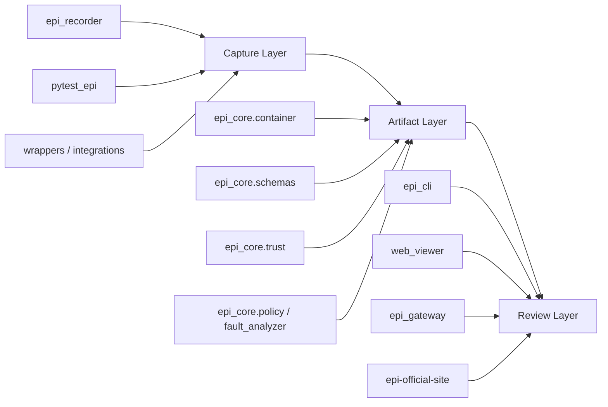
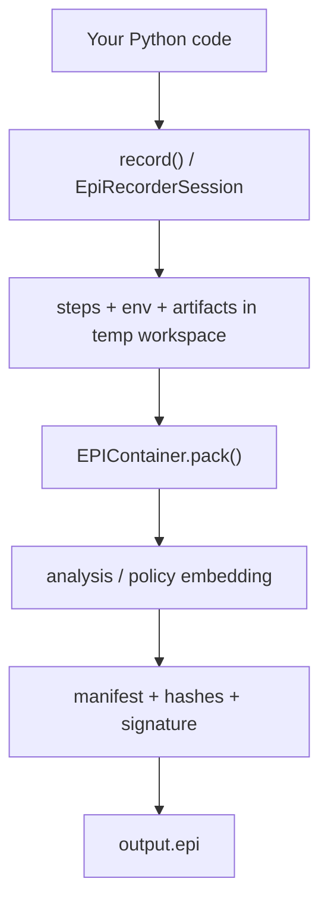
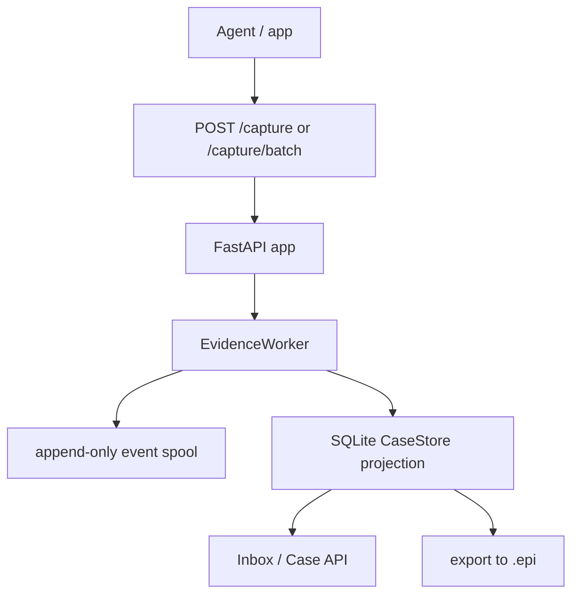

# EPI Codebase Walkthrough

This document is a practical map of the current `epi-recorder` repository.
It is written for someone who wants to understand:

- what EPI is at a systems level
- how the main packages fit together
- which folders matter most
- how a run becomes a `.epi` artifact
- how trust, review, policy, sharing, and the browser viewer work

The goal is not to describe an idealized architecture. The goal is to explain
the codebase that is actually in this repo today.

## 1. What EPI Is

At its core, EPI is a **portable evidence system for AI workflows**.

It is built around one central artifact: the `.epi` file.

That artifact is meant to answer five questions later:

1. What happened during the run?
2. What rules or policies were in effect?
3. Did analysis run, and what did it conclude?
4. Did a human review or approve anything?
5. Can we prove the artifact was not modified after it was sealed?

The repo implements EPI as several connected layers:

1. A **Python recorder SDK** for capturing agent activity in-process.
2. A **core artifact and trust layer** that builds and verifies `.epi` files.
3. A **CLI** for running, viewing, verifying, reviewing, exporting, and sharing artifacts.
4. A **FastAPI gateway** for live capture, shared review, approval callbacks, and hosted sharing.
5. A **browser viewer** for opening and reviewing case files without rebuilding context from raw logs.

If you remember one sentence, remember this:

**EPI turns an AI run into a sealed, reviewable case file.**

## 2. The Best Mental Model

The easiest way to understand the repo is to divide it into three big zones:



### Capture Layer

This is how EPI learns what happened.

It can happen locally with `record()` inside Python code, or remotely through
the gateway's capture endpoints.

### Artifact Layer

This is where raw captured data becomes a portable `.epi` file with hashes,
metadata, optional policy output, and a signature.

### Review Layer

This is the human-facing surface:

- `epi view`
- `epi verify`
- `epi export-summary`
- the browser case UI
- hosted share links
- local shared workspaces through `epi connect open`

## 3. The Most Important Top-Level Folders

This repo is broad. Not every folder has equal importance.

### Primary product folders

These are the folders you should understand first.

#### `epi_recorder/`

This is the local Python SDK and the main developer-facing library surface.

Important files:

- `epi_recorder/api.py`
- `epi_recorder/async_api.py`
- `epi_recorder/bootstrap.py`
- `epi_recorder/environment.py`
- `epi_recorder/patcher.py`
- `epi_recorder/wrappers/`
- `epi_recorder/integrations/`

This package answers:

- How do I record a run locally?
- How do I log steps?
- How do OpenAI / Anthropic / LiteLLM / LangChain calls get captured?
- How does a developer instrument an agent with minimal code changes?

#### `epi_core/`

This is the technical heart of EPI.

Important files:

- `epi_core/schemas.py`
- `epi_core/container.py`
- `epi_core/trust.py`
- `epi_core/serialize.py`
- `epi_core/policy.py`
- `epi_core/fault_analyzer.py`
- `epi_core/capture.py`
- `epi_core/case_store.py`
- `epi_core/review.py`
- `epi_core/artifact_inspector.py`

This package answers:

- What is a `.epi` file?
- How is it packed and unpacked?
- What is signed?
- How does verification work?
- How are policies represented?
- How are live gateway cases stored and exported?

#### `epi_cli/`

This is the Typer-based command-line app.

Important files:

- `epi_cli/main.py`
- `epi_cli/view.py`
- `epi_cli/verify.py`
- `epi_cli/share.py`
- `epi_cli/policy.py`
- `epi_cli/export_summary.py`
- `epi_cli/connect.py`
- `epi_cli/gateway.py`
- `epi_cli/run.py`
- `epi_cli/review.py`
- `epi_cli/ls.py`

This package answers:

- What can users do from the terminal?
- How does the browser viewer get launched?
- How do review/export/share workflows work?

#### `epi_gateway/`

This is the self-hosted / shared-runtime layer.

Important files:

- `epi_gateway/main.py`
- `epi_gateway/worker.py`
- `epi_gateway/share.py`
- `epi_gateway/approval_notify.py`
- `epi_gateway/proxy.py`

This package answers:

- How do events get captured over HTTP?
- How do shared cases work?
- How do approval callbacks and notifications work?
- How do hosted share links work?

#### `web_viewer/`

This is the canonical browser UI for reviewing EPI case files.

Important files:

- `web_viewer/index.html`
- `web_viewer/app.js`
- `web_viewer/styles.css`
- `web_viewer/README.md`

This folder answers:

- What does `epi view` show?
- How does a case render in the browser?
- How are rules, comments, reports, and review actions presented?

#### `pytest_epi/`

This is the pytest plugin.

Important file:

- `pytest_epi/plugin.py`

This turns EPI into test evidence infrastructure.

#### `examples/`

This is how product stories become runnable demos.

Important subfolders:

- `examples/starter_kits/insurance_claim/`
- `examples/starter_kits/refund/`

These are not just examples. They are also part of the product narrative.

#### `tests/`

This is the regression safety net across the whole stack.

It contains tests for:

- container packing
- trust verification
- policy evaluation
- gateway behavior
- share links
- viewer behavior
- CLI commands
- starter kits

#### `docs/`

This folder contains:

- file format docs
- CLI docs
- product plans
- runbooks
- architectural notes

Some docs are current and useful. Some are roadmap or historical context. Treat
code as the final source of truth when there is a mismatch.

### Public site folders

#### `epi-official-site/`

This is the authoritative static site surface for `epilabs.org`.

It contains pages like:

- `verify.html`
- `verify/index.html`
- `cases/index.html`
- `claim-denial-evidence.html`

This is where the public verifier and hosted case page live.

#### `EPI-OFFICIAL/`

This appears to be related to the official site surface as well. In practice,
the repo currently contains a nested official-site working area. The active
public-site implementation you have been using in this workspace is
`epi-official-site/`.

### Secondary or support folders

These matter, but they are not the first place to start.

#### `epi_viewer_static/`

This is a support asset folder, not the main viewer.

Most importantly, it still contains browser crypto code used by:

- `web_viewer/`
- `epi_cli/view.py`
- `epi_core/container.py`

So it is supporting infrastructure, not dead code.

#### `epi_analyzer/`

This is a smaller sidecar package used by debug flows. For example,
`epi_cli/debug.py` imports `epi_analyzer.detector.MistakeDetector`.

It is not the main policy/fault-analysis engine. That main engine lives in
`epi_core/fault_analyzer.py`.

#### `epi-viewer/`

This looks like a separate Electron-style desktop viewer app. It is not the
main architecture path for understanding the current product. The browser-first
viewer in `web_viewer/` is the canonical review surface.

### Likely stale or non-canonical surfaces

#### `website/`

This is an older site mirror and should not be treated as the source of truth
for `epilabs.org`.

## 4. The Main Runtime Paths

There are two core ways EPI is used.

## 4.1 Local recorder path

This is the simplest path and the best place to start understanding the system.



### Step-by-step

1. Your code enters `record(...)` in [api.py](/Users/dell/epi-recorder/epi_recorder/api.py).
2. `EpiRecorderSession.__enter__()` creates a temporary recording workspace.
3. It creates a `RecordingContext` and stores it thread-locally so wrappers and
   helpers can find the active session.
4. It logs `session.start`.
5. Optional stdout capture turns normal console lines into `stdout.print` steps.
6. Your code logs events directly, or wrappers/integrations log them for you.
7. On exit, the session:
   - captures the environment
   - logs `session.end`
   - finalizes SQLite-backed step storage into files
   - creates a `ManifestModel`
   - calls `EPIContainer.pack(...)`
   - signs the artifact if auto-signing is enabled
8. The temp workspace is removed, leaving only the `.epi` file.

### Key local classes

#### `EpiRecorderSession`

This is the central local context manager.

Responsibilities:

- create temp workspace
- install capture context
- log steps
- capture stdout/stderr if configured
- finalize data
- pack and sign the artifact

#### `AgentRun`

This is a higher-level helper layered on top of the session.

It emits structured agent-centric steps such as:

- `agent.run.start`
- `agent.plan`
- `agent.message`
- `tool.call`
- `tool.response`
- `agent.decision`
- `agent.approval.request`
- `agent.run.end`

This is important because EPI is moving away from "generic tracing" toward a
stable vocabulary for consequential AI workflows.

## 4.2 Gateway path

The gateway is the live shared review path.



### What the gateway adds beyond local recording

- shared review state
- browser workspace
- approval request notification
- approval callback capture
- hosted share links
- replay and crash recovery
- auth for shared deployments

### Core gateway pieces

#### `GatewayRuntimeSettings` in [main.py](/Users/dell/epi-recorder/epi_gateway/main.py)

This is the runtime configuration model.

It contains settings for:

- storage
- auth
- CORS
- request size limits
- share uploads
- S3 / R2 object storage
- approval webhook delivery
- SMTP fallback

This file is the best single place to learn what the gateway is capable of.

#### `EvidenceWorker` in [worker.py](/Users/dell/epi-recorder/epi_gateway/worker.py)

This is the background persistence and projection engine.

Its job is to:

- accept normalized capture events
- write append-only JSON spool files
- project those events into SQLite case state
- replay spool files on startup
- recover orphan sessions after crashes
- run optional post-persist hooks

#### `CaseStore` in [case_store.py](/Users/dell/epi-recorder/epi_core/case_store.py)

This is the SQLite-backed shared review model.

It stores:

- case summaries
- full case payloads
- comments
- activity items
- auth sessions
- open workflow sessions
- exported artifacts

It acts as the translation layer between low-level events and business-facing
"cases."

## 5. The `.epi` File Format

The `.epi` artifact is the center of the whole product.

In the current `v4.0.0` line, it is a self-identifying binary envelope with a
defined inner payload layout.

### Typical layout

```text
example.epi
EPI1 header                    # outer identity, payload length, payload SHA-256
payload.zip                    # signed ZIP evidence payload
  mimetype
  steps.jsonl
  environment.json
  analysis.json                # optional
  policy.json                  # optional
  policy_evaluation.json       # optional
  review.json                  # optional
  artifacts/...                # optional
  viewer.html
  manifest.json
```

### What each file does

#### `mimetype`

A tiny marker file inside the ZIP payload containing:

`application/vnd.epi+zip`

It is written first and uncompressed for standards-style ZIP compatibility
inside the signed payload. The outermost `.epi` file itself no longer begins
with ZIP magic bytes in `v4.0.0`.

#### `steps.jsonl`

This is the execution timeline.

It is newline-delimited JSON. Each line is a step/event.

Examples of step kinds:

- `session.start`
- `agent.run.start`
- `tool.call`
- `tool.response`
- `llm.request`
- `llm.response`
- `agent.approval.request`
- `agent.approval.response`
- `agent.decision`
- `session.end`

#### `environment.json`

This is the environment snapshot captured for reproducibility.

It can include information such as:

- Python version
- OS/platform info
- installed packages

#### `analysis.json`

This is the deterministic analyzer output.

It is generated at pack time by `FaultAnalyzer` when steps exist and analysis
runs successfully.

Typical content includes:

- fault summary
- confidence
- whether review is required
- heuristic findings
- policy-linked findings

#### `policy.json`

This is the validated policy that was active at pack time, when a policy was
found and loaded successfully.

This matters because it makes the artifact self-describing. A later reviewer
can see not only what happened, but also what rules EPI used when evaluating it.

#### `policy_evaluation.json`

This is the structured per-rule result set. It is the most compliance-oriented
output in the bundle.

It records whether specific rules passed or failed and includes plain-English
reasoning for each result.

#### `review.json`

This is the human review addendum.

It is intentionally additive. The goal is that human review can be attached
later without pretending the original machine-run evidence was replaced.

#### `viewer.html`

This is the embedded offline viewer.

It is generated from:

- `web_viewer/index.html`
- `web_viewer/app.js`
- `web_viewer/styles.css`
- `epi_viewer_static/crypto.js`

The packer inlines those assets and injects the artifact data into the HTML so
the case can be opened offline.

#### `manifest.json`

This is the most important file in the archive.

It contains:

- artifact metadata
- file hashes
- signature metadata
- analysis status

It is the thing that gets signed.

## 6. The Trust Model

EPI is not just "a ZIP with logs." The trust model is the differentiator.

## 6.1 Manifest and file hashing

The manifest tracks a `file_manifest` mapping of file path to SHA-256 hash.

Those hashes are used to verify that the sealed evidence files still match the
state they had when the artifact was created.

### Important nuance

`viewer.html` is intentionally **not** part of `file_manifest`.

Why?

Because it is a generated presentation layer, not primary evidence content. The
sealed evidence files are things like:

- `steps.jsonl`
- `environment.json`
- `analysis.json`
- `policy.json`
- `policy_evaluation.json`
- `review.json`
- artifacts under `artifacts/`

## 6.2 Signature model

Signing lives in [trust.py](/Users/dell/epi-recorder/epi_core/trust.py).

The basic flow is:

1. Populate the manifest with the public key.
2. Compute a canonical hash of the manifest, excluding the `signature` field.
3. Sign that hash with Ed25519.
4. Store the signature in the manifest.

The signature string format is:

`ed25519:<key-name>:<signature-bytes>`

## 6.3 Verification states

There are three important cases:

### Valid signature

The artifact was signed, and the signature verifies against the embedded public
key.

### Unsigned artifact

This is allowed in many flows. EPI can still verify integrity, but it cannot
prove authorship.

### Invalid signature

This is the red-flag state. It means the signature check failed or the embedded
key/signature data is inconsistent.

## 6.4 Integrity vs authenticity

EPI separates two ideas:

- **integrity**: did the sealed files change?
- **authenticity**: do we trust who signed this?

That distinction is important because an unsigned file may still be intact, and
a signed file may still be invalid if it was modified after sealing.

## 7. Policy and Analyzer Logic

Policy and analyzer behavior lives mainly in:

- [policy.py](/Users/dell/epi-recorder/epi_core/policy.py)
- [fault_analyzer.py](/Users/dell/epi-recorder/epi_core/fault_analyzer.py)

## 7.1 Policy model

`EPIPolicy` is the typed rulebook model.

It contains:

- identity/version fields
- optional scope metadata
- approval policies
- rules

Each `PolicyRule` has a `type`.

Supported rule families include:

- `constraint_guard`
- `sequence_guard`
- `threshold_guard`
- `prohibition_guard`
- `approval_guard`
- `tool_permission_guard`

## 7.2 Built-in profiles

The repo ships starter profiles in `POLICY_PROFILES`.

Important current profiles include:

- `finance.loan-underwriting`
- `finance.refund-agent`
- `insurance.claim-denial`
- `healthcare.triage`

The insurance profile is especially important for the current product focus.

Its built-in rules cover:

- fraud check before denial
- coverage check before denial
- high-value human approval
- denial reason required
- no PII in final claim output

## 7.3 Policy loading behavior

One important design choice:

`load_policy()` is intentionally forgiving and does not raise. If a policy is
missing or malformed, recording still completes.

That design prevents capture failures from breaking the main workflow, but it
also means the codebase needs explicit warnings to avoid silently skipping
analysis. The recorder now warns up front when a local `epi_policy.json` is
invalid.

## 7.4 Analyzer behavior

`FaultAnalyzer` is the deterministic engine that looks at captured steps and
decides things like:

- was there a likely fault?
- what was the primary problem?
- is human review required?
- which policy rules passed or failed?

It writes:

- `analysis.json`
- `policy_evaluation.json`

## 7.5 `analysis_status` in the manifest

The manifest tracks:

- `complete`
- `skipped`
- `error`

This matters because it prevents a dangerous ambiguity: "there is no
`analysis.json`" is not the same as "analysis intentionally did not run."

That distinction is now sealed into the artifact itself.

## 8. The Browser Viewer Architecture

The viewer lives in `web_viewer/`, but it appears in several ways:

1. as the local `epi view` browser experience
2. as the embedded `viewer.html` inside artifacts
3. as the basis for hosted case rendering on `epilabs.org`
4. as the local shared workspace UI opened by `epi connect open`

## 8.1 Viewer data model

The viewer works from a case payload containing things like:

- manifest
- steps
- analysis
- policy
- policy evaluation
- review
- environment
- stdout/stderr
- integrity state
- signature state

In local view mode, `epi_cli/view.py` extracts or regenerates a browser-ready
viewer with preloaded case data.

In hosted mode, `epi-official-site/cases/index.html` fetches raw `.epi` bytes
and renders them client-side using trusted JS.

## 8.2 Viewer state model

`web_viewer/app.js` is a large, stateful browser application.

Its top-level `state` tracks things like:

- loaded cases
- current view
- selected case
- filters
- shared workspace state
- connector setup state
- gateway auth session
- policy editor state

## 8.3 Viewer UX model

The viewer is case-first, not file-browser-first.

Key surfaces include:

- `Inbox`
- `Case`
- `Rules`
- `Reports`

The current product direction pushes the **Case** view to behave like a
business-readable Decision Summary, while still preserving technical detail
lower in the page.

## 8.4 Trust in the browser

The browser verifies:

- file integrity
- signature state
- review signature state when present

The crypto helper in `epi_viewer_static/crypto.js` is part of this browser-side
verification story.

## 9. The CLI Architecture

The CLI is implemented with Typer in [main.py](/Users/dell/epi-recorder/epi_cli/main.py).

It is not just a thin wrapper. It is a major product surface.

### What the CLI does

- first-run setup
- key bootstrap
- Windows association repair
- recording
- viewing
- verifying
- reviewing
- policy generation/validation
- gateway start
- team review workspace launch
- hosted sharing
- summary export

### Important CLI modules

#### `epi_cli/view.py`

Responsibilities:

- resolve artifact paths
- extract or regenerate viewer files
- inject verification context
- open the browser safely

#### `epi_cli/verify.py`

Responsibilities:

- integrity verification
- signature verification
- human-readable trust report

#### `epi_cli/share.py`

Responsibilities:

- local preflight validation
- upload to `/api/share`
- user-facing error handling for unreachable share services
- optional browser auto-open

#### `epi_cli/policy.py`

Responsibilities:

- starter policy generation
- guided profile setup
- policy validation
- optional browser-side rule editing flows

#### `epi_cli/export_summary.py`

Responsibilities:

- turn a case artifact into a buyer-facing Decision Record HTML export

This is important because it bridges the technical artifact world and the
regulatory/compliance presentation world.

#### `epi_cli/connect.py`

Responsibilities:

- run a local browser workspace
- host a local bridge for reviewers and connectors
- open the team review flow in one command

## 10. Wrappers and Integrations

One of EPI's practical strengths is that it does not require every user to log
raw steps manually.

## 10.1 Wrappers

In `epi_recorder/wrappers/`, the repo provides wrappers for client SDKs.

Examples:

- OpenAI
- Anthropic

These wrappers emit EPI step kinds like:

- `llm.request`
- `llm.response`
- `llm.error`

Their job is to convert framework-specific behavior into a stable evidence
vocabulary.

## 10.2 Integrations

In `epi_recorder/integrations/`, the repo provides integration surfaces for:

- LangChain
- LangGraph
- LiteLLM
- OpenTelemetry
- OpenAI Agents-style flows

The pattern is consistent:

- do not force one framework abstraction across everything
- adapt framework callbacks or client operations into EPI steps

## 11. Hosted Sharing

Hosted share support lives in:

- [epi_cli/share.py](/Users/dell/epi-recorder/epi_cli/share.py)
- [epi_gateway/share.py](/Users/dell/epi-recorder/epi_gateway/share.py)
- [epi-official-site/cases/index.html](/Users/dell/epi-recorder/epi-official-site/cases/index.html)

## 11.1 Why sharing is a separate subsystem

The share system is intentionally separate from the live gateway case store.

That design keeps Phase 1 sharing simple:

- upload one `.epi`
- store raw bytes
- return one link
- render it with a trusted hosted page

It does **not** require:

- workspaces
- case queues
- multi-user state

## 11.2 Share architecture

The current architecture is:

1. CLI validates the artifact locally.
2. Gateway validates it again server-side.
3. Share metadata goes into a separate SQLite DB.
4. Raw bytes go into local file storage or S3/R2.
5. Hosted page fetches raw bytes and renders client-side.

### Important safety property

Hosted share pages do **not** execute the artifact's embedded `viewer.html`.

They use a trusted renderer served from the official site.

That matters because uploaded viewer HTML is untrusted content.

## 12. Human Review and Approval

EPI has two related but different concepts:

### Review

This is the human judgment attached to a finished artifact.

It is represented by `review.json` and viewer review actions.

### Approval during a live run

This is the "human-in-the-loop while the workflow is still active" path.

That lives mostly in the gateway.

Current runtime flow:

1. the agent emits `agent.approval.request`
2. the gateway can send a webhook
3. the gateway can optionally send an email
4. a human hits `/api/approve/{workflow_id}/{approval_id}`
5. the gateway records `agent.approval.response`
6. the workflow can continue with a durable human decision step

That architecture is important because it turns approval from a fake demo step
into a real event path.

## 13. Crash Recovery and Reliability Logic

A lot of the codebase exists to avoid "pretty demos with fragile internals."

Examples:

### Local path

- recording workspace creation has fallbacks
- stdout capture failures do not break user code
- policy failures do not break packing
- temp cleanup happens in `finally`

### Gateway path

- append-only spool files exist before projection
- spool is replayed on startup
- corrupt replay files are tracked
- orphan sessions are recovered after restarts
- open sessions are tracked in SQLite

This is one of the subtle strengths of the codebase: it cares about durability,
not just happy-path UX.

## 14. Testing Strategy

The test suite is broad and is one of the clearest signals that this repo is a
real product codebase rather than a prototype.

The suite covers:

- container format and integrity
- viewer packaging
- CLI workflows
- gateway endpoints
- share routes
- policy setup and validation
- insurance starter kit
- browser-viewer assumptions
- Windows association behavior
- packaging hygiene

If you want to understand how the maintainers expect a subsystem to behave,
reading the tests is often faster than reading the implementation.

## 15. Suggested Reading Order

If you want to learn the repo quickly, read in this order:

1. [README.md](/Users/dell/epi-recorder/README.md)
2. [docs/EPI-SPEC.md](/Users/dell/epi-recorder/docs/EPI-SPEC.md)
3. [epi_recorder/api.py](/Users/dell/epi-recorder/epi_recorder/api.py)
4. [epi_core/schemas.py](/Users/dell/epi-recorder/epi_core/schemas.py)
5. [epi_core/container.py](/Users/dell/epi-recorder/epi_core/container.py)
6. [epi_core/trust.py](/Users/dell/epi-recorder/epi_core/trust.py)
7. [epi_core/policy.py](/Users/dell/epi-recorder/epi_core/policy.py)
8. [epi_core/fault_analyzer.py](/Users/dell/epi-recorder/epi_core/fault_analyzer.py)
9. [epi_cli/main.py](/Users/dell/epi-recorder/epi_cli/main.py)
10. [epi_cli/view.py](/Users/dell/epi-recorder/epi_cli/view.py)
11. [web_viewer/README.md](/Users/dell/epi-recorder/web_viewer/README.md)
12. [web_viewer/app.js](/Users/dell/epi-recorder/web_viewer/app.js)
13. [epi_gateway/main.py](/Users/dell/epi-recorder/epi_gateway/main.py)
14. [epi_gateway/worker.py](/Users/dell/epi-recorder/epi_gateway/worker.py)
15. [epi_core/case_store.py](/Users/dell/epi-recorder/epi_core/case_store.py)

That reading path goes from the outside in:

- product explanation
- file format
- local recorder
- artifact core
- viewer
- shared runtime

## 16. What Is Canonical vs What Is Historical

If you are trying to avoid confusion, use this rule:

### Treat these as canonical today

- `epi_recorder/`
- `epi_core/`
- `epi_cli/`
- `epi_gateway/`
- `web_viewer/`
- `pytest_epi/`
- `examples/starter_kits/`
- `epi-official-site/`

### Treat these as support or secondary

- `epi_viewer_static/`
- `epi_analyzer/`

### Treat these as historical, experimental, or non-primary unless a specific
### workflow sends you there

- `website/`
- `epi-viewer/`

The repo has clearly evolved through multiple product phases:

- recorder-first
- artifact-first
- reviewer/browser-first
- gateway/share/pilot-readiness

Understanding that evolution helps explain why there are multiple viewer/site
surfaces and why some folders feel newer than others.

## 17. Bottom Line

EPI is best understood as:

**a capture SDK + artifact format + trust system + review UI + gateway, all
organized around one portable case file.**

If you are lost in the codebase, keep coming back to the central question:

**Which part of the system is responsible for turning raw execution into a
sealed, reviewable, trustworthy case file?**

Most of the repo is just one piece of that answer.
