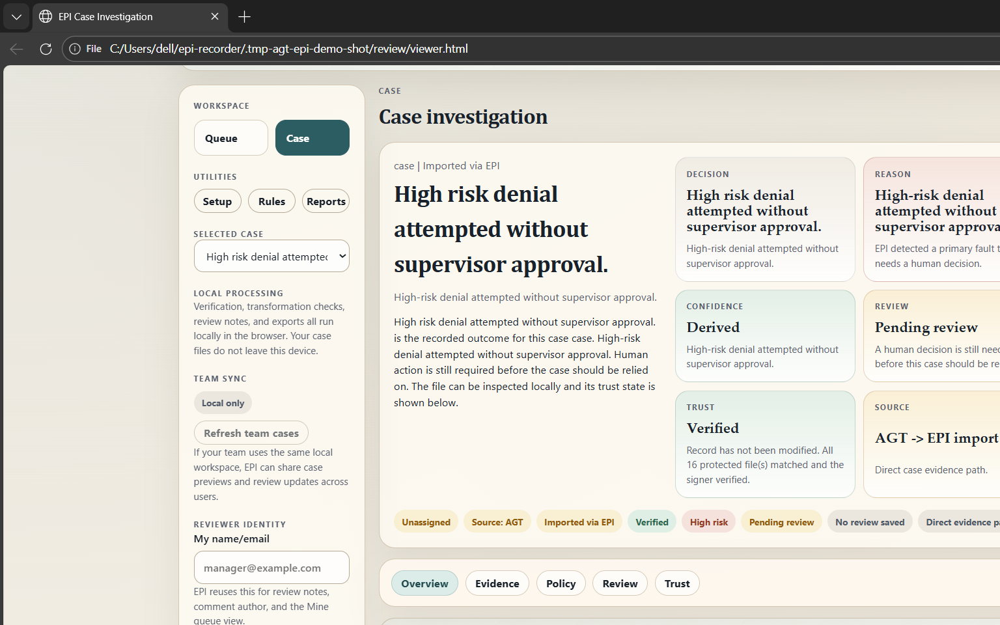

# RFC: AGT -> EPI Portable Artifact Layer

## Problem

AGT currently cannot produce a **single portable, sealed, independently verifiable case artifact**.

Today, its compliance evidence is spread across in-memory structures, SQLite audit logs, and Annex IV Markdown/JSON exports.

Those outputs are useful, but they require manual reconstruction to understand or audit a decision.

There is no single artifact a reviewer, auditor, or regulator can reopen later with full trust.

## Before vs After

### Before

- fragmented evidence across logs and exports
- no integrity guarantees
- difficult audit handoff

### After

- one `.epi` file
- full execution trace and policy evaluation
- preserved source evidence
- independently verifiable integrity

## Proposal

Introduce `.epi` as an **optional output layer** of the AGT Annex IV exporter.

This would package:
- execution trace
- policy and evaluation outputs
- runtime context
- source evidence
- integrity and signature metadata

This is an extension, not a replacement.

## Architecture

```text
AGT Runtime
   ->
Annex IV Exporter
   ->
EPI Adapter
   ->
.epi artifact
```

AGT remains unchanged.
The Annex IV exporter remains the producer.
EPI adds a portable artifact layer on top.

## Evidence Mapping

| AGT Evidence | EPI Output |
| --- | --- |
| `ComplianceReport` | `policy_evaluation.json` plus decision context |
| `PolicyDocument` | `policy.json` |
| `audit_logs` | `steps.jsonl` |
| `flight_recorder` | `steps.jsonl` |
| `runtime_context` | `environment.json` |
| `slo_data` | `artifacts/slo.json` |
| `annex_markdown` | `artifacts/annex_iv.md` |
| `annex_json` | `artifacts/annex_iv.json` |
| raw AGT payloads | `artifacts/agt/` |
| mapping metadata | `artifacts/agt/mapping_report.json` |

## Standards Alignment

EPI is a container layer, not a competing standard.

It aligns with:
- `SLSA` -> provenance
- `Sigstore` -> signing and verification
- `CycloneDX` -> optional structured evidence

The goal is not to replace standards, but to package AGT evidence into one portable case artifact.

## Minimal Flow

Current working proof:

```bash
epi import agt examples/agt-epi-demo/sample_annex_bundle.json --out case.epi
epi verify case.epi
epi view case.epi
```

Future AGT integration:
- the Annex IV exporter emits this bundle shape directly
- or the Annex IV exporter calls an equivalent EPI adapter

## Why This Matters

- portable compliance evidence
- verifiable audit handoff
- local investigation
- regulator- and reviewer-ready case artifact

AGT evidence becomes a single, trusted case file instead of scattered logs and exports.


